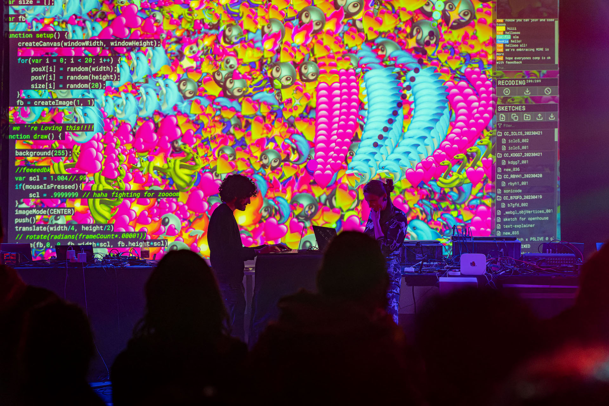

2026.05.04

# P5LIVE ~ Deep Dive
**Colabor 2026  
[Ted Davis](https://teddavis.org)**

[https://dusie.ch/2526/colabor](https://dusie.ch/2526/colabor)

  

*[ICLC 2023 Ultrecht](https://iclc.toplap.org/2023/index.html), [P5LIVE COCODING](https://iclc.toplap.org/2023/catalogue/performance/p5live-cocoding.html), [Ted Davis](https://teddavis.org/), [Sabrina Verhage](https://www.sabrinaverhage.com/) © Paulus van Dorsten*

Let's dive into [P5LIVE](https://p5live.org/), the p5.js collaborative live-coding vj environment! We'll walk through as many of its features as time allows and get you up and running within the environment so that soon enough you'll be performing at an [algorave](https://en.wikipedia.org/wiki/Algorave) near you! 

Our workshop is shrt, so this will merely be a crash course on P5LIVE features relevant for your course and tips + tricks for your live-coding performances. Nevertheless, these resources stay online for your further research and there's resources galore to go further with p5js. Shameless plug, sign on up for my [IDCE Summer Workshop](https://www.fhnw.ch/en/art-design/continuing-education/offerings/programmes/creative-coding) if you want a 1-week intensive on this.

## Recording
*wait for it...*

## Resources
### Workshop (tldc;)
- [p5.js teaching material](https://dusie.ch/topics/p5js/)
- [P5LIVE](https://p5live.org)
- [HackMD](https://hackmd.io/gnEB8mFoScmECfPxZ4XzcQ?both), shared pad for spotaneous notes / links / exchange

### p5.js
- [Teaching material](https://dusie.ch/topics/p5js/)
- [Resources](https://dusie.ch/topics/p5js/?c=resources)
- [Cheatsheet](http://dusie.ch/shared/p5js_shared/files/p5js_cheatsheet_v3.pdf)
- [References](https://p5js.org/reference/)
- v2.0: [Website](https://beta.p5js.org/) / [v1 compatibility](https://github.com/processing/p5.js-compatibility) / [vid: await/async](https://www.youtube.com/watch?v=0Ad5Frf8NBM) / [vid: 2.0 features](https://www.youtube.com/watch?v=1KqQeqZ3R9Y)

### P5LIVE
- [P5LIVE](https://p5live.org)
- [P5LIVE WALKTHROUGH](https://youtube.com/playlist?list=PLVFTsPTlaBzJlf6XMJki9thI3JIsC6_y-)

### hydra
- [hydra cheatsheet](https://dusie.ch/shared/p5js_shared/files/hydra-cheatsheet-v02.pdf)
- [hydra api](https://hydra.ojack.xyz/api/)
- [hydra docs](https://hydra.ojack.xyz/docs)

### p5.js YouTube Tutorials
- [The Coding Train](https://www.youtube.com/watch?v=HerCR8bw_GE&list=PLRqwX-V7Uu6Zy51Q-x9tMWIv9cueOFTFA)
- [ComputationalMama](https://www.youtube.com/c/ComputationalMama)
- [SoSunny Project](https://www.youtube.com/sosunnyproject)
- [xin xin](https://www.youtube.com/channel/UCufOCDs5G1A4AffwmeV0XBw)
- [Carrie Sijia Wang - 3min videos](https://carriesijiawang.com/3cc/)
- [Designing Generative Systems](https://www.youtube.com/watch?v=rTqvf0BkTNE&list=PLyRZnpOSgMj3K8AV2I6UldnvTj6d_Zrf0&index=1)
- [P5LIVE SESSIONS](https://www.youtube.com/playlist?list=PLVFTsPTlaBzJN5ADww-TGchirUbfGvI15)

## CODE OF CONDUCT

In this workshop, we'll follow p5.js' very thoughtful [CoC](https://github.com/processing/p5.js/blob/main/CODE_OF_CONDUCT.md).  
Keep it in mind as we form a community.