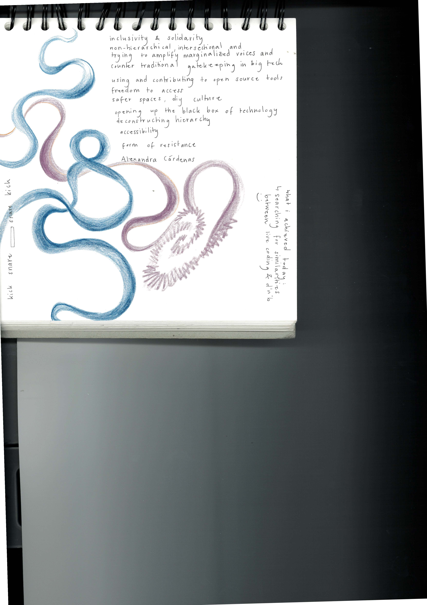
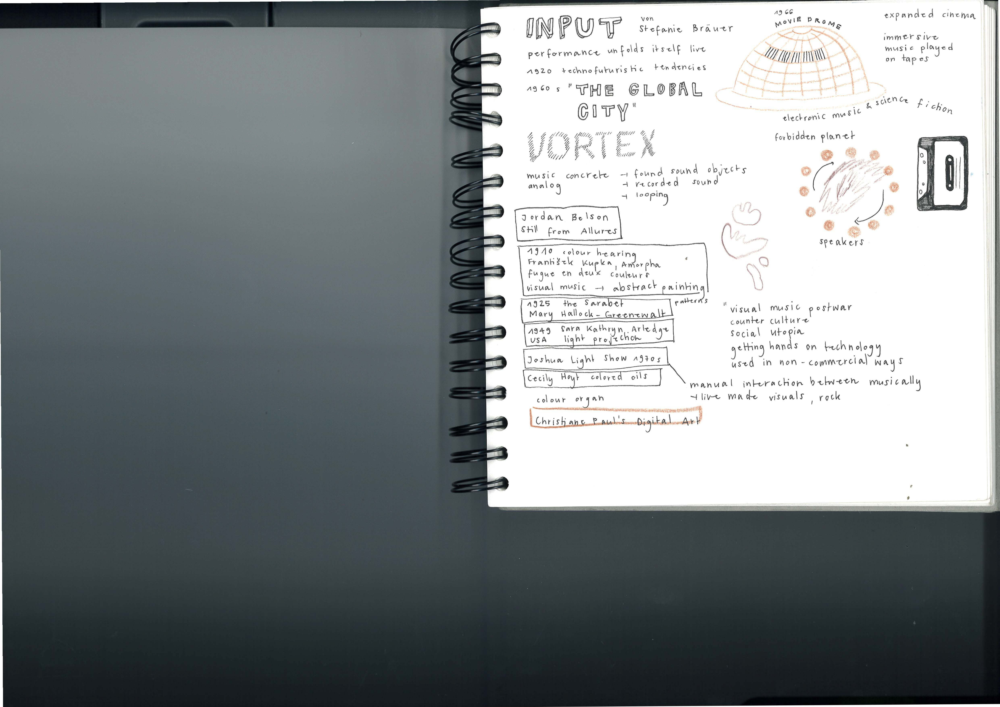
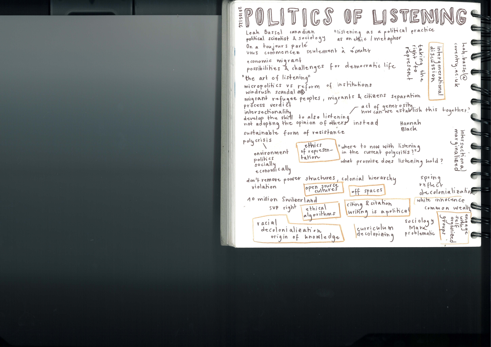
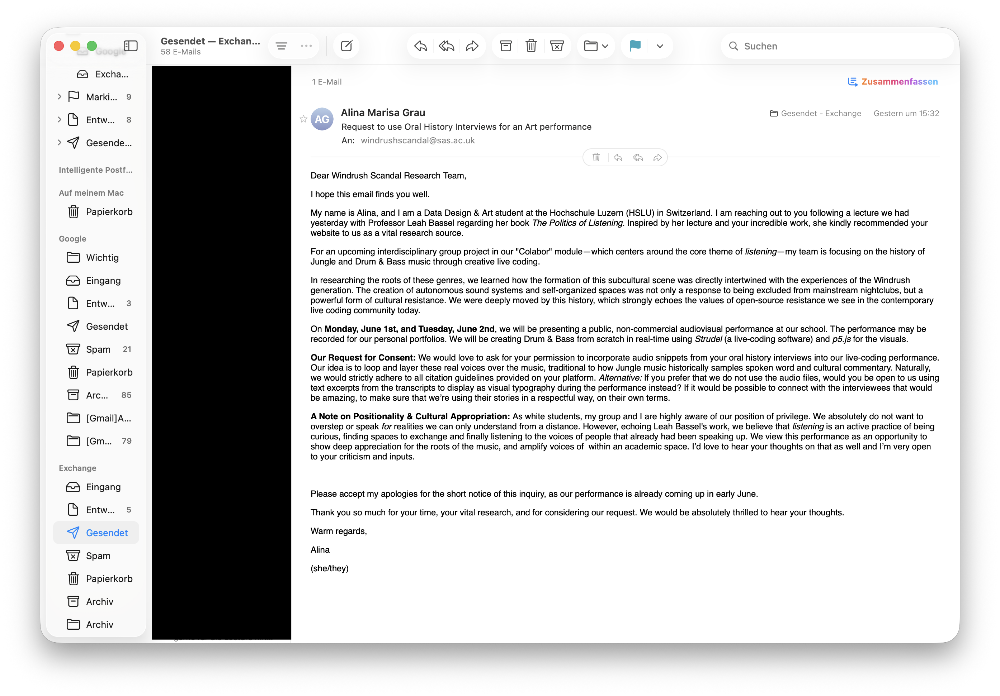
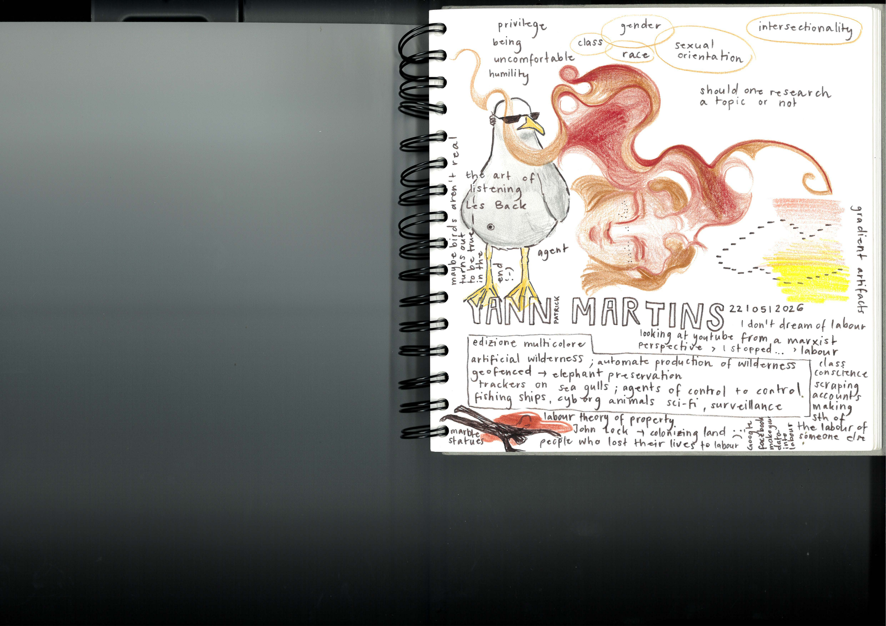
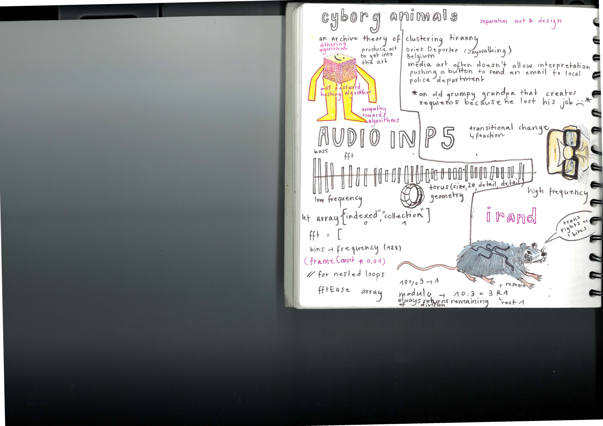
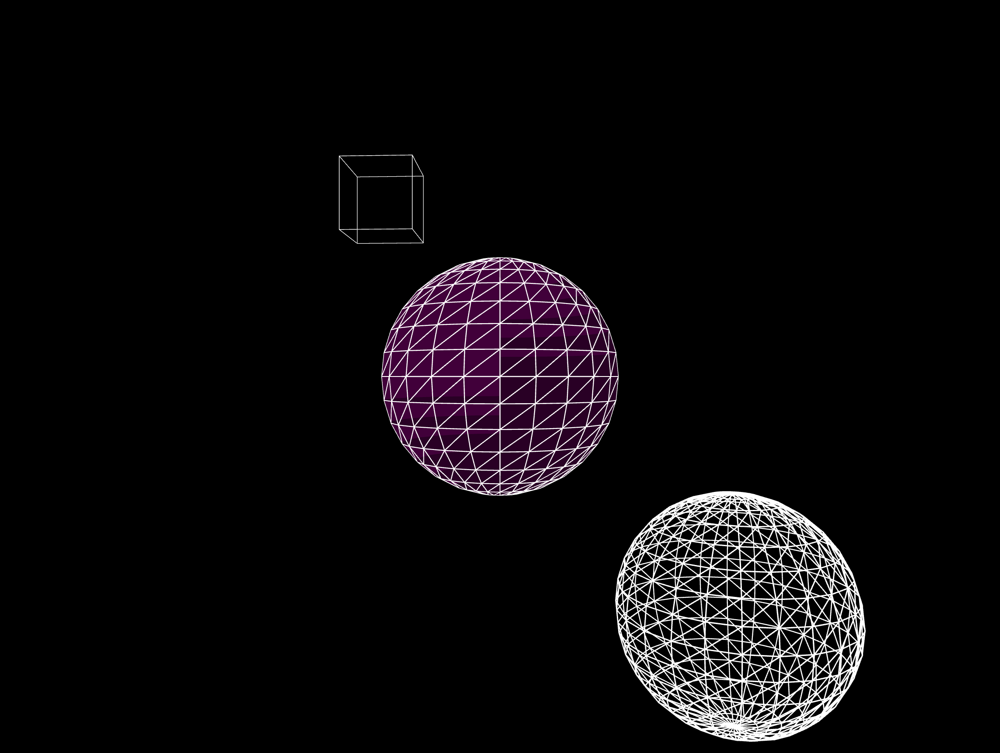
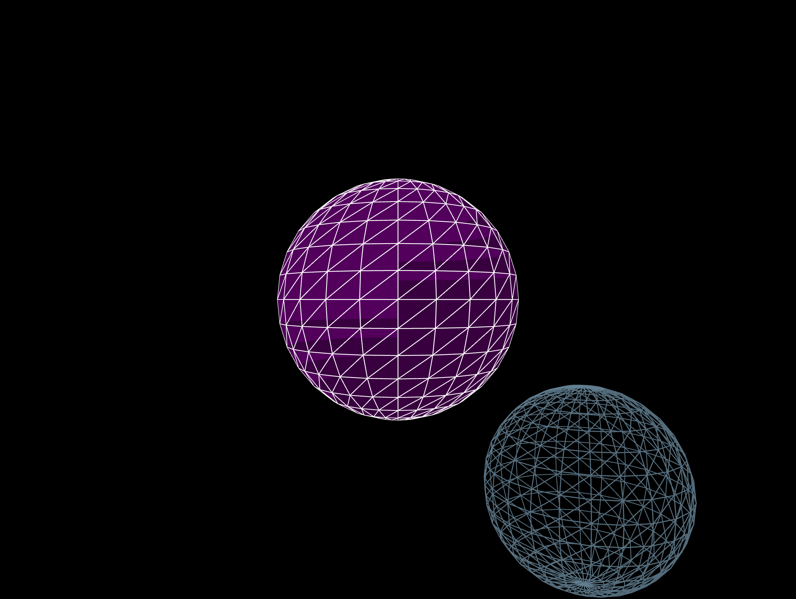
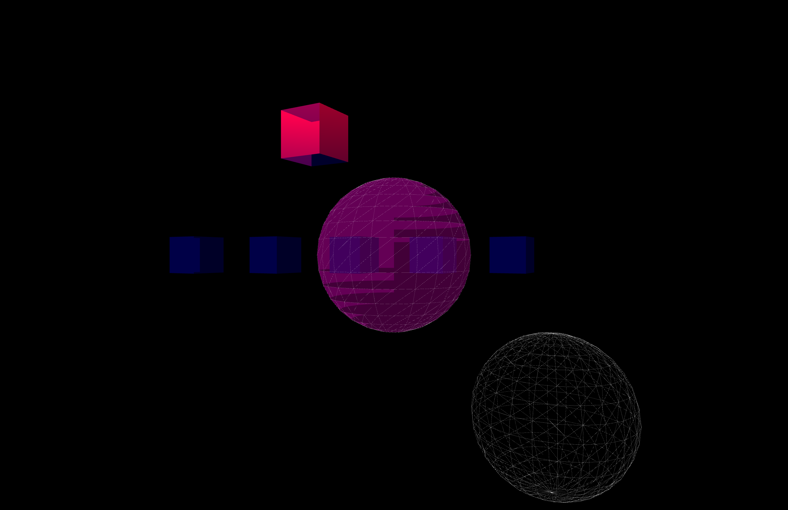

## Monday, 18th of may

I watched a tutorial on how to create different kinds of bass lines 

```javascript
setcpm(173/4)

$:s("sd:2").beat("4,12",16).gain(0.5)//.random(2,5)
$:s("hh:3!8").gain(0.25)

//https://www.youtube.com/watch?v=t5oDmmwBuS4
//The Dotted Quarter Note -> 3+3+2 Rhythmus
_$: s("drumulator_bd").lpf(500)
  .note("c3 c3 f3")
.struct("1@3 1@3 0@2").gain(0.25)// 3/8, 3/8, 2/8

// Ich möchte mehr Varianz reinbringen, indem ich 
// verschiedene Basslines kreiere
_$: s("bd").lpf(200)
.note("F1 F#1")
.struct("0 1@5 1@2")

//foghorn :)
_$: s("drumulator_bd").lpf(200)
.note("C")
.struct("0 0 1@11 0@4")

// 1/4  Takt
$:s("bd").lpf(200)
.note("F1 F#2 F2")
.struct("1@4 1@3 1")
```


```java
setcpm(173/4)

$:s("sd:2").beat("4,12",16).gain(0.5)//.random(2,5)
$:s("hh:3!8").gain(0.25).gain(0.25,0,5)

_$:s("bd").beat("0,7?,10",16).duck("3:4:5")

//https://www.youtube.com/watch?v=t5oDmmwBuS4
//The Dotted Quarter Note -> 3+3+2 Rhythmus
_$: s("drumulator_bd").lpf(500)
  .note("c3 c3 f3")
.struct("1@3 1@3 0@2").gain(0.25)// 3/8, 3/8, 2/8

// Ich möchte mehr Varianz reinbringen, indem ich 
// verschiedene Basslines kreiere
_$: s("bd").lpf(200)
.note("F1 F#1")
.struct("0 1@5 1@2")

//foghorn :)
_$: s("drumulator_bd").lpf(200)
.note("C")
.struct("0 0 1@11 0@4")

// 1/4  Takt
_$:s("bd").lpf(200)
.note("F1 F#2 F2")
.struct("1@4 1@3 1")

//1/8th notes (bass melody kinda dubstep vibes)
_$:s("gm_fx_atmosphere").lpf(500)
//.note("B1*2 A#1*2 G#1*2 F#1*2 D#1*6 F#1*2")
.note("B1 A#1 G#1 F#1 D#1@3 F#1")
//.note("B1 B1 A#1 A#1 G#1 G#1 F#1 F#1 D#1@6 F#1 F#1")
.struct("1*8")
.delay(0.25)
._punchcard()
// three dotted 1/4 taking 1/4 increase the length by half
// 3/8 3/8 2/8 bzw 1/4
_$:s("bd:8").lpf(200)
.note("F2 F#1 F")
.struct("1@3 1@3 1@2")

//1/8th notes 
_$:s("bd")
.note("F1 F#1")
.struct("[0 1 1 1] *4")

// reggaeton kind of bassline
_$:s("bd:8").lpf(200)
.note("F2")
.struct("1@4 1@4 1@3 1@3 1@2")

// different reggaeton 
_$:s("wt_digital_basique").lpf(200)
.note("F2")
.struct("1@4 1@4 1@3 1@3 1@2")

//neuro drum and bass (pattern8)
_$:s("bd:7").lpf(300)
.note("F1").sustain(2)
.beat("0, 4, 7, 10,13",16)

// mirrored 2-step
_$: s("bd").lpf(300)
.note("G").sustain(10)
//.beat("0,5,8,11,13",16)
.struct("1@4 1@3 1@3 1@2 1@4")

_$: note("F1 C2 F1*5").s("sine")
.struct("1@6 1@2 1@2 1@2 1@2 1@2")

_$:s("music_:2").gain(0.25)
```

Nun habe ich zu Übungszwecken verschiedene wav-Dateien heruntergeladen, um diese zu verändern.

### Wednesday, may 20th input with Stefanie 





### Thursday, may 21st

On thursday may 21st I researched the sources Leah Bassel shared with us in her lecture about her book "the politics of listening". It was kind of a coincidence that she brought up the windrush scandal herself. So I had the opportunity to ask her about it.

https://blog.history.ac.uk/2023/12/learning-from-the-windrush-scandal-oral-history-archives/

 

https://journals.sagepub.com/doi/full/10.1177/03063968221081417


https://www.history.ac.uk/research/history-policy/windrush-scandal-transnational-commonwealth-context


After my research I realized that there's an archive of 60 interviews with people that experienced the windrush scandal or are connected with it in a way. So I decided to ask for consent if we could  use their audio files or transcripts for our live coding performance.



I hope I'll get an answer from them before the live coding performance but as the performance is already coming up in a bit more than a week I'm not so sure about that.


### Friday, may 22nd input with Yann




```javascript
// {"P5LIVE":{"name":"3d_audio_2.0","mod":1779457061595}} 

// how to include audio with yann

function setup() {
	createCanvas(windowWidth, windowHeight,WEBGL)

	// audio stuff now behind the scenes, 'true' makes class vars global
	setupAudio(true) // if empty, use 'a5.' before audio vars below
	a5.ease = .075 // customize ease speed, lower values make it smoother
}

function draw() {
	/* audio vars: amp, ampL, ampR, ampEase, fft, fftEase, waveform, waveformEase */
	
	ambientLight(255,0,200)
	
	updateAudio()
	background(0)
	stroke(255)
	fill(fft)
	sph(0,0,0,100+fftEase[20],20)// low frequency
	
	noFill()
	stroke(10+fftEase,fftEase,100+fftEase)
	sph(200,200,200,100+fftEase[100])//high frequency
	
	ambientLight(255,0,20)
	cube(-200,-300,-400,120)
	
	/* fftEase 
	for(let i = 0; i < fftEase.length; i++) {
		let freq = fftEase[i]; // (0, 255)
		let x = map(i, 0, fftEase.length, 0, width)
		let w = width / fftEase.length
		rect(x, height * .805, w, freq)
	}
	console.log(fftEase)
	*/
}

//define functions outside the for-Loop

function sph(x,y,z,size,rSpeed){
	
	push()
	translate(x,y,z)
	sphere(size)
	pop()
} 

function cube(x,y,z,size){
	push()
	translate(x,y,z)
	rotateY(frameCount * 0.01)
	box(size)
	pop()
}

//function trs(x,y,z,size,rSpeed)

/* 
P5LIVE - Audio
If using outside P5LIVE, include p5live-audio.js 
https://cdn.jsdelivr.net/gh/ffd8/P5LIVE/includes/utils/p5live-audio.js
*/
```

```javascript
// {"P5LIVE":{"name":"3d_audio_2.0","mod":1779450645522}} 

// how to include audio with yann

function setup() {
	createCanvas(windowWidth, windowHeight,WEBGL)

	// audio stuff now behind the scenes, 'true' makes class vars global
	setupAudio(true) // if empty, use 'a5.' before audio vars below
	a5.ease = .075 // customize ease speed, lower values make it smoother
}

function draw() {
	/* audio vars: amp, ampL, ampR, ampEase, fft, fftEase, waveform, waveformEase */
	
	ambientLight(255,0,200)
	
	updateAudio()
	background(0)
	stroke(255)
	fill(fft)
	sph(0,0,0,100+fftEase[20])// low frequency
	
	noFill()
	stroke(fftEase)
	sph(200,200,200,100+fftEase[100])//high frequency
	
	
	
	/* fftEase 
	for(let i = 0; i < fftEase.length; i++) {
		let freq = fftEase[i]; // (0, 255)
		let x = map(i, 0, fftEase.length, 0, width)
		let w = width / fftEase.length
		rect(x, height * .805, w, freq)
	}
	console.log(fftEase)
	*/
}

//define functions outside the for-Loop

function sph(x,y,z,size){
	
	push()
	translate(x,y,z)
	sphere(size)
	pop()
} 

/* 
P5LIVE - Audio
If using outside P5LIVE, include p5live-audio.js 
https://cdn.jsdelivr.net/gh/ffd8/P5LIVE/includes/utils/p5live-audio.js
*/
```

```javascript
// {"P5LIVE":{"name":"3d_music_forloop","mod":1779458257984}} 

// how to include audio with yann

function setup() {
	createCanvas(windowWidth, windowHeight,WEBGL)

	// audio stuff now behind the scenes, 'true' makes class vars global
	setupAudio(true) // if empty, use 'a5.' before audio vars below
	a5.ease = .075 // customize ease speed, lower values make it smoother
}

function draw() {
	/* audio vars: amp, ampL, ampR, ampEase, fft, fftEase, waveform, waveformEase */
	
	//orbitControl()
	ambientLight(255,0,200)
	updateAudio()
	background(0)
	
	//for loop fÞr die Wiederholung
	let number = 5
	for(let x=0;x<number; x++){
		let posX= map(x,0,5,-width/4,width/4)
		cube(posX,0,0,60)
	}
	
	stroke(255)
	strokeWeight(0.08)
	fill(fft)
	sph(0,0,0,100+fftEase[20],20)// low frequency
	
	noFill()
	// like sunlight
	directionalLight(255,0,0,0,1,0) //v1,v2,v3,x,y,z
	stroke(10+fftEase,fftEase,100+fftEase)
	sph(200,200,200,100+fftEase[100])//high frequency
	
	ambientLight(255,0,20)
	noStroke()
	fill(0,0,255,50)
	specularMaterial(255)
	cube(-200,-300,-400,120)
	
	/* fftEase 
	for(let i = 0; i < fftEase.length; i++) {
		let freq = fftEase[i]; // (0, 255)
		let x = map(i, 0, fftEase.length, 0, width)
		let w = width / fftEase.length
		rect(x, height * .805, w, freq)
	}
	console.log(fftEase)
	*/
}

//define functions outside the for-Loop

function sph(x,y,z,size,rSpeed){
	
	push()
	translate(x,y,z)
	sphere(size)
	pop()
} 

function cube(x,y,z,size){
	push()
	translate(x,y,z)
	rotateY(frameCount * 0.01)
	box(size)
	pop()
}

//function trs(x,y,z,size,rSpeed)

/* 
P5LIVE - Audio
If using outside P5LIVE, include p5live-audio.js 
https://cdn.jsdelivr.net/gh/ffd8/P5LIVE/includes/utils/p5live-audio.js
*/
```


We experimented with WEBGL and 3D shapes that were audioreactive. I really liked the idea of creating an own mesh in blender and let it bounce around. 

