## Tuesday, 26th of may

My goal for this week is to use code in strudel for the audio to randomize audio snippets. When i had a short conversation with Yann on friday I realized that the power of creative coding and especially generative looping is also the randomization.

So I want to experiment more with the functions that allow me to discover new kind of sounds like:

```javascript
n(irand(12).seg(32)) //.seg(16)
.rib(8,1)
.chord("C Am Em C").voicing()
```

Sadly I haven't really heard anything of the windrush scandal research team so far. So maybe I have to decide how to implement quotes or if i should focus on something else like the amen break and the story behind it. 

#### Feedback with Yann and Stefanie

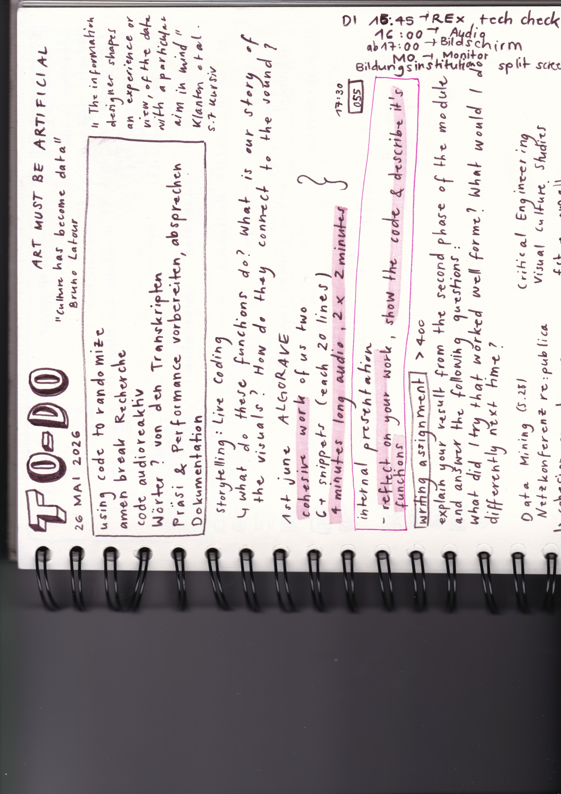

After the feedback I decided to dig into the Flocking as well for a better understanding of the code and how to influence it with audio. I realized that it's quite complicated in a way. 

I was in the library the whole day and search for references in different books. That made me a bit melancholic because of all the ai use etc. 

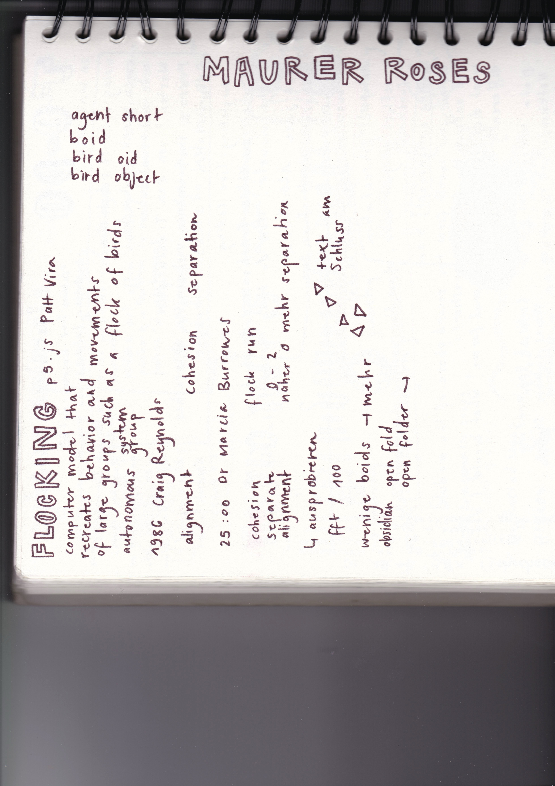


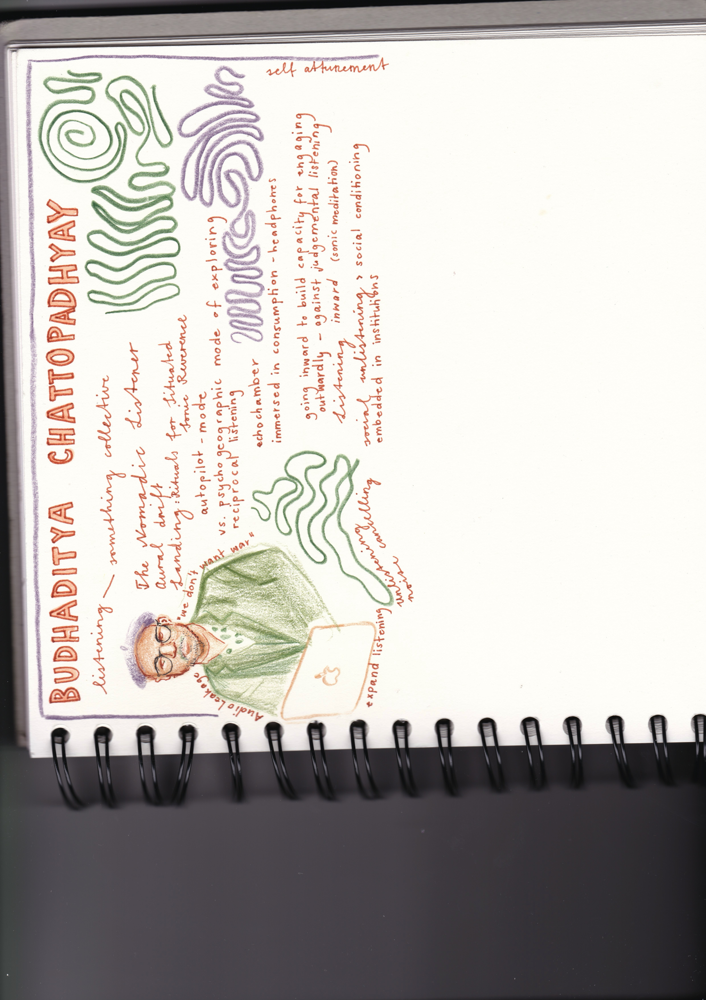

I enjoyed the input from Budhaditya because I liked the way of listening in a really meditative state of mind. My take away was that I never want to lose my curiosity to really listen to places and environments I take for granted.

## Wednesday, 27th of may

```javascript
$:n(irand(2).seg(8)) //.seg(16)
.rib(32,8)
.chord("C D F").voicing()
.add("0 100 -140 0")
.decay("0.05")// very short
.lpf(sine.slow(12).range(500, 2000))//between 20 20'000(filter)
.delay("0.3")
.delaytime(1)
.s("supersaw").gain(0.5)._punchcard()
```

I really like the sound of that snippet.

I experimented a bit with the flocking and audio interaction:

```javascript
// {"P5LIVE":{"name":"flock_dominique_27_05 ","mod":1779985599287}} 

// noprotect
const PALETTE = [
  "#ffffff", "#a5b2cf", "#0015ad"
];
const wordColorMap = {};
let colorIndex = 0;
function getWordColor(word) {
  const key = word.toLowerCase();
  if (!wordColorMap[key]) {
    wordColorMap[key] = PALETTE[colorIndex++ % PALETTE.length];
  }
  return wordColorMap[key];
}
 
let wordPool = ["△", "▲"]
let wordInput;
let flock;
function setup() {
  createCanvas(windowWidth, windowHeight);
  setupAudio(true);  // Mikrofon aktivieren
  a5.ease = .15;     // Glättung der FFT-Werte (träger = ruhiger)
  flock = new Flock();
  for (let i = 0; i < 200; i++)
    flock.add(new Boid(width/2, height/2));
  // Eingabefeld für neue Wörter
  wordInput = createInput('');
  wordInput.position(width/2 - 140, 12);
  wordInput.size(280, 30);
  wordInput.attribute('placeholder', 'Wort eingeben, Enter = hinzufügen');
  wordInput.elt.addEventListener('keydown', e => {
    if (e.key === 'Enter') {
      const words = wordInput.value().trim().split(/\s+/).filter(w => w.length > 0);
      words.forEach(w => {
        if (!wordPool.includes(w)) wordPool.push(w);
        getWordColor(w);
        flock.add(new Boid(width/2, height/2));
      });
      flock.boids.forEach(b => {
        b.word = wordPool[floor(random(wordPool.length))];
      });
      wordInput.value('');
    }
  });
}
function draw() {
  updateAudio();  // Audio-Analyse jeden Frame aktualisieren
 for(let i = 0; i < fftEase.length; i++) {
		let freq = fftEase[i]; // (0, 255)
		let x = map(i, 0, fftEase.length, 0, width)
		let w = width / fftEase.length
		rect(x, height * .805, w, freq)
	}
  // Bass (tiefe Frequenzen) aus FFT: Index 0–2 mitteln
  let bass = (fftEase[0] + fftEase[1] + fftEase[2]) / 3;
 
  // Helle Blitze bei starkem Bass (Hintergrund kurz aufhellen)
  let bgAlpha = map(bass, 0, 255, 10, 80);
  background(0, 30, 255, bgAlpha);
 
  let x = map(mouseX, 0, width,  0.00001, 6);
  let y = map(mouseY, 0, height, 0.00001, 1);
 
  // Bass steuert Separation — bei Beat weichen Boids stärker aus
  let separation = map(bass, 0, 255, 1.5, 4.0);
  flock.run(separation, y, x);
}
function mouseDragged() {
  flock.add(new Boid(mouseX, mouseY));
}
// ──────────────────────────────────────────────────
// Klasse Flock — der Schwarm
// ──────────────────────────────────────────────────
class Flock {
  constructor() { this.boids = []; }
  add(b)  { this.boids.push(b); }
  run(s, a, c) {
    this.boids.forEach(b => b.run(this.boids, s, a, c));
  }
}
// ──────────────────────────────────────────────────
// Klasse Boid — ein einzelnes Tier im Schwarm
// ──────────────────────────────────────────────────
class Boid {
  constructor(x, y) {
    this.pos = createVector(x, y);
    this.vel = createVector(random(-1,1), random(-1,1));
    this.acc = createVector(0, 0);
    this.r  = 5;
    this.ms = 15;
    this.mf = 1;
    // Zufälliges Wort aus dem Pool beim Erstellen zuweisen
    this.word = wordPool[floor(random(wordPool.length))];
    // Jedem Boid einen eigenen FFT-Index zuweisen → verschiedene Frequenzen steuern verschiedene Boids
    this.fftIndex = floor(random(fftEase.length));
  }
  run(bs, s, a, c) {
    this.acc.add(this.separate(bs).mult(s));
    this.acc.add(this.align(bs).mult(a));
    this.acc.add(this.cohesion(bs).mult(c));
    this.vel.add(this.acc).limit(this.ms);
    this.pos.add(this.vel);
    this.acc.set(0, 0);
    this.borders();
    this.render();
  }
  steer(bs, dist, fn) {
    let sum = createVector(0, 0);
    let count = 0;
    for (let o of bs) {
      let d = p5.Vector.dist(this.pos, o.pos);
      if (d > 0 && d < dist) { fn(sum, o, d); count++; }
    }
    return count > 0 ? sum.div(count) : createVector(0, 0);
  }
  limit(s) {
    return s.normalize().mult(this.ms).sub(this.vel).limit(this.mf);
  }
  seek(t) {
    return this.limit(p5.Vector.sub(t, this.pos));
  }
  separate(bs) {
    let s = this.steer(bs, 125, (sum, o, d) =>
      sum.add(p5.Vector.sub(this.pos, o.pos).normalize().div(d)));
    return s.mag() > 0 ? this.limit(s) : s;
  }
  align(bs) {
    let s = this.steer(bs, 300, (sum, o) => sum.add(o.vel));
    return s.mag() > 0 ? this.limit(s) : s;
  }
  cohesion(bs) {
    let s = this.steer(bs, 400, (sum, o) => sum.add(o.pos));
    return s.mag() > 0 ? this.seek(s) : s;
  }
  borders() {
    for (let [ax, max] of [['x', width], ['y', height]]) {
      if (this.pos[ax] < -this.r)       this.pos[ax] = max + this.r;
      if (this.pos[ax] > max + this.r)  this.pos[ax] = -this.r;
    }
  }
  // ──────────────────────────────────────────────────
  // Den Boid als Wort zeichnen, das in Flugrichtung zeigt.
  // Gleiche Wörter → gleiche Farbe (aus wordColorMap)
  // Eigene FFT-Frequenz steuert Schriftgrösse
  // ──────────────────────────────────────────────────
  render() {
    // Schriftgrösse pulsiert mit der eigenen Frequenz des Boids
    let freq = fftEase[this.fftIndex];
    let size = this.r * 2.2 + map(freq, 0, 255, 0, this.r * 4);
 
    push();
    translate(this.pos.x, this.pos.y);
    rotate(this.vel.heading() + radians(90)); // In Flugrichtung drehen
    fill(getWordColor(this.word));
    noStroke();
    textAlign(CENTER, CENTER);
    textSize(size);  // Schriftgrösse proportional zu r + FFT
    text(this.word, 0, 0);
    pop();
  }
}

/* 
P5LIVE - Audio
If using outside P5LIVE, include p5live-audio.js 
https://cdn.jsdelivr.net/gh/ffd8/P5LIVE/includes/utils/p5live-audio.js
*/
```

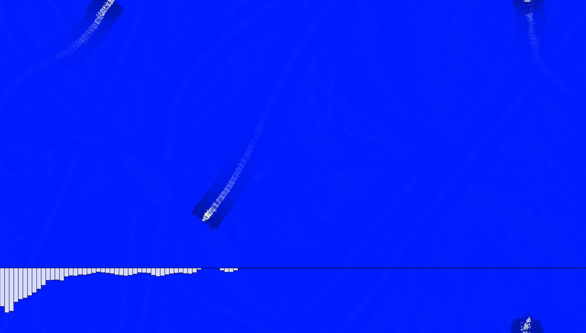
```javascript
// noprotect
const PALETTE = [
  "#ffffff", "#a5b2cf", "#0015ad"
];
const wordColorMap = {};
let colorIndex = 0;
function getWordColor(word) {
  const key = word.toLowerCase();
  if (!wordColorMap[key]) {
    wordColorMap[key] = PALETTE[colorIndex++ % PALETTE.length];
  }
  return wordColorMap[key];
}
 
let wordPool = ["△", "▲"]
let wordInput;
let flock;
function setup() {
  createCanvas(windowWidth, windowHeight);
  setupAudio(true);  // Mikrofon aktivieren
  a5.ease = .15;     // Glättung der FFT-Werte (träger = ruhiger)
  flock = new Flock();
  for (let i = 0; i < 200; i++)
    flock.add(new Boid(width/2, height/2));
    
 // Eingabefeld für neue Wörter
  wordInput = createInput('');
  wordInput.position(width/2 - 140, 12);
  wordInput.size(280, 30);
  wordInput.attribute('placeholder', 'Wort eingeben, Enter = hinzufügen');
  wordInput.elt.addEventListener('keydown', e => {
    if (e.key === 'Enter') {
      const words = wordInput.value().trim().split(/\s+/).filter(w => w.length > 0);
      words.forEach(w => {
        if (!wordPool.includes(w)) wordPool.push(w);
        getWordColor(w);
        flock.add(new Boid(width/2, height/2));
      });
      flock.boids.forEach(b => {
        b.word = wordPool[floor(random(wordPool.length))];
      });
      wordInput.value('');
    }
  });
}
function draw() {
//bei Ted nachfragen, wie wir das optimieren können
  updateAudio();  // Audio-Analyse jeden Frame aktualisieren
 
 //circle that demonstrates the UK
 noStroke()
 circle(windowWidth/2,windowHeight/2,200)
 
  // Bass (tiefe Frequenzen) aus FFT: Index 0–2 mitteln
let bassSum =0;
for(let i = 0; i < 80; i++) {
    bassSum += fftEase[i];
  }
 let bass = bassSum /80 //desto grösser die Zahl umso reaktiver?
 
 //console.log(bass)
 
  // Helle Blitze bei starkem Bass (Hintergrund kurz aufhellen)
  let bgAlpha = map(bass, 0, 255, 1, 255);
  background(0, 30, 255,bgAlpha);
 
 //je nachdem map der mouseX und mouseY weglassen?
 
  //let x = map(mouseX, 0, width,  0.00001, 6);
  //let y = map(mouseY, 0, height, 0.00001, 1);
  
  let x=0
  let y=0
 
  // Bass steuert Separation — bei Beat weichen Boids stärker aus
  let separation = map(bass, 0, 255, 3,12); //gemapt auf 1.5,4
  flock.run(separation, y, x);
}
function mouseDragged() {
  flock.add(new Boid(mouseX, mouseY));
}
// ──────────────────────────────────────────────────
// Klasse Flock — der Schwarm
// ──────────────────────────────────────────────────
class Flock {
  constructor() { this.boids = []; }
  add(b)  { this.boids.push(b); }
  run(s, a, c) {
    this.boids.forEach(b => b.run(this.boids, s, a, c));
  }
}
// ──────────────────────────────────────────────────
// Klasse Boid — ein einzelnes Tier im Schwarm
// ──────────────────────────────────────────────────
class Boid {
  constructor(x, y) {
    this.pos = createVector(x, y);
    this.vel = createVector(random(-1,1), random(-1,1));
    this.acc = createVector(0, 0);
    this.r  = 5;
    this.ms = 15;
    this.mf = 1.833;
    // Zufälliges Wort aus dem Pool beim Erstellen zuweisen
    this.word = wordPool[floor(random(wordPool.length))];
    // Jedem Boid einen eigenen FFT-Index zuweisen → verschiedene Frequenzen steuern verschiedene Boids
    this.fftIndex = floor(random(fftEase.length));
  }
  run(bs, s, a, c) {
    this.acc.add(this.separate(bs).mult(s));
    this.acc.add(this.align(bs).mult(a));
    this.acc.add(this.cohesion(bs).mult(c));
    this.vel.add(this.acc).limit(this.ms);
    this.pos.add(this.vel);
    this.acc.set(0, 0);
    this.borders();
    this.render();
  }
  steer(bs, dist, fn) {
    let sum = createVector(0, 0);
    let count = 0;
    for (let o of bs) {
      let d = p5.Vector.dist(this.pos, o.pos);
      if (d > 0 && d < dist) { fn(sum, o, d); count++; }
    }
    return count > 0 ? sum.div(count) : createVector(0, 0);
  }
  limit(s) {
    return s.normalize().mult(this.ms).sub(this.vel).limit(this.mf);
  }
  seek(t) {
    return this.limit(p5.Vector.sub(t, this.pos));
  }
  separate(bs) {
    let s = this.steer(bs, 125, (sum, o, d) =>
      sum.add(p5.Vector.sub(this.pos, o.pos).normalize().div(d)));
    return s.mag() > 0 ? this.limit(s) : s;
  }
  align(bs) {
    let s = this.steer(bs, 150, (sum, o) => sum.add(o.vel));
    return s.mag() > 0 ? this.limit(s) : s;
  }
  cohesion(bs) {
    let s = this.steer(bs, 150, (sum, o) => sum.add(o.pos));
    return s.mag() > 0 ? this.seek(s) : s;
  }
  borders() {
    for (let [ax, max] of [['x', width], ['y', height]]) {
      if (this.pos[ax] < -this.r)       this.pos[ax] = max + this.r;
      if (this.pos[ax] > max + this.r)  this.pos[ax] = -this.r;
    }
  }
  // ──────────────────────────────────────────────────
  // Den Boid als Wort zeichnen, das in Flugrichtung zeigt.
  // Gleiche Wörter → gleiche Farbe (aus wordColorMap)
  // Eigene FFT-Frequenz steuert Schriftgrösse
  // ──────────────────────────────────────────────────
  render() {
    // Schriftgrösse pulsiert mit der eigenen Frequenz des Boids
    let freq = fftEase[this.fftIndex];
    let size = this.r * 2.2 + map(freq, 0, 255, 0, this.r * 4);
 
    push();
    translate(this.pos.x, this.pos.y);
    rotate(this.vel.heading() + radians(90)); // In Flugrichtung drehen
    fill(getWordColor(this.word).fftEase/100);
    noStroke();
    textAlign(CENTER, CENTER);
    textSize(size);  // Schriftgrösse proportional zu r + FFT
    text(this.word, 0, 0);
    pop();
  }
}

/* 
P5LIVE - Audio
If using outside P5LIVE, include p5live-audio.js 
https://cdn.jsdelivr.net/gh/ffd8/P5LIVE/includes/utils/p5live-audio.js
*/
```

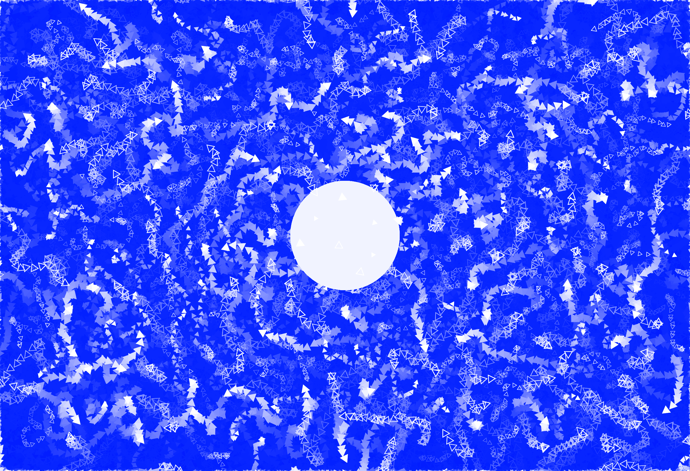

```javascript
// {"P5LIVE":{"name":"flock_dominique_27_006","mod":1779982812939}} 

// noprotect
const PALETTE = [
  "#ffffff", "#a5b2cf", "#0015ad"
];
const wordColorMap = {};
let colorIndex = 0;
function getWordColor(word) {
  const key = word.toLowerCase();
  if (!wordColorMap[key]) {
    wordColorMap[key] = PALETTE[colorIndex++ % PALETTE.length];
  }
  return wordColorMap[key];
}
 
let wordPool = ["△", "▲"]
let wordInput;
let flock;
function setup() {
  createCanvas(windowWidth, windowHeight);
  setupAudio(true);  // Mikrofon aktivieren
  a5.ease = .15;     // Glättung der FFT-Werte (träger = ruhiger)
  flock = new Flock();
  for (let i = 0; i < 200; i++)
    flock.add(new Boid(width/2, height/2));
    
 // Eingabefeld für neue Wörter
  wordInput = createInput('');
  wordInput.position(width/2 - 140, 12);
  wordInput.size(280, 30);
  wordInput.attribute('placeholder', 'Wort eingeben, Enter = hinzufügen');
  wordInput.elt.addEventListener('keydown', e => {
    if (e.key === 'Enter') {
      const words = wordInput.value().trim().split(/\s+/).filter(w => w.length > 0);
      words.forEach(w => {
        if (!wordPool.includes(w)) wordPool.push(w);
        getWordColor(w);
        flock.add(new Boid(width/2, height/2));
      });
      flock.boids.forEach(b => {
        b.word = wordPool[floor(random(wordPool.length))];
      });
      wordInput.value('');
    }
  });
}
function draw() {
//bei Ted nachfragen, wie wir das optimieren können
  updateAudio();  // Audio-Analyse jeden Frame aktualisieren
 
 //circle that demonstrates the UK
 noStroke()
 circle(windowWidth/2,windowHeight/2,200)
 
  // Bass (tiefe Frequenzen) aus FFT: Index 0–2 mitteln
let bassSum =0;
for(let i = 0; i < 80; i++) {
    bassSum += fftEase[i];
  }
 let bass = bassSum /80 //desto grösser die Zahl umso reaktiver?
 
 //console.log(bass)
 
  // Helle Blitze bei starkem Bass (Hintergrund kurz aufhellen)
  let bgAlpha = map(bass, 0, 255, 1, 255);
  background(0, 30, 255,bgAlpha);
 
 //je nachdem map der mouseX und mouseY weglassen?
 
  //let x = map(mouseX, 0, width,  0.00001, 6);
  //let y = map(mouseY, 0, height, 0.00001, 1);
  
  // dafür x und y auf 0 setzen
  let x=0
  let y=0
 
  // Bass steuert Separation — bei Beat weichen Boids stärker aus
  let separation = map(bass, 0, 255, 3,12); //gemapt auf 1.5,4
  flock.run(separation, y, x);
}
function mouseDragged() {
  flock.add(new Boid(mouseX, mouseY));
}
// ──────────────────────────────────────────────────
// Klasse Flock — der Schwarm
// ──────────────────────────────────────────────────

class Flock {
  constructor() { this.boids = []; }
  add(b)  { this.boids.push(b); }
  run(s, a, c) {
    this.boids.forEach(b => b.run(this.boids, s, a, c));
  }
}
// ──────────────────────────────────────────────────
// Klasse Boid — ein einzelnes Tier im Schwarm
// ──────────────────────────────────────────────────
class Boid {
  constructor(x, y) {
    this.pos = createVector(x, y);
    this.vel = createVector(random(-1,1), random(-1,1));
    this.acc = createVector(0, 0);
    this.r  = 5;
    this.ms = 15;
    this.mf = 100;//kontrolliert die Anzahl einzelner in der flock
    // Zufälliges Wort aus dem Pool beim Erstellen zuweisen
    this.word = wordPool[floor(random(wordPool.length))];
    // Jedem Boid einen eigenen FFT-Index zuweisen → verschiedene Frequenzen steuern verschiedene Boids
    this.fftIndex = floor(random(fftEase.length));
  }
  run(bs, s, a, c) {
    this.acc.add(this.separate(bs).mult(s));
    this.acc.add(this.align(bs).mult(a));
    this.acc.add(this.cohesion(bs).mult(c));
    this.vel.add(this.acc).limit(this.ms);
    this.pos.add(this.vel);
    this.acc.set(0, 0);
    this.borders();
    this.render();
  }
  steer(bs, dist, fn) {
    let sum = createVector(0, 0);
    let count = 0;
    for (let o of bs) {
      let d = p5.Vector.dist(this.pos, o.pos);
      if (d > 0 && d < dist) { fn(sum, o, d); count++; }
    }
    return count > 0 ? sum.div(count) : createVector(0, 0);
  }
  limit(s) {
    return s.normalize().mult(this.ms).sub(this.vel).limit(this.mf);
  }
  seek(t) {
    return this.limit(p5.Vector.sub(t, this.pos));
  }
  separate(bs) {
    let s = this.steer(bs, 125, (sum, o, d) =>
      sum.add(p5.Vector.sub(this.pos, o.pos).normalize().div(d)));
    return s.mag() > 0 ? this.limit(s) : s;
  }
  align(bs) {
    let s = this.steer(bs, 150, (sum, o) => sum.add(o.vel));
    return s.mag() > 0 ? this.limit(s) : s;
  }
  cohesion(bs) {
    let s = this.steer(bs, 150, (sum, o) => sum.add(o.pos));
    return s.mag() > 0 ? this.seek(s) : s;
  }
  borders() {
    for (let [ax, max] of [['x', width], ['y', height]]) {
      if (this.pos[ax] < -this.r)       this.pos[ax] = max + this.r;
      if (this.pos[ax] > max + this.r)  this.pos[ax] = -this.r;
    }
  }
  // ──────────────────────────────────────────────────
  // Den Boid als Wort zeichnen, das in Flugrichtung zeigt.
  // Gleiche Wörter → gleiche Farbe (aus wordColorMap)
  // Eigene FFT-Frequenz steuert Schriftgrösse
  // ──────────────────────────────────────────────────
  render() {
    // Schriftgrösse pulsiert mit der eigenen Frequenz des Boids
    let freq = fftEase[this.fftIndex];
    let size = this.r * 2.2 + map(freq, 0, 255, 0, this.r * 4);
 
    push();
    translate(this.pos.x, this.pos.y);
    rotate(this.vel.heading() + radians(90)); // In Flugrichtung drehen
    fill(getWordColor(this.word).fftEase/100);
    noStroke();
    textAlign(CENTER, CENTER);
    textSize(size);  // Schriftgrösse proportional zu r + FFT
    text(this.word, 0, 0);
    pop();
  }
}

/* 
P5LIVE - Audio
If using outside P5LIVE, include p5live-audio.js 
https://cdn.jsdelivr.net/gh/ffd8/P5LIVE/includes/utils/p5live-audio.js
*/
```
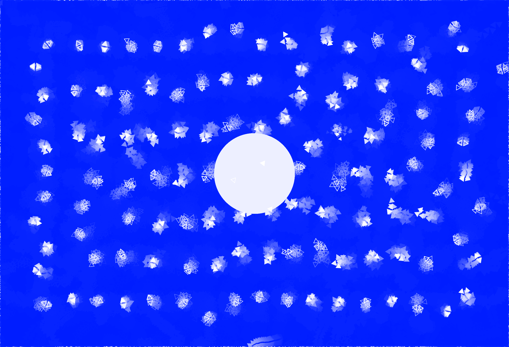

## Thursday, 28th of may

After the feedback I decided to use the interview anyways and to make use of the right of quotation in an educational context. 

**JC           1:26:23**

"Has it affected the way you feel connected to the country?"

**CT          1:27:02**

"Oh, yeah, 100%, it has. And it’s very strange as a child, when I was at school, and it was a very white school, I remember going to school and people used to say to me, your Dad needs to go back to where he come from. And I remember I never ever told my Mum and Dad, but I used to be really frightened as a kid like, oh my gosh, what if they come and take my Dad and then as I got older, I was like, gosh, how irrational that I was even thinking that and then to be like, fast forwarding, like, it really nearly was a possibility. Yeah, I don’t feel uhm.  No, I don’t feel very British, if I’m honest. I don’t feel uhm because I think I’ve seen that it can be taken away really easily. And I don’t feel, especially the government, as it is now, I don’t think it is inclusive. I think it is hostile. So yeah, it’s a funny way to be it’s, it’s hard because my partner, he was born in Germany, and he’s white, and I, we laugh because he’s, I say, like you, you stand a better chance from someone that’s come in to this [country], but it feels like he’s better belonging here than what I am. And I was born here. It’s like, I feel like almost our feelings are switched. You know, like, I feel like, I’m not really settled here. Not that I don’t belong here. But I don’t feel settled here. Like, it doesn’t feel…"

**JC           1:28: 27**

"Like feeling safe, or secure?"

**CT          1:28:30**

"Yeah maybe, but I just, I don’t know. Maybe it’s a bit of resentment. Maybe I don’t really like it. Like how this is all played out. Maybe that’s a bit of a point as well."`

Tobierre, C. (2023). 
Oral History Project: The Windrush Scandal in a Transnational and Commonwealth Context.
Interviewed by Cox, J. 20 March, Chelmsford. 
Available at: https://windrushscandal.org/charlotte-tobierre-interview/ 
[Accessed: 28 May 2026]

I decided to use the audio of that because I wanted to share it in full length and trying to reproduce it as original as possible. 

```javascript

//noprotect

let meAskyou = ["Did you hear about the windrush generation before?",
"What does it have to do with drum and bass?","And how was drum and bass being formed in the UK?"]
let questions = meAskyou.join(' ')
let interview = ["Has it affected the way you feel connected to the country?Oh, yeah, 100%, it has. And it’s very strange as a child, when I was at school, and it was a very white school, I remember going to school and people used to say to me, your Dad needs to go back to where he come from. And I remember I never ever told my Mum and Dad, but I used to be really frightened as a kid like, oh my gosh, what if they come and take my Dad and then as I got older, I was like, gosh, how irrational that I was even thinking that and then to be like, fast forwarding, like, it really nearly was a possibility. Yeah, I don’t feel uhm.  No, I don’t feel very British, if I’m honest. I don’t feel uhm because I think I’ve seen that it can be taken away really easily. And I don’t feel, especially the government, as it is now, I don’t think it is inclusive. I think it is hostile. So yeah, it’s a funny way to be it’s, it’s hard because my partner, he was born in Germany, and he’s white, and I, we laugh because he’s, I say, like you, you stand a better chance from someone that’s come in to this [country], but it feels like he’s better belonging here than what I am. And I was born here. It’s like, I feel like almost our feelings are switched. You know, like, I feel like, I’m not really settled here. Not that I don’t belong here. But I don’t feel settled here. Like, it doesn’t feel. Like feeling safe, or secure?Yeah maybe, but I just, I don’t know. Maybe it’s a bit of resentment. Maybe I don’t really like it. Like how this is all played out. Maybe that’s a bit of a point as well."]
let alphaValue = 100

// Start-Verschiebung für das Scrollen
let yStart = 0;

function setup() {
	createCanvas(windowWidth, windowHeight)
}

function draw() {
	background(0,0,255,alphaValue)
	
	let live = (frameCount % 10)
	frameRate(2); // Leicht erhöht auf 2, damit das Scrollen flüssiger aussieht

	textSize(80);
	
	// BOLD,ITALIC,BOLDITALIC
	textStyle(random([ITALIC,NORMAL]));
	// CHAR Zeilenumbruch no matter what
	textWrap(CHAR);
	// Wichtig: LINKSBÜNDIG, damit der Text links bei x=50 sauber startet
	textAlign(LEFT);
	
	// Dein Glitch für den Zeilenabstand (mindestens 40px, damit es sich nicht völlig überlagert)
	textLeading(40 + (24 * live));

	// Die Schleife zeichnet den Text zeilenweise untereinander auf dem Bildschirm
	// Da textSize=80 ist, erhöhen wir den Y-Schritt auf += 120, sonst überlappen die Zeilen extrem starr
	for (let y = yStart; y < height * 2; y += 120) { 
		// Ein cooler Farbverlauf (Gradient) von Weiß ins Rötliche/Gelbliche basierend auf der Y-Position
		fill(255, y / 4 + 100, 150); 
		
		// KORREKTUR: interview[0] statt 'content', Start bei x=50 und Breite angepasst
		text(interview[0], 50, y, windowWidth - 100); 
	}
	
	// Jedes Frame wandert der Text um 4 Pixel nach oben (Automatisches Scrollen)
	yStart -= 4; 
	
	// Wenn der Text komplett oben rausgescrollt ist, setzen wir ihn zurück
	if (yStart < -windowHeight * 3) {
		yStart = 0;
	}
}
```
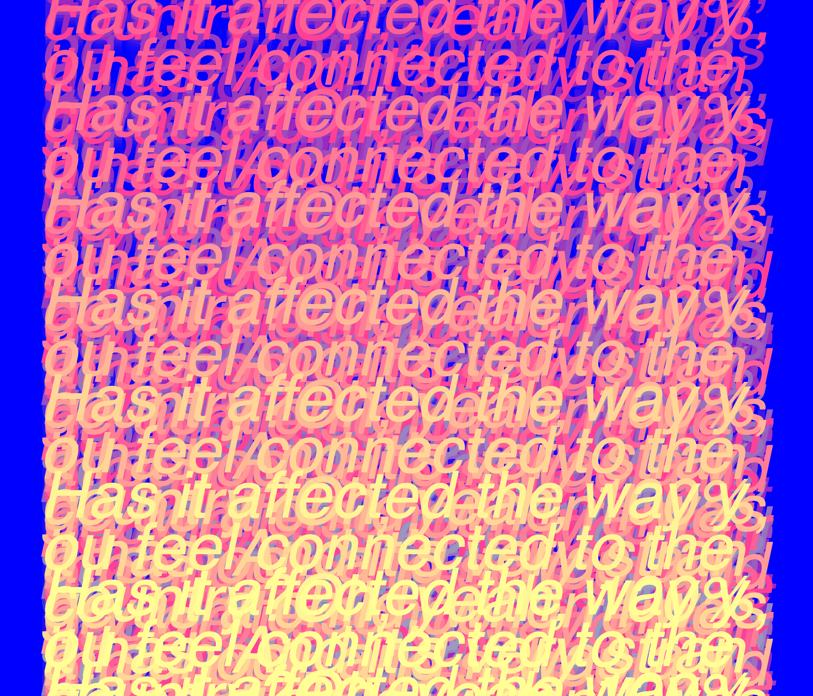
```javascript
function setup() {
	createCanvas(windowWidth, windowHeight)
	setupAudio(true) // if empty, use 'a5.' before audio vars below
	a5.ease = .075
}


function draw() {
	updateAudio();
	background(2,0,200)
	let live= (frameCount%10)
	//frameRate -> 
	frameRate(1);
	background(230);
	textFont("futura")
	//Pixelwert
	textSize(80);
	fill(fftEase/100);
	//BOLD,ITALIC,BOLDITALIC
	textStyle(random([ITALIC,NORMAL]));
	// WORD Zeilenumbruch nach ganzem Wort, CHAR Zeilenumbruch no matter what
	textWrap(CHAR);
	//LEFT linksbündig, RIGHT rechtsbündig, CENTER 
	textAlign(LEFT);
	//default ist textSize 100 -> Leading 100
	textLeading(32*live);
	// um eine Textbox zu machen,die einen Zeilenumbruch macht ("string",posx,posy,wW,wH)
	text("did you hear about the windrush generation before?".repeat(random(20)),100,100,windowWidth/1.2,
	windowHeight);

}
```


```javascript
function setup() {
	createCanvas(windowWidth, windowHeight)
	setupAudio(true) // if empty, use 'a5.' before audio vars below
	a5.ease = .075
}


function draw() {
	updateAudio();
	background(2,0,200)
	let live= (frameCount%10)
	//frameRate -> 
	frameRate(1);
	background(230);
	textFont("futura")
	//Pixelwert
	textSize(80);
	fill(fftEase/100);
	//BOLD,ITALIC,BOLDITALIC
	textStyle(random([ITALIC,NORMAL]));
	// WORD Zeilenumbruch nach ganzem Wort, CHAR Zeilenumbruch no matter what
	textWrap(CHAR);
	//LEFT linksbündig, RIGHT rechtsbündig, CENTER 
	textAlign(LEFT);
	//default ist textSize 100 -> Leading 100
	textLeading(32*live);
	// um eine Textbox zu machen,die einen Zeilenumbruch macht ("string",posx,posy,wW,wH)
	text("did you hear about the windrush generation before?".repeat(random(20)),100,100,windowWidth/1.2,
	windowHeight);

}
```


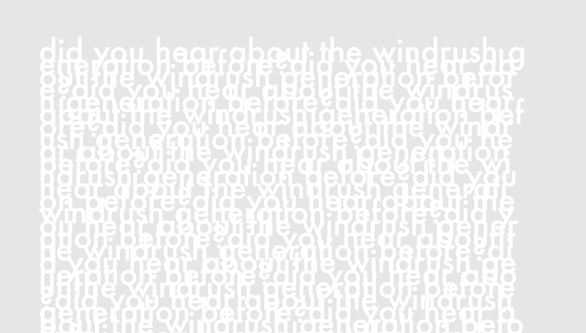

```javascript
let meAskyou = ["Did you hear about the windrush generation before?",
"What does it have to do with drum and bass?","And how was drum and bass being formed in the UK?"]

let questions = meAskyou.join(' ')

let interview = ["Has it affected the way you feel connected to the country?Oh, yeah, 100%, it has. And it’s very strange as a child, when I was at school, and it was a very white school, I remember going to school and people used to say to me, your Dad needs to go back to where he come from. And I remember I never ever told my Mum and Dad, but I used to be really frightened as a kid like, oh my gosh, what if they come and take my Dad and then as I got older, I was like, gosh, how irrational that I was even thinking that and then to be like, fast forwarding, like, it really nearly was a possibility. Yeah, I don’t feel uhm.  No, I don’t feel very British, if I’m honest. I don’t feel uhm because I think I’ve seen that it can be taken away really easily. And I don’t feel, especially the government, as it is now, I don’t think it is inclusive. I think it is hostile. So yeah, it’s a funny way to be it’s, it’s hard because my partner, he was born in Germany, and he’s white, and I, we laugh because he’s, I say, like you, you stand a better chance from someone that’s come in to this [country], but it feels like he’s better belonging here than what I am. And I was born here. It’s like, I feel like almost our feelings are switched. You know, like, I feel like, I’m not really settled here. Not that I don’t belong here. But I don’t feel settled here. Like, it doesn’t feel. Like feeling safe, or secure?Yeah maybe, but I just, I don’t know. Maybe it’s a bit of resentment. Maybe I don’t really like it. Like how this is all played out. Maybe that’s a bit of a point as well."]


function setup() {
	createCanvas(windowWidth, windowHeight)
	setupAudio(true) // if empty, use 'a5.' before audio vars below
	a5.ease = .075
}

function draw() {
	updateAudio();
	background(0,0,255)
	let live= (frameCount%10)
	//frameRate -> 
	frameRate(1);
	//Pixelwert
	textSize(80*fftEase);
	fill(255);
	//BOLD,ITALIC,BOLDITALIC
	textStyle(random([ITALIC,NORMAL]));
	// WORD Zeilenumbruch nach ganzem Wort, CHAR Zeilenumbruch no matter what
	textWrap(CHAR);
	//LEFT linksbündig, RIGHT rechtsbündig, CENTER 
	textAlign(LEFT);
	//default ist textSize 100 -> Leading 100
	textLeading(32*live);
	// um eine Textbox zu machen,die einen Zeilenumbruch macht ("string",posx,posy,wW,wH)
	text(questions.repeat(random(20)),100,100,windowWidth/1.2,
	windowHeight);

}
```


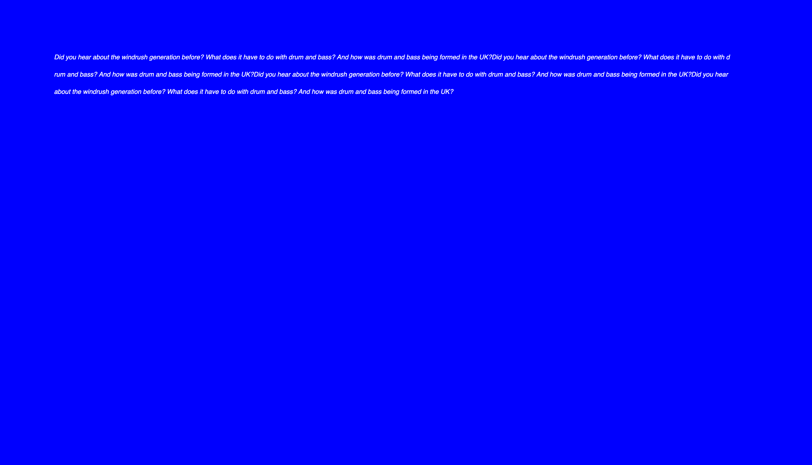

```javascript
let meAskyou = ["Did you hear about the windrush generation before?",
"What does it have to do with drum and bass?","And how was drum and bass being formed in the UK?"]

let questions = meAskyou.join(' ')

let interview = ["Has it affected the way you feel connected to the country?Oh, yeah, 100%, it has. And it’s very strange as a child, when I was at school, and it was a very white school, I remember going to school and people used to say to me, your Dad needs to go back to where he come from. And I remember I never ever told my Mum and Dad, but I used to be really frightened as a kid like, oh my gosh, what if they come and take my Dad and then as I got older, I was like, gosh, how irrational that I was even thinking that and then to be like, fast forwarding, like, it really nearly was a possibility. Yeah, I don’t feel uhm.  No, I don’t feel very British, if I’m honest. I don’t feel uhm because I think I’ve seen that it can be taken away really easily. And I don’t feel, especially the government, as it is now, I don’t think it is inclusive. I think it is hostile. So yeah, it’s a funny way to be it’s, it’s hard because my partner, he was born in Germany, and he’s white, and I, we laugh because he’s, I say, like you, you stand a better chance from someone that’s come in to this [country], but it feels like he’s better belonging here than what I am. And I was born here. It’s like, I feel like almost our feelings are switched. You know, like, I feel like, I’m not really settled here. Not that I don’t belong here. But I don’t feel settled here. Like, it doesn’t feel. Like feeling safe, or secure?Yeah maybe, but I just, I don’t know. Maybe it’s a bit of resentment. Maybe I don’t really like it. Like how this is all played out. Maybe that’s a bit of a point as well."]

let alphaValue =100

function setup() {
	createCanvas(windowWidth, windowHeight)
	setupAudio(true) // if empty, use 'a5.' before audio vars below
	a5.ease = .075
}

function draw() {
	updateAudio();
	background(0,0,255,alphaValue)
	let live= (frameCount%10)
	//frameRate -> 
	frameRate(1);
	//Pixelwert
	textSize(80);
	fill(255);
	//BOLD,ITALIC,BOLDITALIC
	textStyle(random([ITALIC,NORMAL]));
	// WORD Zeilenumbruch nach ganzem Wort, CHAR Zeilenumbruch no matter what
	textWrap(CHAR);
	//LEFT linksbündig, RIGHT rechtsbündig, CENTER 
	textAlign(LEFT);
	//default ist textSize 100 -> Leading 100
	textLeading(32*live);
	// um eine Textbox zu machen,die einen Zeilenumbruch macht ("string",posx,posy,wW,wH)
	text(questions.repeat(random(20)),100,100,windowWidth/1.2,
	windowHeight);

}
```


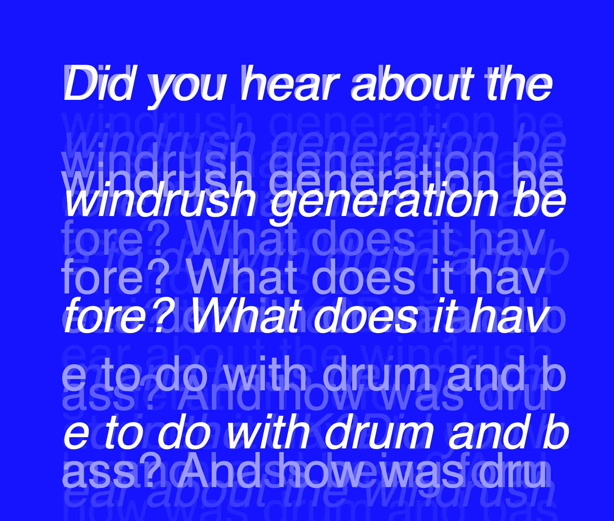

Because of the textWrap(CHAR) sometimes the text starts at another line after one letter so I realized that (WORD) would be better.

```javascript
let meAskyou = ["Did you hear about the windrush generation before?",
"What does it have to do with drum and bass?","And how was drum and bass being formed in the UK?"]

let questions = meAskyou.join(' ')

let interview = ["Has it affected the way you feel connected to the country?Oh, yeah, 100%, it has. And it’s very strange as a child, when I was at school, and it was a very white school, I remember going to school and people used to say to me, your Dad needs to go back to where he come from. And I remember I never ever told my Mum and Dad, but I used to be really frightened as a kid like, oh my gosh, what if they come and take my Dad and then as I got older, I was like, gosh, how irrational that I was even thinking that and then to be like, fast forwarding, like, it really nearly was a possibility. Yeah, I don’t feel uhm.  No, I don’t feel very British, if I’m honest. I don’t feel uhm because I think I’ve seen that it can be taken away really easily. And I don’t feel, especially the government, as it is now, I don’t think it is inclusive. I think it is hostile. So yeah, it’s a funny way to be it’s, it’s hard because my partner, he was born in Germany, and he’s white, and I, we laugh because he’s, I say, like you, you stand a better chance from someone that’s come in to this [country], but it feels like he’s better belonging here than what I am. And I was born here. It’s like, I feel like almost our feelings are switched. You know, like, I feel like, I’m not really settled here. Not that I don’t belong here. But I don’t feel settled here. Like, it doesn’t feel. Like feeling safe, or secure?Yeah maybe, but I just, I don’t know. Maybe it’s a bit of resentment. Maybe I don’t really like it. Like how this is all played out. Maybe that’s a bit of a point as well."]

let alphaValue =100

function setup() {
	createCanvas(windowWidth, windowHeight)
}

function draw() {
	background(0,0,255,alphaValue)
	let live= (frameCount%10)
	//frameRate -> 
	frameRate(1);
	//Pixelwert
	textSize(80);
	fill(255);
	//BOLD,ITALIC,BOLDITALIC
	textStyle(random([ITALIC,NORMAL]));
	// WORD Zeilenumbruch nach ganzem Wort, CHAR Zeilenumbruch no matter what
	textWrap(CHAR);
	//LEFT linksbündig, RIGHT rechtsbündig, CENTER 
	textAlign(LEFT);
	//default ist textSize 100 -> Leading 100
	textLeading(32*live);
	// um eine Textbox zu machen,die einen Zeilenumbruch macht ("string",posx,posy,wW,wH)
	text(questions.repeat(random(20)),100,100,windowWidth/1.2,
	windowHeight);

}

```


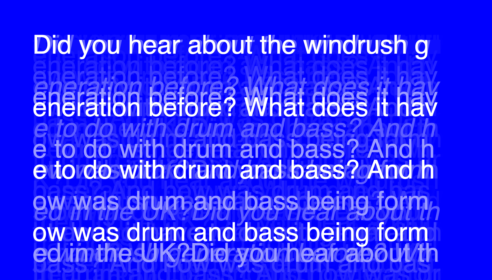

```javascript
let meAskyou = ["Did you hear about the windrush generation before?",
"What does it have to do with drum and bass?","And how was drum and bass being formed in the UK?"]

let questions = meAskyou.join(' ')

let interview = ["Has it affected the way you feel connected to the country?Oh, yeah, 100%, it has. And it’s very strange as a child, when I was at school, and it was a very white school, I remember going to school and people used to say to me, your Dad needs to go back to where he come from. And I remember I never ever told my Mum and Dad, but I used to be really frightened as a kid like, oh my gosh, what if they come and take my Dad and then as I got older, I was like, gosh, how irrational that I was even thinking that and then to be like, fast forwarding, like, it really nearly was a possibility. Yeah, I don’t feel uhm.  No, I don’t feel very British, if I’m honest. I don’t feel uhm because I think I’ve seen that it can be taken away really easily. And I don’t feel, especially the government, as it is now, I don’t think it is inclusive. I think it is hostile. So yeah, it’s a funny way to be it’s, it’s hard because my partner, he was born in Germany, and he’s white, and I, we laugh because he’s, I say, like you, you stand a better chance from someone that’s come in to this [country], but it feels like he’s better belonging here than what I am. And I was born here. It’s like, I feel like almost our feelings are switched. You know, like, I feel like, I’m not really settled here. Not that I don’t belong here. But I don’t feel settled here. Like, it doesn’t feel. Like feeling safe, or secure?Yeah maybe, but I just, I don’t know. Maybe it’s a bit of resentment. Maybe I don’t really like it. Like how this is all played out. Maybe that’s a bit of a point as well."]

let alphaValue =100

let textY = 100;

function setup() {
	createCanvas(windowWidth, windowHeight)
	setupAudio(true) // if empty, use 'a5.' before audio vars below
	a5.ease = .075 // customize ease speed, lower values make it smoother
}

function draw() {
	/* audio vars: amp, ampL, ampR, ampEase, fft, fftEase, waveform, waveformEase */
	updateAudio()
	for(let i = 0; i < fftEase.length; i++) {
		let freq = fftEase[i]; // (0, 255)
		let x = map(i, 0, fftEase.length, 0, width)
		let w = width / fftEase.length
		rect(x, height * .805, w, freq)
	}
	background(0,0,255,alphaValue)
	let live= (frameCount%10)
	//frameRate -> 
	frameRate(1);
	//Pixelwert
	textSize(80);
	fill(255);
	//BOLD,ITALIC,BOLDITALIC
	textStyle(random([ITALIC,NORMAL]));
	// WORD Zeilenumbruch nach ganzem Wort, CHAR Zeilenumbruch no matter what
	textWrap(CHAR);
	//LEFT linksbündig, RIGHT rechtsbündig, CENTER 
	textAlign(LEFT);
	//default ist textSize 100 -> Leading 100
	textLeading(32*live);
	// um eine Textbox zu machen,die einen Zeilenumbruch macht ("string",posx,posy,wW,wH)
	//text(questions.repeat(random(20)),100,100,windowWidth/1.2,	windowHeight);
	text(interview,100,textY,windowWidth/1.2,windowHeight);

}
//scrollen
function mousePressed() {
  // Verschiebt den Text bei jedem Klick um 150 Pixel nach oben
  textY -= 150; 
}
```

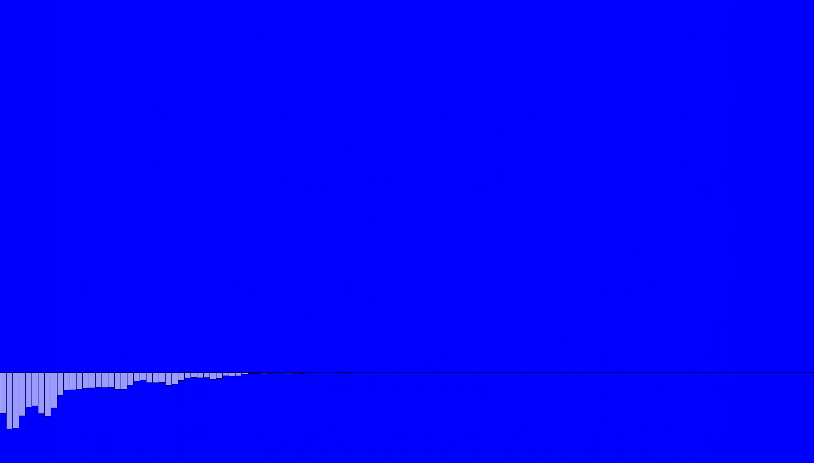

```javascript
//noprotect
let meAskyou = ["Did you hear about the windrush generation before?",
"What does it have to do with drum and bass?",
"And how was drum and bass being formed in the UK?"]
let questions = meAskyou.join(' ')
let interview = ["Has it affected the way you feel connected to the country?Oh, yeah, 100%, it has. And it’s very strange as a child, when I was at school, and it was a very white school, I remember going to school and people used to say to me, your Dad needs to go back to where he come from. And I remember I never ever told my Mum and Dad, but I used to be really frightened as a kid like, oh my gosh, what if they come and take my Dad and then as I got older, I was like, gosh, how irrational that I was even thinking that and then to be like, fast forwarding, like, it really nearly was a possibility. Yeah, I don’t feel uhm.  No, I don’t feel very British, if I’m honest. I don’t feel uhm because I think I’ve seen that it can be taken away really easily. And I don’t feel, especially the government, as it is now, I don’t think it is inclusive. I think it is hostile. So yeah, it’s a funny way to be it’s, it’s hard because my partner, he was born in Germany, and he’s white, and I, we laugh because he’s, I say, like you, you stand a better chance from someone that’s come in to this [country], but it feels like he’s better belonging here than what I am. And I was born here. It’s like, I feel like almost our feelings are switched. You know, like, I feel like, I’m not really settled here. Not that I don’t belong here. But I don’t feel settled here. Like, it doesn’t feel. Like feeling safe, or secure?Yeah maybe, but I just, I don’t know. Maybe it’s a bit of resentment. Maybe I don’t really like it. Like how this is all played out. Maybe that’s a bit of a point as well."]
let alphaValue =100

function setup() {
	createCanvas(windowWidth, windowHeight)
}

function draw() {

	background(0,0,255,alphaValue)
	let live= (frameCount%10)
	//frameRate -> 
	frameRate(1);
	//Pixelwert
	textSize(80);
	fill(255);
	//BOLD,ITALIC,BOLDITALIC
	textStyle(random([ITALIC,NORMAL]));
	// WORD Zeilenumbruch nach ganzem Wort, CHAR Zeilenumbruch no matter what
	textWrap(WORD);
	//LEFT linksbündig, RIGHT rechtsbündig, CENTER 
	textAlign(LEFT);
	//default ist textSize 100 -> Leading 100
	textLeading(32*live);
	// um eine Textbox zu machen,die einen Zeilenumbruch macht ("string",posx,posy,wW,wH)
	text(questions.repeat(random(20)),100,100,windowWidth/1.2,	windowHeight);
	//text(interview[0], 50, 100, windowWidth - 100)
}
```

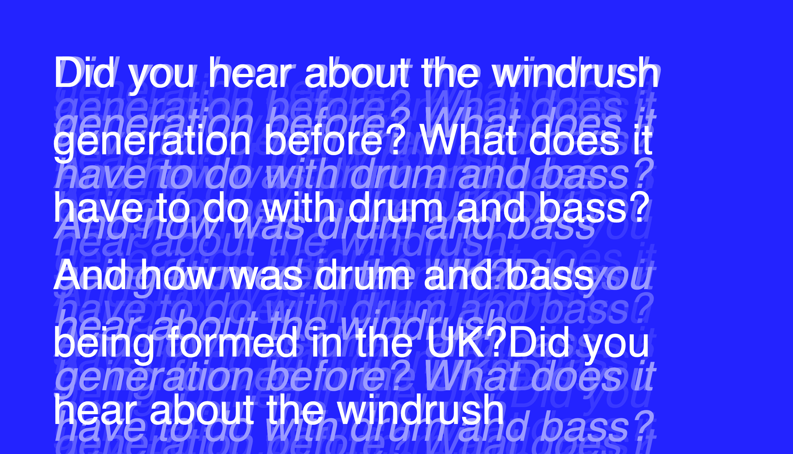

```javascript
//noprotect
let meAskyou = ["Did you hear about the windrush generation before?",
"What does it have to do with drum and bass?",
"And how was drum and bass being formed in the UK?"]
let questions = meAskyou.join(' ')
let interview = ["Has it affected the way you feel connected to the country?Oh, yeah, 100%, it has. And it’s very strange as a child, when I was at school, and it was a very white school, I remember going to school and people used to say to me, your Dad needs to go back to where he come from. And I remember I never ever told my Mum and Dad, but I used to be really frightened as a kid like, oh my gosh, what if they come and take my Dad and then as I got older, I was like, gosh, how irrational that I was even thinking that and then to be like, fast forwarding, like, it really nearly was a possibility. Yeah, I don’t feel uhm.  No, I don’t feel very British, if I’m honest. I don’t feel uhm because I think I’ve seen that it can be taken away really easily. And I don’t feel, especially the government, as it is now, I don’t think it is inclusive. I think it is hostile. So yeah, it’s a funny way to be it’s, it’s hard because my partner, he was born in Germany, and he’s white, and I, we laugh because he’s, I say, like you, you stand a better chance from someone that’s come in to this [country], but it feels like he’s better belonging here than what I am. And I was born here. It’s like, I feel like almost our feelings are switched. You know, like, I feel like, I’m not really settled here. Not that I don’t belong here. But I don’t feel settled here. Like, it doesn’t feel. Like feeling safe, or secure?Yeah maybe, but I just, I don’t know. Maybe it’s a bit of resentment. Maybe I don’t really like it. Like how this is all played out. Maybe that’s a bit of a point as well."]
let alphaValue =100

function setup() {
	createCanvas(windowWidth, windowHeight)
}

function draw() {

	background(0,0,255,alphaValue)
	let live= (frameCount%10)
	//frameRate -> 
	frameRate(1);
	//Pixelwert
	textSize(80);
	fill(255);
	//BOLD,ITALIC,BOLDITALIC
	textStyle(random([ITALIC,NORMAL]));
	// WORD Zeilenumbruch nach ganzem Wort, CHAR Zeilenumbruch no matter what
	textWrap(WORD);
	//LEFT linksbündig, RIGHT rechtsbündig, CENTER 
	textAlign(LEFT);
	//default ist textSize 100 -> Leading 100
	textLeading(32*live);
	// um eine Textbox zu machen,die einen Zeilenumbruch macht ("string",posx,posy,wW,wH)
	text(questions.repeat(random(20)),100,100,windowWidth/1.2,	windowHeight);
	//text(interview[0], 50, 100, windowWidth - 100)
}
```


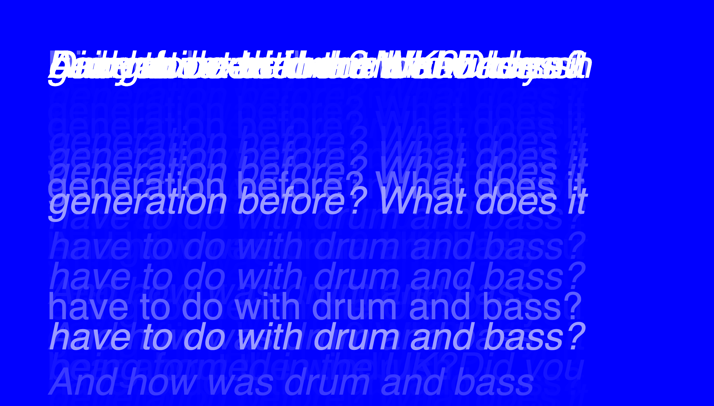


With Dominique I decided to create the opening scene of the visuals for our performance in a concrete poetry kind of style (i really liked the input with Jasmin), whilst playing some audio snippets. 

First we also thought that it could make sense to play the audio of the interview and also reproduce it as a quotation in a concrete poetry kind of way. But then we decided that it would be too long and we wanted to give the flocking more space.

```javascript
let scrollText = ` "Has it affected the way you feel connected to the country?
Oh, yeah, 100%, it has. And it’s very strange as a child, 
when I was at school, and it was a very white school, I remember 
going to school and people used to say to me, your Dad needs 
to go back to where he come from. And I remember I never ever 
told my Mum and Dad, but I used to be really frightened as a kid 
like, oh my gosh, what if they come and take my Dad and then as I 
got older, I was like, gosh, how irrational that I was even thinking 
that and then to be like, fast forwarding, like, it really nearly 
was a possibility. Yeah, I don’t feel uhm.  No, I don’t feel very British, 
if I’m honest. I don’t feel uhm because I think I’ve seen that it can be 
taken away really easily. And I don’t feel, especially the government, 
as it is now, I don’t think it is inclusive. I think it is hostile. So 
yeah, it’s a funny way to be it’s, it’s hard because my partner, he was 
born in Germany, and he’s white, and I, we laugh because he’s, I say, like 
you, you stand a better chance from someone that’s come in to this [country], 
but it feels like he’s better belonging here than what I am. And I was born here. 
It’s like, I feel like almost our feelings are switched. You know, like, I feel 
like, I’m not really settled here. Not that I don’t belong here. But I don’t 
feel settled here. Like, it doesn’t feel. Like feeling safe, or secure?
Yeah maybe, but I just, I don’t know. Maybe it’s a bit of resentment. Maybe 
I don’t really like it. Like how this is all played out. Maybe that’s a bit 
of a point as well." `;

let yPos=0;

function setup() {
  createCanvas(windowWidth, windowHeight);
  setupAudio(true) // if empty, use 'a5.' before audio vars below
 a5.ease = .075 // customize ease speed, lower values make it smoother
 // Startet den Text am unteren Bildschirmrand
  yPos = height;
}

function draw() {
	
 updateAudio()
 let blueTone = map(fftEase,0,0,255)

  background(0, 0,255,5);
  
  textAlign(LEFT, TOP); // TOP hilft bei der vertikalen Ausrichtung
  fill(255);
  textSize(80);
  textWrap(WORD);
  textStyle(random([ITALIC,NORMAL]))
  textLeading(95); // Verhindert, dass die großen Zeilen ineinanderlaufen
  

  text(scrollText, 100, yPos, windowWidth - 200, 10000);
  
  // Geschwindigkeit des Scrollens, umso tiefer, desto langsamer
  yPos -= 1; 
  
//zurücksetzen
  if (yPos < -2800) {
    yPos = height;
  }
}
```
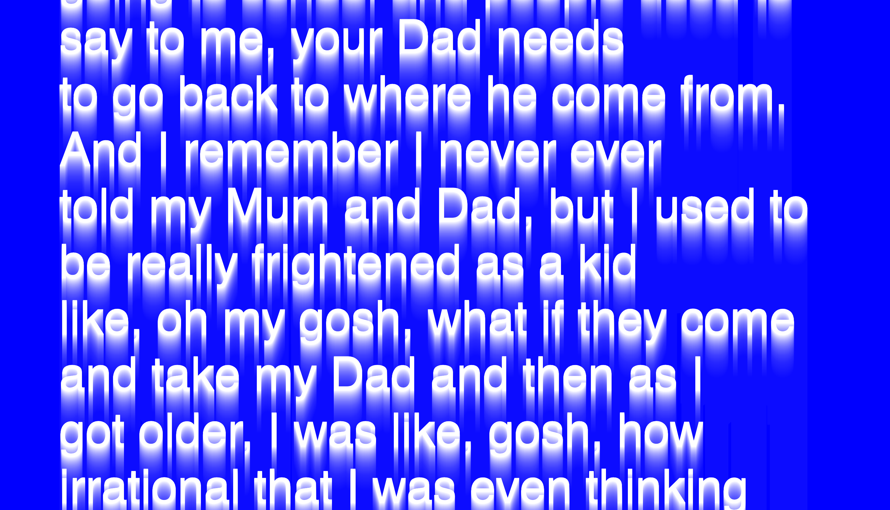

```javascript
let scrollText = ` "Has it affected the way you feel connected to the country?
Oh, yeah, 100%, it has. And it’s very strange as a child, 
when I was at school, and it was a very white school, I remember 
going to school and people used to say to me, your Dad needs 
to go back to where he come from. And I remember I never ever 
told my Mum and Dad, but I used to be really frightened as a kid 
like, oh my gosh, what if they come and take my Dad and then as I 
got older, I was like, gosh, how irrational that I was even thinking 
that and then to be like, fast forwarding, like, it really nearly 
was a possibility. Yeah, I don’t feel uhm.  No, I don’t feel very British, 
if I’m honest. I don’t feel uhm because I think I’ve seen that it can be 
taken away really easily. And I don’t feel, especially the government, 
as it is now, I don’t think it is inclusive. I think it is hostile. So 
yeah, it’s a funny way to be it’s, it’s hard because my partner, he was 
born in Germany, and he’s white, and I, we laugh because he’s, I say, like 
you, you stand a better chance from someone that’s come in to this [country], 
but it feels like he’s better belonging here than what I am. And I was born here. 
It’s like, I feel like almost our feelings are switched. You know, like, I feel 
like, I’m not really settled here. Not that I don’t belong here. But I don’t 
feel settled here. Like, it doesn’t feel. Like feeling safe, or secure?
Yeah maybe, but I just, I don’t know. Maybe it’s a bit of resentment. Maybe 
I don’t really like it. Like how this is all played out. Maybe that’s a bit 
of a point as well." `;

let meAskyou = ["Did you hear about the windrush generation before?",
"What does it have to do with drum and bass?",
"And how was drum and bass being formed in the UK?"]
let questions = meAskyou.join(' ')

let yPos=0;


function setup() {
  createCanvas(windowWidth, windowHeight);
  setupAudio(true) // if empty, use 'a5.' before audio vars below
 a5.ease = .075 // customize ease speed, lower values make it smoother
 // Startet den Text am unteren Bildschirmrand
  yPos = height;
}

function draw() {
	
 updateAudio()
 let live= (frameCount%10)
	//frameRate -> 
 let blueTone = map(fftEase,0,0,255)

  background(0, 0,255,5);
  
  //default ist textSize 100 -> Leading 100
	textLeading(32*live);
	// um eine Textbox zu machen,die einen Zeilenumbruch macht ("string",posx,posy,wW,wH)
	text(questions.repeat(random(20)),100,100,windowWidth/1.2,	windowHeight);
  
  textAlign(LEFT, TOP); // TOP hilft bei der vertikalen Ausrichtung
  fill(255);
  textSize(80);
  textWrap(WORD);
  textStyle(random([ITALIC,NORMAL]))
  textLeading(95); // Verhindert, dass die großen Zeilen ineinanderlaufen
  

  text(scrollText, 100, yPos, windowWidth - 200, 10000);
  
 
  
 // Geschwindigkeit des Scrollens, umso tiefer, desto langsamer
  yPos -= 1; 
  
//zurücksetzen
  if (yPos < -2800) {
    yPos = height;
  }
}
```

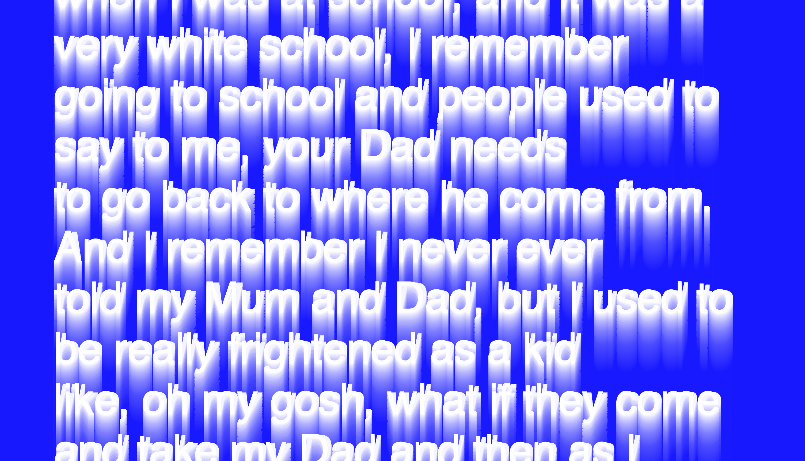

```javascript
let scrollText = ` "Has it affected the way you feel connected to the country?
Oh, yeah, 100%, it has. And it’s very strange as a child, 
when I was at school, and it was a very white school, I remember 
going to school and people used to say to me, your Dad needs 
to go back to where he come from. And I remember I never ever 
told my Mum and Dad, but I used to be really frightened as a kid 
like, oh my gosh, what if they come and take my Dad and then as I 
got older, I was like, gosh, how irrational that I was even thinking 
that and then to be like, fast forwarding, like, it really nearly 
was a possibility. Yeah, I don’t feel uhm.  No, I don’t feel very British, 
if I’m honest. I don’t feel uhm because I think I’ve seen that it can be 
taken away really easily. And I don’t feel, especially the government, 
as it is now, I don’t think it is inclusive. I think it is hostile. So 
yeah, it’s a funny way to be it’s, it’s hard because my partner, he was 
born in Germany, and he’s white, and I, we laugh because he’s, I say, like 
you, you stand a better chance from someone that’s come in to this [country], 
but it feels like he’s better belonging here than what I am. And I was born here. 
It’s like, I feel like almost our feelings are switched. You know, like, I feel 
like, I’m not really settled here. Not that I don’t belong here. But I don’t 
feel settled here. Like, it doesn’t feel. Like feeling safe, or secure?
Yeah maybe, but I just, I don’t know. Maybe it’s a bit of resentment. Maybe 
I don’t really like it. Like how this is all played out. Maybe that’s a bit 
of a point as well." `;

let meAskyou = ["Did you hear about the windrush generation before?",
"What does it have to do with drum and bass?",
"And how was drum and bass being formed in the UK?"]
let questions = meAskyou.join(' ')

let yPos=0;


function setup() {
  createCanvas(windowWidth, windowHeight);
  setupAudio(true) // if empty, use 'a5.' before audio vars below
 a5.ease = .075 // customize ease speed, lower values make it smoother
 // Startet den Text am unteren Bildschirmrand
  yPos = height;
}

function draw() {
	
 updateAudio()
 let live= (frameCount%50)
	//frameRate -> 
 let blueTone = map(fftEase,0,1024,0,255)

  background(0, 0,255,2);
  
  /*
  //default ist textSize 100 -> Leading 100
	textLeading(32*live);
	// um eine Textbox zu machen,die einen Zeilenumbruch macht ("string",posx,posy,wW,wH)
	text(questions.repeat(random(20)),100,100,windowWidth/1.2,	windowHeight);
  */
  textAlign(LEFT, TOP); // TOP hilft bei der vertikalen Ausrichtung
  fill(255);
  textSize(80);
  textWrap(WORD);
  textStyle(random([ITALIC,NORMAL]))
  textLeading(95); // Verhindert, dass die Zeilen ineinanderlaufen
  

  text(scrollText, 100, yPos, windowWidth - 200, 10000);
  
 // Geschwindigkeit des Scrollens, umso tiefer, desto langsamer
  yPos -= 1; 
  
//zurücksetzen
  if (yPos < -2800) {
    yPos = height;
  }
}
```

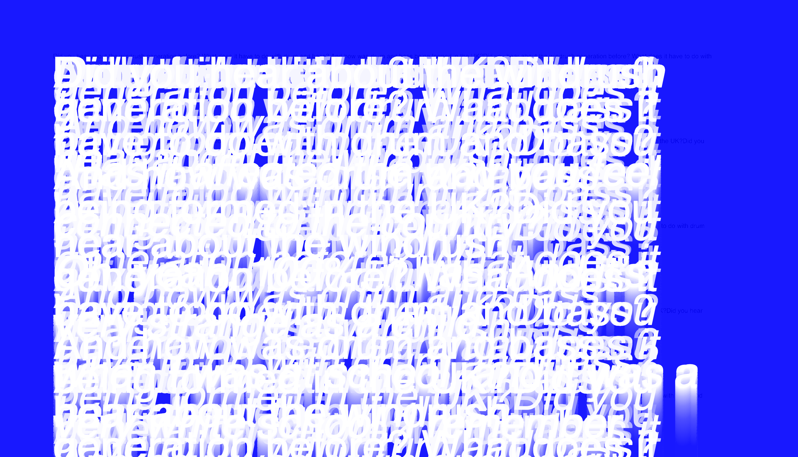
```javascript
let scrollText = ` "Has it affected the way you feel connected to the country?
Oh, yeah, 100%, it has. And it’s very strange as a child, 
when I was at school, and it was a very white school, I remember 
going to school and people used to say to me, your Dad needs 
to go back to where he come from. And I remember I never ever 
told my Mum and Dad, but I used to be really frightened as a kid 
like, oh my gosh, what if they come and take my Dad and then as I 
got older, I was like, gosh, how irrational that I was even thinking 
that and then to be like, fast forwarding, like, it really nearly 
was a possibility. Yeah, I don’t feel uhm.  No, I don’t feel very British, 
if I’m honest. I don’t feel uhm because I think I’ve seen that it can be 
taken away really easily. And I don’t feel, especially the government, 
as it is now, I don’t think it is inclusive. I think it is hostile. So 
yeah, it’s a funny way to be it’s, it’s hard because my partner, he was 
born in Germany, and he’s white, and I, we laugh because he’s, I say, like 
you, you stand a better chance from someone that’s come in to this [country], 
but it feels like he’s better belonging here than what I am. And I was born here. 
It’s like, I feel like almost our feelings are switched. You know, like, I feel 
like, I’m not really settled here. Not that I don’t belong here. But I don’t 
feel settled here. Like, it doesn’t feel. Like feeling safe, or secure?
Yeah maybe, but I just, I don’t know. Maybe it’s a bit of resentment. Maybe 
I don’t really like it. Like how this is all played out. Maybe that’s a bit 
of a point as well." `;

let meAskyou = ["Did you hear about the windrush generation before?",
"What does it have to do with drum and bass?",
"And how was drum and bass being formed in the UK?"]
let questions = meAskyou.join(' ')

let yPos=0;


function setup() {
  createCanvas(windowWidth, windowHeight);
  setupAudio(true) // if empty, use 'a5.' before audio vars below
 a5.ease = .075 // customize ease speed, lower values make it smoother
 // Startet den Text am unteren Bildschirmrand
  yPos = height;
}

function draw() {
	
 updateAudio()
 let live= (frameCount%10)
	//frameRate -> 
frameRate(1)
  background(0, 0,255,2);
  
  
  //default ist textSize 100 -> Leading 100
	textLeading(32*live);
	// um eine Textbox zu machen,die einen Zeilenumbruch macht ("string",posx,posy,wW,wH)
	text(questions.repeat(random(20)),100,100,windowWidth/1.2,	windowHeight);
  
  // TOP für die vertikale Ausrichtung
  textAlign(LEFT, TOP); 
  fill(255);
  textSize(80);
  textWrap(WORD);
  textStyle(random([NORMAL,ITALIC]))
  textLeading(95); 
  

  text(scrollText, 100, yPos, windowWidth - 200, 10000);
  
 
  
 // Geschwindigkeit des Scrollens, umso tiefer, desto langsamer
  yPos -= 1; 
  
//zurücksetzen
  if (yPos < -2800) {
    yPos = height;
  }
}
```

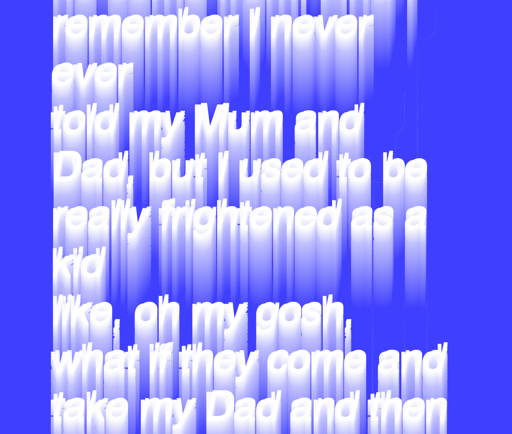

```javascript
let scrollText = ` "Has it affected the way you feel connected to the country?
Oh, yeah, 100%, it has. And it’s very strange as a child, 
when I was at school, and it was a very white school, I remember 
going to school and people used to say to me, your Dad needs 
to go back to where he come from. And I remember I never ever 
told my Mum and Dad, but I used to be really frightened as a kid 
like, oh my gosh, what if they come and take my Dad and then as I 
got older, I was like, gosh, how irrational that I was even thinking 
that and then to be like, fast forwarding, like, it really nearly 
was a possibility. Yeah, I don’t feel uhm.  No, I don’t feel very British, 
if I’m honest. I don’t feel uhm because I think I’ve seen that it can be 
taken away really easily. And I don’t feel, especially the government, 
as it is now, I don’t think it is inclusive. I think it is hostile. So 
yeah, it’s a funny way to be it’s, it’s hard because my partner, he was 
born in Germany, and he’s white, and I, we laugh because he’s, I say, like 
you, you stand a better chance from someone that’s come in to this [country], 
but it feels like he’s better belonging here than what I am. And I was born here. 
It’s like, I feel like almost our feelings are switched. You know, like, I feel 
like, I’m not really settled here. Not that I don’t belong here. But I don’t 
feel settled here. Like, it doesn’t feel. Like feeling safe, or secure?
Yeah maybe, but I just, I don’t know. Maybe it’s a bit of resentment. Maybe 
I don’t really like it. Like how this is all played out. Maybe that’s a bit 
of a point as well." `;

let meAskyou = ["Did you hear about the windrush generation before?",
"What does it have to do with drum and bass?",
"And how was drum and bass being formed in the UK?"]
let questions = meAskyou.join(' ')

let yPos=0;


function setup() {
  createCanvas(windowWidth, windowHeight);
  setupAudio(true) // if empty, use 'a5.' before audio vars below
 a5.ease = .075 // customize ease speed, lower values make it smoother
 // Startet den Text am unteren Bildschirmrand
  yPos = height;
}

function draw() {
	
 updateAudio()
 let live= (frameCount%10)
	//frameRate -> 
  //frameRate(30);
  
  background(0, 0,255,2);
  
  /*
  //default ist textSize 100 -> Leading 100
	textLeading(32*live);
	// um eine Textbox zu machen,die einen Zeilenumbruch macht ("string",posx,posy,wW,wH)
	text(questions.repeat(random(20)),100,100,windowWidth/1.2,	windowHeight);
  */
  
  // TOP für die vertikale Ausrichtung
  textAlign(LEFT, TOP); 
  fill(255);
  textSize(80);
  textWrap(WORD);
 // textStyle(random([NORMAL,ITALIC]))
if (fftEase > 40) {
  textStyle(BOLDITALIC); // Aggressiver Look bei viel Bass
} else {
  textStyle(NORMAL);     // Ruhiger Look bei leisen Passagen
}
  textLeading(95); 
  

  text(scrollText, 100, yPos, windowWidth - 200, 10000);
  
 
  
 // Geschwindigkeit des Scrollens, umso tiefer, desto langsamer
  yPos -= 1; 
  
//zurücksetzen
  if (yPos < -2800) {
    yPos = height;
  }
}
```

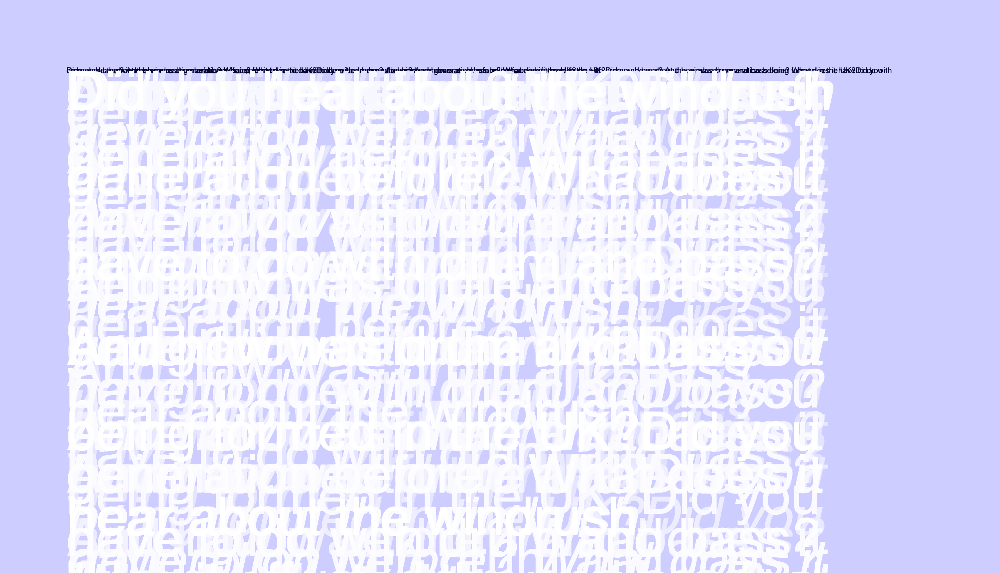

```javascript
let scrollText = ` "Has it affected the way you feel connected to the country?
Oh, yeah, 100%, it has. And it’s very strange as a child, 
when I was at school, and it was a very white school, I remember 
going to school and people used to say to me, your Dad needs 
to go back to where he come from. And I remember I never ever 
told my Mum and Dad, but I used to be really frightened as a kid 
like, oh my gosh, what if they come and take my Dad and then as I 
got older, I was like, gosh, how irrational that I was even thinking 
that and then to be like, fast forwarding, like, it really nearly 
was a possibility. Yeah, I don’t feel uhm.  No, I don’t feel very British, 
if I’m honest. I don’t feel uhm because I think I’ve seen that it can be 
taken away really easily. And I don’t feel, especially the government, 
as it is now, I don’t think it is inclusive. I think it is hostile. So 
yeah, it’s a funny way to be it’s, it’s hard because my partner, he was 
born in Germany, and he’s white, and I, we laugh because he’s, I say, like 
you, you stand a better chance from someone that’s come in to this [country], 
but it feels like he’s better belonging here than what I am. And I was born here. 
It’s like, I feel like almost our feelings are switched. You know, like, I feel 
like, I’m not really settled here. Not that I don’t belong here. But I don’t 
feel settled here. Like, it doesn’t feel. Like feeling safe, or secure?
Yeah maybe, but I just, I don’t know. Maybe it’s a bit of resentment. Maybe 
I don’t really like it. Like how this is all played out. Maybe that’s a bit 
of a point as well." `;

let meAskyou = ["Did you hear about the windrush generation before?",
"What does it have to do with drum and bass?",
"And how was drum and bass being formed in the UK?"]
let questions = meAskyou.join(' ')

let yPos=0;


function setup() {
  createCanvas(windowWidth, windowHeight);
  setupAudio(true) // if empty, use 'a5.' before audio vars below
 a5.ease = .075 // customize ease speed, lower values make it smoother
 // Startet den Text am unteren Bildschirmrand
  yPos = height;
}

function draw() {
	
 updateAudio()
 let live= (frameCount%8)
	//frameRate -> 
  frameRate(1);
  
  background(0, 0,255,20);
  
  
  //default ist textSize 100 -> Leading 100
  fill(255)
  textSize(80)
  textWrap(WORD)
	textLeading(32*live);
	// um eine Textbox zu machen,die einen Zeilenumbruch macht ("string",posx,posy,wW,wH)
	text(questions.repeat(random(20)),100,100,windowWidth/1.2,	windowHeight);
  
  /*
  // TOP für die vertikale Ausrichtung
  textAlign(LEFT, TOP); 
  fill(255);
  textSize(80);
  textWrap(WORD);
  */
 // textStyle(random([NORMAL,ITALIC]))
if (fftEase[100] > 40) {
  textStyle(BOLDITALIC); // Aggressiver Look bei viel Bass
} else {
  textStyle(NORMAL);     // Ruhiger Look bei leisen Passagen
}
  //textLeading(95); 
  // text(scrollText, 100, yPos, windowWidth - 200, 10000);
  
 
  
 // Geschwindigkeit des Scrollens, umso tiefer, desto langsamer
  yPos -= 1; 
  
//zurücksetzen
  if (yPos < -2800) {
    yPos = height;
  }
}
```


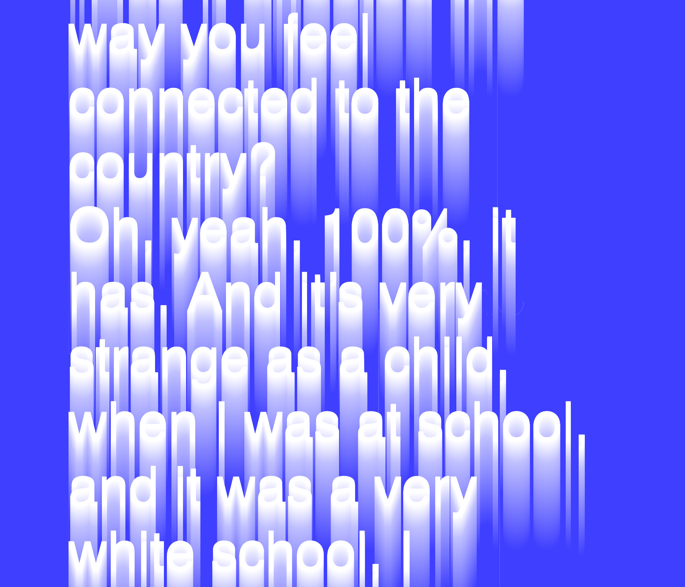

```javascript
let scrollText = ` "Has it affected the way you feel connected to the country?
Oh, yeah, 100%, it has. And it’s very strange as a child, 
when I was at school, and it was a very white school, I remember 
going to school and people used to say to me, your Dad needs 
to go back to where he come from. And I remember I never ever 
told my Mum and Dad, but I used to be really frightened as a kid 
like, oh my gosh, what if they come and take my Dad and then as I 
got older, I was like, gosh, how irrational that I was even thinking 
that and then to be like, fast forwarding, like, it really nearly 
was a possibility. Yeah, I don’t feel uhm.  No, I don’t feel very British, 
if I’m honest. I don’t feel uhm because I think I’ve seen that it can be 
taken away really easily. And I don’t feel, especially the government, 
as it is now, I don’t think it is inclusive. I think it is hostile. So 
yeah, it’s a funny way to be it’s, it’s hard because my partner, he was 
born in Germany, and he’s white, and I, we laugh because he’s, I say, like 
you, you stand a better chance from someone that’s come in to this [country], 
but it feels like he’s better belonging here than what I am. And I was born here. 
It’s like, I feel like almost our feelings are switched. You know, like, I feel 
like, I’m not really settled here. Not that I don’t belong here. But I don’t 
feel settled here. Like, it doesn’t feel. Like feeling safe, or secure?
Yeah maybe, but I just, I don’t know. Maybe it’s a bit of resentment. Maybe 
I don’t really like it. Like how this is all played out. Maybe that’s a bit 
of a point as well." `;

let meAskyou = ["Did you hear about the windrush generation before?",
"What does it have to do with drum and bass?",
"And how was drum and bass being formed in the UK?"]
let questions = meAskyou.join(' ')

let yPos=0;


function setup() {
  createCanvas(windowWidth, windowHeight);
  setupAudio(true) // if empty, use 'a5.' before audio vars below
 a5.ease = .075 // customize ease speed, lower values make it smoother
 // Startet den Text am unteren Bildschirmrand
  yPos = height;
}

function draw() {
	
 updateAudio()
 let live= (frameCount%8)
	//frameRate -> 
  frameRate(1);
  
  background(0, 0,255,20);
  
  
  //default ist textSize 100 -> Leading 100
  fill(255)
  textSize(80)
  textWrap(WORD)
	textLeading(32*live);
	// um eine Textbox zu machen,die einen Zeilenumbruch macht ("string",posx,posy,wW,wH)
	text(questions.repeat(random(20)),100,100,windowWidth/1.2,	windowHeight);
  
  //interview
  /*
  // TOP für die vertikale Ausrichtung
  textAlign(LEFT, TOP); 
  fill(255);
  textSize(80);
  textWrap(WORD);
  */
 // textStyle(random([NORMAL,ITALIC]))
if (fftEase[100] > 40) {
  textStyle(BOLDITALIC); // Aggressiver Look bei viel Bass
} else {
  textStyle(NORMAL);     // Ruhiger Look bei leisen Passagen
}
  //textLeading(95); 
  // text(scrollText, 100, yPos, windowWidth - 200, 10000);
  
 
  
 // Geschwindigkeit des Scrollens, umso tiefer, desto langsamer
  yPos -= 1; 
  
//zurücksetzen
  if (yPos < -2800) {
    yPos = height;
  }
}
```


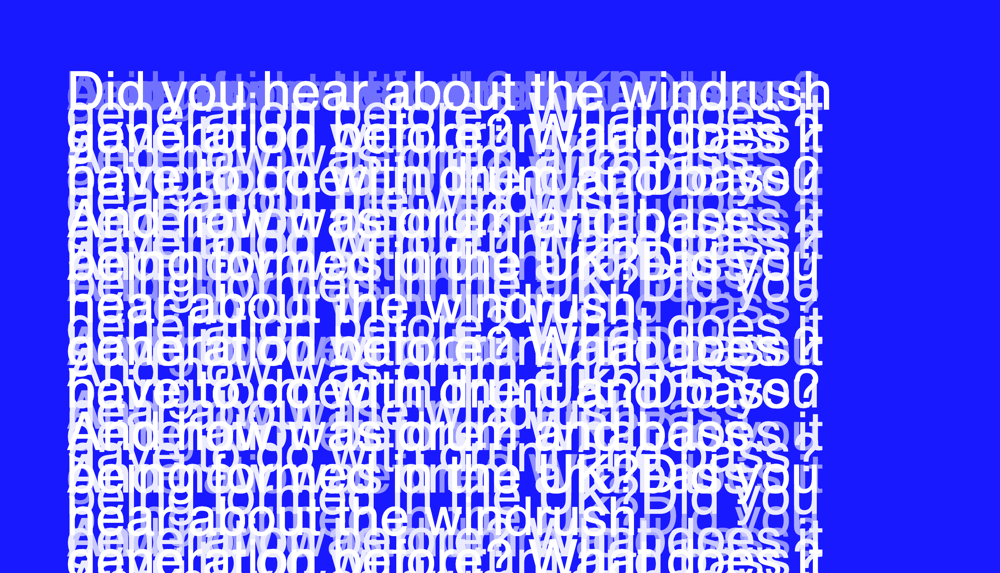

```javascript
let scrollText = ` "Has it affected the way you feel connected to the country?
Oh, yeah, 100%, it has. And it’s very strange as a child, 
when I was at school, and it was a very white school, I remember 
going to school and people used to say to me, your Dad needs 
to go back to where he come from. And I remember I never ever 
told my Mum and Dad, but I used to be really frightened as a kid 
like, oh my gosh, what if they come and take my Dad and then as I 
got older, I was like, gosh, how irrational that I was even thinking 
that and then to be like, fast forwarding, like, it really nearly 
was a possibility. Yeah, I don’t feel uhm.  No, I don’t feel very British, 
if I’m honest. I don’t feel uhm because I think I’ve seen that it can be 
taken away really easily. And I don’t feel, especially the government, 
as it is now, I don’t think it is inclusive. I think it is hostile. So 
yeah, it’s a funny way to be it’s, it’s hard because my partner, he was 
born in Germany, and he’s white, and I, we laugh because he’s, I say, like 
you, you stand a better chance from someone that’s come in to this [country], 
but it feels like he’s better belonging here than what I am. And I was born here. 
It’s like, I feel like almost our feelings are switched. You know, like, I feel 
like, I’m not really settled here. Not that I don’t belong here. But I don’t 
feel settled here. Like, it doesn’t feel. Like feeling safe, or secure?
Yeah maybe, but I just, I don’t know. Maybe it’s a bit of resentment. Maybe 
I don’t really like it. Like how this is all played out. Maybe that’s a bit 
of a point as well." `;

let meAskyou = ["Did you hear about the windrush generation before?",
"What does it have to do with drum and bass?",
"And how was drum and bass being formed in the UK?"]
let questions = meAskyou.join(' ')

let yPos=0;


function setup() {
  createCanvas(windowWidth, windowHeight);
  setupAudio(true) // if empty, use 'a5.' before audio vars below
 a5.ease = .075 // customize ease speed, lower values make it smoother
 // Startet den Text am unteren Bildschirmrand
  yPos = height;
}

function draw() {
	
 updateAudio()
 let live= (frameCount%8)
	//frameRate -> interview (20)
// frameRate questions 2-3
  frameRate(3);
  
  //Transparenz aka alpha beim scroll ->5-10
  // alpha bei questions 100-150
  background(0, 0,255,100); 
  
   
  //default ist textSize 100 -> Leading 100
  fill(255)
  textSize(80)
  textWrap(WORD)
	textLeading(32*live);
	textStyle(random([ITALIC,NORMAL]))
	// um eine Textbox zu machen,die einen Zeilenumbruch macht ("string",posx,posy,wW,wH)
	text(questions.repeat(random(15)),100,100,windowWidth/1.2,	windowHeight);
  
  //interview
  /*
  // TOP für die vertikale Ausrichtung
  textAlign(LEFT, TOP); 
  fill(255);
  textSize(80);
  textStyle(random([ITALIC,NORMAL]))
  textWrap(WORD);
  */
 
if (fftEase[100] > 40) {
  textStyle(BOLDITALIC); // Aggressiver Look bei viel Bass
} else {
  textStyle(NORMAL);     // Ruhiger Look bei leisen Passagen
}
  //textLeading(95); 
  //text(scrollText, 100, yPos, windowWidth - 200, 10000);
  
 
  
 // Geschwindigkeit des Scrollens, umso tiefer, desto langsamer
  yPos -= 2; 
  
//zurücksetzen der y-Position
  if (yPos < -2800) {
    yPos = height;
  }
}
```

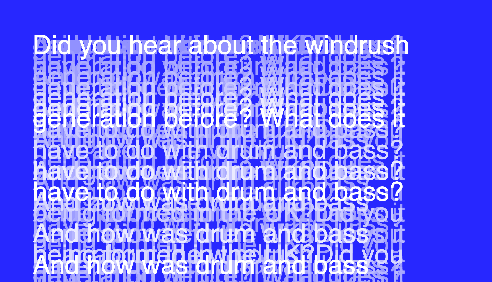

I played a lot with the alpha channel for the background and i loved the smear lines.

I drew a storyboard that I shared with Dominique so that we could make sure of what we're talking.
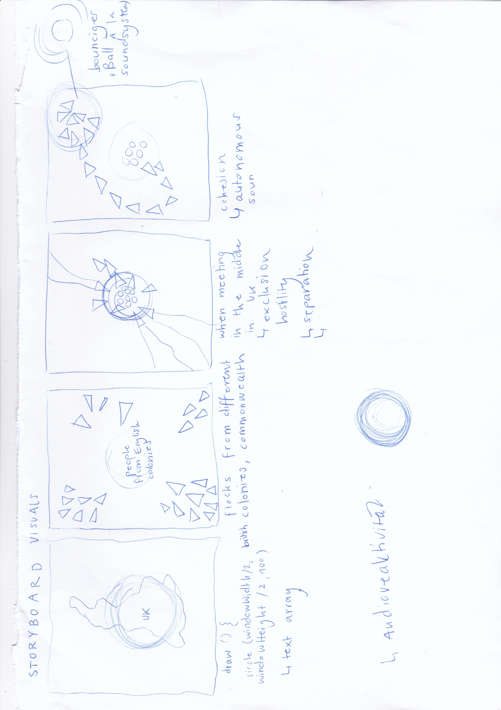

I really tried a lot of different things:


it got really laggy...


During the process I created my code in strudel and I was really frustrated. But that was the first try that was way too long! 


```javascript
//we want to talk about the story of the so called "windrush generation"
//and about the formation of drum and bass in the UK

//"did you hear about the windrush generation before?"
_$:s("my_voice:0").slow(4)
//"what does it have to do with drum and bass?"
_$:s("my_voice:1").slow(4)
//"and how was drum and bass being formed in the UK?"
_$:s("my_voice:2").slow(4)


/*Tobierre, C. (2023). 
Oral History Project: The Windrush Scandal in a Transnational and Commonwealth Context.
Interviewed by Cox, J. 20 March, Chelmsford. 
Available at: https://windrushscandal.org/charlotte-tobierre-interview/ 
[Accessed: 28 May 2026]*/

//so let us listen to a daughter of a victim of the windrush scandal
_$:s("my_voice:3").slow(1)._scope()

//and now that you heard of a family member of a windrush scandal victim
$:setcpm(173/4)
//first there was a snare drum
$:s("sd:2").beat("4,12",16).gain(0.5)//.random(2,5)
//and some highhats
$:s("hh:3!8").gain(0.25).gain(0.25,0,5)
//and of course a bass
$:s("bd").beat("0,7?,10",16).duck("3:4:5").gain(0.5)

// OF COURSE WITH THE CLASSIC OFFBEAT!

//https://www.youtube.com/watch?v=t5oDmmwBuS4
//The Dotted Quarter Note -> 3+3+2 Rhythmus
_$: s("drumulator_bd").lpf(500)
  .note("c3 c3 f3")
//struct for patterns of hit and silences
.struct("1@3 1@3 0@2").gain(0.25)// 3/8, 3/8, 2/8

// Ich möchte mehr Varianz reinbringen, indem ich 
// verschiedene Basslines kreiere
_$: s("bd").lpf(200)
.note("F1 F#1")
.struct("0 1@5 1@2")
._punchcard()
//deep bass wobbly blast

//"foghorn" -> riffs:67
_$: s("riffs:70")//.lpf(200)
.note("C")
.struct("0 0 1@11 0@4")

// 1/4  Takt
$:s("bd").lpf(200)
.note("F1 F#2 F2")
.struct("1@4 1@3 1")
._punchcard()
//1/8th notes (bass melody kinda dubstep vibes) 
_$:s("gm_fx_atmosphere").lpf(500)
//.note("B1*2 A#1*2 G#1*2 F#1*2 D#1*6 F#1*2")
.note("B1 A#1 G#1 F#1 D#1@3 F#1")
//.note("B1 B1 A#1 A#1 G#1 G#1 F#1 F#1 D#1@6 F#1 F#1")
.struct("1*8")
.delay(0.25)
._punchcard()
// three dotted 1/4 taking 1/4 increase the length by half
// 3/8 3/8 2/8 bzw 1/4
_$:s("bd:8")//.lpf(200)
.note("F2 F#1 F")
.struct("1@3 1@3 1@2")

//foghorn
_$:s("riffs:67").slow(8)

// reggaeton kind of bassline
_$:s("bd:8").lpf(200)
.note("F2")
.struct("1@4 1@4 1@3 1@3 1@2")

// different reggaeton 
_$:s("bd").lpf(200)
.note("F2")
.struct("1@4 1@4 1@3 1@3 1@2")

//neuro drum and bass (pattern8)
_$:s("bd:7").lpf(300)
.note("F1").sustain(2)
.beat("0, 4, 7, 10,13",16)

// mirrored 2-step
_$: s("bd").lpf(300)
.note("G").sustain(10)
//.beat("0,5,8,11,13",16)
.struct("1@4 1@3 1@3 1@2 1@4")

_$: note("F1 C2 F1*5").s("sine")
.struct("1@6 1@2 1@2 1@2 1@2 1@2")

// 2 ist sehr cool,6, 12 sehr atmosphärisch,1,59 
// back to the pads
$:s("pads:2").slow(2).legato(1)
  .lpf("<300 150 200 600 300>") 
  //lpf("<200 150 200>")
  //.gain("0.2")
  .resonance(12).gain("0.25, 0.1")


$:s("vocals:36").slow(16).gain(0.25)

// biuuuum fx 48, 31 very nice, vrrrr 43
$:s("fx:48").slow(4).gain(0.1)// funky little sound

//amen break
_$: s("breaks:16").slow(4).gain(0.25)

_$:s("music_:16")
  .slow(8) 
  .legato(1)
  .gain(0.25)

_$:s("music_:13").slow(64).legato(1).delay(0.8)

// let's get some random notes in there
// let's use the power of code to create something new

_$:note("c2 g2!2 d2 f1").s(wchoose(["sine",10], ["triangle",1], ["bd:6",1]))

_$:n(irand(12).seg(2))
.chord("em am").voicing()
  
$:n(irand(16).seg(8)) //.seg(16)
.rib(8,2)
.chord("C D F").voicing()
.add("0 100 -140 0")
.decay("0.05")// very short
.lpf(sine.slow(12).range(500, 2000))//between 20 20'000(filter)
.delay("0.6")
.delaytime(1)
.s("supersaw").gain(0.5)._punchcard()


 // .voicing()
/*"You can tell the world you still will get no place
Every door is shut in your face
So boys, if you brown they say you can stick around
If you white, well everything’s alright
If your skin is dark, no use to try
You got to suffer until you die.- Lord Kitchener")*/

```

I tried to create voices with text but I didn't figure out if it could work. 