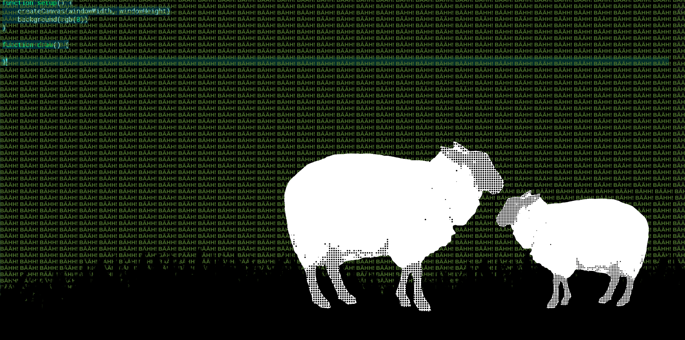
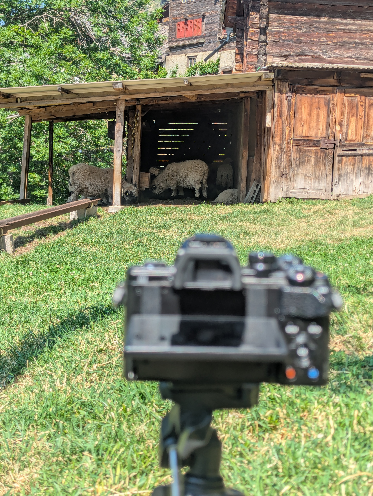

# Creative Coding — Documentation

# Week 1

## Reflections

The first week was great. I got to meet many new people, and I learned about p5.js for the first time. It was great to get back into programming.

Since I already have programming experience, the first week’s content was pretty self-explanatory and didn’t require too much energy from me.

---

# Week 2

## Code

### 05.05 — Input Example

```jsx
let slider, checkbox, button, colorPicker, dropdown, input, sliderText, radio;
let bgColor;
let positionDOM;
let angle = 0; // Variable to track our continuous rotation

function setup() {
	createCanvas(windowWidth, windowHeight);

	positionDOM = width - 400;

	// Checkbox
	checkbox = createCheckbox('Show Trippy Shapes', true);
	checkbox.position(positionDOM, 20);
	checkbox.style('color', 'white'); // Makes HTML text readable on dark background

	// Sliders
	slider = createSlider(50, height - 100, 200);
	slider.position(positionDOM, 60);

	// Button
	button = createButton('Glitch Background');
	button.position(positionDOM, 100);
	button.mousePressed(() => {
		// Randomizes into dark gray / purple / magenta shades
		bgColor = color(random(20, 80), random(0, 10), random(50, 150));
	});
	bgColor = color(20); // Start with a dark gray

	// Color Picker - Starting with a bright magenta
	colorPicker = createColorPicker('#ff00aa');
	colorPicker.position(positionDOM, 140);

	// Dropdown (Swapped for sharper, edgier shapes)
	dropdown = createSelect();
	dropdown.position(positionDOM, 180);
	dropdown.option('Square Vortex');
	dropdown.option('Sharp Triangles');
	rectMode(CENTER);

	// Input field
	input = createInput('O_O');
	input.position(positionDOM, 220);
	textAlign(CENTER, CENTER);

	// Radio button
	radio = createRadio();
	radio.option('Dark Gray');
	radio.option('White');
	radio.selected('White');
	radio.position(positionDOM, 260);
	radio.style('color', 'white');

	sliderText = createSlider(20, 300, 40);
	sliderText.position(positionDOM, 300);
}

function draw() {
	// 1. THE TRAIL EFFECT
	// Instead of background(bgColor), we draw a transparent box over the screen
	push();
	rectMode(CORNER);
	fill(red(bgColor), green(bgColor), blue(bgColor), 25); // Alpha controls the trail
	noStroke();
	rect(0, 0, width, height);
	pop();

	if (checkbox.checked()) {
		push();

		// Move the 0,0 point to the center of the screen
		translate(width / 2, height / 2);

		// 2. CONTINUOUS ROTATION
		angle += 0.02;
		rotate(angle);

		// 3. THE NESTED LOOP
		let shapeSize = slider.value();
		for (let i = 0; i < 5; i++) {
			stroke(colorPicker.value());
			noFill();
			strokeWeight(2);

			// Slightly rotate each nested layer to make it twist
			rotate(angle * 0.1);

			if (dropdown.value() === 'Square Vortex') {
				// Shrink the shape based on the loop counter 'i'
				rect(0, 0, shapeSize - (i * 30), shapeSize - (i * 30));
			} else if (dropdown.value() === 'Sharp Triangles') {
				triangle(
					0, -shapeSize + (i * 20),
					shapeSize - (i * 20), shapeSize - (i * 20),
					-shapeSize + (i * 20), shapeSize - (i * 20)
				);
			}
		}
		pop(); // Restore standard grid so the text doesn't spin
	}

	// Text rendering
	if (radio.value() === 'Dark Gray') fill(40);
	if (radio.value() === 'White') fill(255);

	noStroke();
	textSize(sliderText.value());

	// Add a tiny bit of random jitter to the text coordinates to make it shake
	let jitterX = random(-2, 2);
	let jitterY = random(-2, 2);
	text(input.value(), (width / 2) + jitterX, (height / 2) + jitterY);
}
```

### 05.07 — Typography Example

```jsx
let speedSlide, charDrop, colorBtn, rainCol;

function setup() {
	createCanvas(windowWidth, windowHeight);
	frameRate(15); // Slightly higher for smoother sine waves

	speedSlide = createSlider(1, 50, 10).position(width - 200, 20);

	charDrop = createSelect().position(width - 200, 60);
	['Rain (, -)', 'Matrix (0 1)', 'Glitch (* +)'].forEach(opt => charDrop.option(opt));

	colorBtn = createButton('New Color').position(width - 200, 100);
	rainCol = color(255, 0, 150); // Starts with a sharp magenta

	// Randomizes colors, but stays in magenta and dark gray-ish ranges
	colorBtn.mousePressed(() => rainCol = color(random(100, 255), random(0, 40), random(100, 200)));
}

function draw() {
	background(20, 20, 20, 50); // 1. TRAIL EFFECT

	textSize(windowWidth / 50);
	textFont('monospace');
	textWrap(CHAR);
	textAlign(CENTER);

	let speed = speedSlide.value() / 100;
	let count = floor(30 * sin(frameCount * speed) + 30);

	let chars = charDrop.value() === 'Matrix (0 1)'
		? '10'
		: charDrop.value() === 'Glitch (* +)'
			? '*+'
			: ',';
	let space = charDrop.value() === 'Rain (, -)' ? '-' : ' ';

	let buildStr = chars;
	for (let i = 0; i < 12; i++) {
		buildStr += space;
		let finalLine = buildStr.repeat(count + 30);

		// 2. GRADIENT: Darkens the magenta toward gray on each row
		fill(red(rainCol) - i * 15, green(rainCol) - i * 15, blue(rainCol) - i * 15);

		// 3. WIND: Sine wave pushes the X coordinate
		let windX = sin(frameCount * speed + i) * 100;

		text(finalLine, 10 + windX, (finalLine.length * i) / 4, windowWidth, windowHeight);
	}
}
```

## Reflections

This was a great week. I learned a lot about the possibilities of p5.js and how to work with sound, text, and Hydra. We also got to know about the Unsorted collective and what they do, which was nice.

I had no difficulties understanding the content this week either, but I could help other students who were struggling.

Now that the groups are fixed, we started our group work. My team partner Bastian and I were both more interested in creating visual art and keeping the audio part to a minimum (even though audio is required for the final presentations).

We were inspired by ASCII art and the following examples, and we are aiming to create something in a similar style:

- [https://fauux.neocities.org/consciousness](https://fauux.neocities.org/consciousness)

We split the tasks for now:

- I generate the “subject”
- Bastian codes a “background”

---

# Week 3

## Code

### Image to ASCII — Usage

```jsx
let myImages = [];
let morpher; // Declare the variable

function preload() {
	// Assuming images are in the exact same folder as this file
	myImages.push(loadImage('./data/quallen1.png'));
	myImages.push(loadImage('./data/quallen2.png'));
}

function setup() {
	createCanvas(windowWidth, windowHeight);
	textFont('monospace');

	// Call the class directly. The browser knows what it is because of the HTML file.
	morpher = new AsciiMorpher(myImages, {
		density: 'ABCD',
		rows: 100,
		h: windowHeight * 0.8,
		x: windowWidth / 4,
		y: windowHeight * 0.1,
		speed: 0.1,
		hold: 190,
		useImgCol: false,
		cDark: '#ff0000',
		cLight: '#ff00ff'
	});

	morpher.init();
}

function draw() {
	background('#0d0d0d');
	morpher.update();
	morpher.draw();
}
```

### Image to ASCII — Library Integration

```jsx
// libs: ['./data/asciiLib.js']

let myImages = [];
let morpher; // Declare the variable

function preload() {
	myImages.push(loadImage('./data/quallen1.png'));
	myImages.push(loadImage('./data/quallen2.png'));
}

function setup() {
	createCanvas(windowWidth, windowHeight);
	textFont('monospace');

	morpher = new AsciiMorpher(myImages, {
		density: '█▓▒░▄▀■- ',
		rows: 300,
		h: windowHeight * 0.8,
		x: windowWidth / 2,
		y: windowHeight * 0.1,
		speed: 0.1,
		hold: 190,
		useImgCol: true,
		cDark: 'white',
		cLight: 'purple'
	});

	morpher.init();
}

function draw() {
	background('#0d0d0d');
	morpher.update();
	morpher.draw();
}
```

### Hy5 Flashlight

```jsx
/*
	_HY5_p5_hydra // cc teddavis.org 2024
	pass p5 into hydra
	docs: https://github.com/ffd8/hy5
*/

let libs = [
	'https://unpkg.com/hydra-synth',
	'includes/libs/hydra-synth.js',
	'https://cdn.jsdelivr.net/gh/ffd8/hy5@main/hy5.js',
	'includes/libs/hy5.js'
];

// sandbox - start
H.pixelDensity(2); // 2x = retina, set <= 1 if laggy

s0.initP5(); // send p5 to hydra
P5.toggle(0); // optionally hide p5

// Start with a dark gray background
solid(0.05, 0.05, 0.05)
	// Layer the previous frame, shrunken and tinted magenta/red to create the trail
	.layer(src(o0).scale(0.99).color(0.9, 0.0, 0.4))
	// Add the real-time mouse "flashlight" effect on top
	.layer(
		shape(400, 0.15, 0.3)
			.color(0.8, 0.0, 0.3)
			.scrollX(() => (mouse.x / window.innerWidth) - 0.5)
			// Hydra Y is bottom-up, browser Y is top-down
			.scrollY(() => 0.5 - (mouse.y / window.innerHeight))
	)
	.out(o0);
// sandbox - end

function setup() {
	createCanvas(windowWidth, windowHeight);
}

function draw() {
	circle(mouseX, mouseY, 100);
}
```

## Images

### Image to ASCII Result


### Current Hy5 Flashlight


## Reflections

This short week was more about doing than learning. For me, the main task was to create the “subject” part of our group project and have it ready for the midterm presentation.

My idea was to use an image, turn it into ASCII, and use that as the subject. I looked up how to do that, and with some trial and error I got it working.

With that as a base, a new idea came to me: I wanted to try to *animate* my ASCII art. My approach was to load multiple images and smoothly morph between them, which creates the illusion of animation.

The problem was that the full code was around 150 lines, but in our course requirements a snippet can only be 20–30 lines. So I moved the full logic into a separate file and referenced it as an object in the main sketch. That way I could keep the visible code short, while still having lots of parameters exposed for live tweaking.

We still needed a third snippet for the midterm. Since I really wanted to do something in Hydra, I decided to create a sphere-like circle that follows the pointer. The idea was that it could later be used as a flashlight on top of our canvas. I tried to build the flashlight directly in Hydra, but at that point I mainly got the cursor-following working reliably. I still put it into p5live so we had three snippets ready for the midterm.

---

# Week 4

## Midterm

The midterm went well. We presented our current standpoint and got useful feedback.

One important point was that the current flashlight does not really make sense in its current setup. It will be easier and cleaner to do it purely in Hydra.

## Reflections

The midterm gave a good preview of how the final presentations are going to feel. We got feedback that will help us improve the performance.

The field trip on Tuesday was a great change from the normal classes. It was refreshing and gave me some ideas about playing with electronics and visuals. I especially liked our first visit to HEK. It was a great exhibition and something I had never seen before. Even though it probably will not directly influence our performance, it was great to see what is possible, especially since I am generally interested in “cyber” topics.

Learning about visual music on Wednesday was interesting too. I learned a new concept that I had never heard of before.

---

# Week 5

## Meeting (24.05)

I met with my team partner online to discuss our current state and the direction we are heading.

We treated the snippets as tasks so it was easier to split the work. We split it like this:

- **Already done**
    - ASCII subject snippet (Jakob)
    - Typography background snippet (Bastian)
    - Typography background snippet 2 (Bastian)
- **To do**
    - Music snippet (Strudel) → Bastian
    - 2 remaining snippets → Jakob

We also decided that I am going to think about how we can combine everything into one continuous and coherent performance.

### Plan (after the meeting, to discuss with Bastian)

1. Subtle background (with really small text) → Bastian
    - Reference: [https://fauux.neocities.org/Love](https://fauux.neocities.org/Love)
2. Subject (video converted to a dotted image) → Jakob
3. Subject support (second background graphic supporting the subject) → Jakob
4. Altering video conversion (switching between halftone, ASCII, dotted, pixels) → Jakob
5. Music with Strudel → Bastian
6. Surprise (spontaneous idea while implementing)

Here is a mockup of how our final code could look. We still had to decide on the topic, but the current topic was sheep.




## 27.05 — Full Project Day

Today’s goal was to work the whole day on the project so that, by the end of the day, my part was finished and only needed refinement before we bring everything together.

First, I extended the library so it can:

1. Process videos, not just images
2. Render in different styles

For the second part, I implemented the conversion methods `dotted`, `pixel`, and `lines`, based on articles explaining the theory. With some trial and error (and help from AI) I got the library working. Especially the conversion to lines was hard, because I had never done something similar before.

For video input I used the webcam for now.

### Webcam to Lines


### Webcam to Dots


### Webcam to Pixels


### Webcam to ASCII (charset stored in lib)


### New “CreativeProcessor” Library

```jsx
class CreativeProcessor {
	constructor(mediaElements, config) {
		this.elements = Array.isArray(mediaElements) ? mediaElements : [mediaElements];
		this.cfg = Object.assign({
			density: '█▓▒░▄▀■- ',
			rows: 60,
			h: 600,
			x: 0,
			y: 0,
			speed: 0.05,
			hold: 90,
			useLiveColor: false,
			cDark: '#0a000a',
			cLight: '#ff00aa',
			mediaType: 'image',
			mode: 'ascii',
			dotScale: 0.8
		}, config);

		this.idx = 0;
		this.next = 1;
		this.prog = 0;
		this.holdTimer = 0;
		this.isHolding = true;
	}

	init() {
		this.colD = color(this.cfg.cDark);
		this.colL = color(this.cfg.cLight);

		if (this.cfg.mediaType === 'image') {
			this.elements[0].resize(0, this.cfg.rows);
			let masterW = this.elements[0].width;
			this.elements.forEach(img => img.resize(masterW, this.cfg.rows));
		}

		this.updateDimensions();
	}

	updateDimensions() {
		let source = this.elements[this.idx];
		this.rW = this.cfg.h * (source.width / source.height);
		this.cW = this.rW / (
			this.cfg.mediaType === 'video'
				? this.cfg.rows * (source.width / source.height)
				: source.width
		);
		this.cH = this.cfg.h / (this.cfg.mediaType === 'video' ? this.cfg.rows : source.height);
	}

	update() {
		if (this.cfg.mediaType === 'video') return;

		if (this.isHolding) {
			if (++this.holdTimer >= this.cfg.hold) {
				this.isHolding = false;
				this.holdTimer = 0;
			}
		} else {
			this.prog += this.cfg.speed;
			if (this.prog >= 1) {
				this.prog = 0;
				this.isHolding = true;
				this.idx = this.next;
				this.next = (this.next + 1) % this.elements.length;
			}
		}
	}

	render() {
		let srcA = this.elements[this.idx];
		let srcB = this.cfg.mediaType === 'video' ? srcA : this.elements[this.next];

		srcA.loadPixels();
		if (this.cfg.mediaType !== 'video') srcB.loadPixels();

		noStroke();
		textAlign(CENTER, CENTER);

		let sWidth = this.cfg.mediaType === 'video'
			? Math.floor(this.cfg.rows * (srcA.width / srcA.height))
			: srcA.width;
		let sHeight = this.cfg.mediaType === 'video' ? this.cfg.rows : srcA.height;

		this.cW = this.rW / sWidth;
		this.cH = this.cfg.h / sHeight;

		for (let y = 0; y < sHeight; y++) {
			for (let x = 0; x < sWidth; x++) {
				let pX = Math.floor(map(x, 0, sWidth, 0, srcA.width));
				let pY = Math.floor(map(y, 0, sHeight, 0, srcA.height));
				this.processCell(x, y, pX, pY, srcA, srcB);
			}
		}
	}

	processCell(x, y, pX, pY, srcA, srcB) {
		let p = (pX + pY * srcA.width) * 4;

		let r = lerp(srcA.pixels[p], srcB.pixels[p], this.prog);
		let g = lerp(srcA.pixels[p + 1], srcB.pixels[p + 1], this.prog);
		let b = lerp(srcA.pixels[p + 2], srcB.pixels[p + 2], this.prog);
		let br = (r + g + b) / 3;

		let xPos = this.cfg.x + (x * this.cW) + (this.cW * 0.5);
		let yPos = this.cfg.y + (y * this.cH) + (this.cH * 0.5);

		if (this.cfg.useLiveColor) {
			fill(r, g, b);
		} else {
			fill(lerpColor(this.colD, this.colL, br / 255));
		}

		if (this.cfg.mode === 'ascii') {
			let cIdx = floor(map(br, 0, 255, this.cfg.density.length - 1, 0));
			let ch = this.cfg.density.charAt(cIdx);
			if (ch !== ' ') {
				textSize(this.cW * 1.2);
				text(ch, xPos, yPos);
			}
		} else if (this.cfg.mode === 'dotted') {
			let radius = map(br, 0, 255, 0, this.cW * this.cfg.dotScale);
			ellipse(xPos, yPos, radius, radius);
		} else if (this.cfg.mode === 'lines') {
			let angle = map(br, 0, 255, 0, TWO_PI);
			push();
			translate(xPos, yPos);
			rotate(angle);
			rect(0, 0, this.cW * this.cfg.dotScale, this.cH * 0.2);
			pop();
		} else if (this.cfg.mode === 'pixel') {
			rect(xPos, yPos, this.cW, this.cH);
		}
	}
}
```

### New Video-to-Processing Snippet (Webcam) — Snippet 1

```jsx
let liveVideo, subjectProcessor;

function preload() {
	// Capture webcam feed (or swap with createVideo('path.mp4') for a clip)
	liveVideo = createCapture(VIDEO);
	liveVideo.size(640, 480);
	liveVideo.hide(); // Hide raw video element from the DOM
}

function setup() {
	createCanvas(windowWidth, windowHeight);
	subjectProcessor = new CreativeProcessor(liveVideo, {
		mediaType: 'video',
		mode: 'dotted',
		rows: 75,
		h: windowHeight * 0.7,
		x: windowWidth * 0.35,
		y: windowHeight * 0.15,
		dotScale: 0.95,
		cDark: '#050005',
		cLight: '#ffffff'
	});
	subjectProcessor.init();
}

function draw() {
	background(10);
	subjectProcessor.render();
}
```

## Snippet 2 — Background

I also rewrote Bastian’s background to match the sketch we made on Sunday better.


```jsx
let bgString = "BÄAH! BÄHH! BÄÄH! ";
let dynamicLines = 36;

function setup() {
	createCanvas(windowWidth, windowHeight);
	frameRate(8);
}

function draw() {
	background(5);

	textSize(windowWidth / 75);
	textFont('monospace');
	textAlign(LEFT, TOP);

	let stepFactor = floor(25 * sin(frameCount * 0.04) + 25);
	let completeLineText = bgString.repeat(stepFactor + 20);

	for (let i = 0; i < dynamicLines; i++) {
		// Structural color gradient toward the lower canvas horizon
		let luminosity = map(i, 0, dynamicLines, 95, 20);
		fill(luminosity, luminosity * 0.1, luminosity * 0.4); // Gray/magenta tone

		let xScrollOffset = (i % 2 === 0)
			? (frameCount * 4) % 150
			: -((frameCount * 4) % 150);

		text(completeLineText, -100 + xScrollOffset, i * (windowHeight / dynamicLines));
	}
}
```

## Snippet 4 — Iterating Conversion Modes

I created an extension of snippet 1 so we can automatically change the conversion mode every 5 seconds.

```jsx
let liveVideo, subjectProcessor;
let modes = ['lines', 'dotted', 'ascii', 'pixel'];

function preload() {
	liveVideo = createCapture(VIDEO);
	liveVideo.size(640, 480);
	liveVideo.hide();
}

function setup() {
	createCanvas(windowWidth, windowHeight);
	subjectProcessor = new CreativeProcessor(liveVideo, {
		mediaType: 'video',
		mode: 'dotted',
		rows: 75,
		h: windowHeight * 0.7,
		x: windowWidth * 0.35,
		y: windowHeight * 0.15,
		dotScale: 0.95,
		cDark: 'green',
		cLight: 'blue'
	});
	subjectProcessor.init();
	frameRate(8);
}

function draw() {
	background(10);

	let currentModeIndex = floor(millis() / 5000) % modes.length;
	subjectProcessor.cfg.mode = modes[currentModeIndex];

	subjectProcessor.render();
}
```

## Photos of Sheep

I went out to film some sheep to use as our subject in the presentation. This was quite hard, because the sheep didn’t do what I wanted them to do. They are animals after all.

I added the best video as the source, and it seems to work well and look cool as expected.

The background is a bit annoying though. Maybe if there is still time I will do something about it.




## Snippet 3 — Grass

For snippet 3 I wanted to draw “grass”. I thought of drawing multiple horizontal triangles that wiggle and change based on cosine and sine curves. With some trial and error I was happy with the result.

```jsx
let bladeCount = 60;
let grassHeight = 120;

function setup() {
	createCanvas(windowWidth, windowHeight);
}

function draw() {
	background('black');

	noStroke();
	fill('green');

	let bladeWidth = width / bladeCount;

	for (let i = 0; i < bladeCount; i++) {
		let leftBaseX = i * bladeWidth;
		let rightBaseX = (i + 1) * bladeWidth;

		let tipX = leftBaseX + (bladeWidth * 0.5) + sin(frameCount * 0.05 + i) * 15;

		let currentHeight = grassHeight + cos(i * 0.5) * 40;
		let tipY = height - currentHeight;

		triangle(leftBaseX, height, rightBaseX, height, tipX, tipY);
	}
}
```


## Combined Canvas (All Snippets Together)


```jsx
// ==========================================
// --- PERFORMANCE CONFIGURATION BLOCKS ---
// ==========================================

// --- Snippet 1 & 4 Global State ---
let liveVideo, subjectProcessor;
let modes = ['lines', 'dotted', 'ascii', 'pixel']; // Standardized to your library keywords

// --- Snippet 1: Background Variables ---
let bgString = "BÄAH! BÄHH! BÄÄH! ";
let dynamicLines = 30;

// --- Snippet 2: Silhouette Grass Variables ---
let bladeCount = 300;
let grassHeight = 200;

function preload() {
	// Setup the video stream source
	liveVideo = createVideo('/data/sheep.MOV');
	liveVideo.size(640, 480);
	liveVideo.hide();
	liveVideo.loop();
	liveVideo.volume(0);
	liveVideo.play();
}

function setup() {
	createCanvas(windowWidth, windowHeight);
	frameRate(8); // Performance throttle matching target terminal refresh look

	// Initialize the extended processing core
	subjectProcessor = new CreativeProcessor(liveVideo, {
		mediaType: 'video',
		mode: 'dotted',
		rows: 100,
		h: windowHeight * 0.7,
		x: windowWidth * 0.35,
		y: windowHeight * 0.15,
		dotScale: 0.95,
		cDark: '#050005',
		cLight: '#ffffff'
	});
	subjectProcessor.init();
}

function draw() {
	background('#050005');

	// ==========================================
	// SNIPPET 1: Fauux-Inspired Background Text
	// ==========================================
	textSize(windowWidth / 75);
	textFont('monospace');
	textStyle(BOLD);
	textAlign(LEFT, TOP);

	let stepFactor = floor(25 * sin(frameCount * 0.04) + 25);
	let completeLineText = bgString.repeat(stepFactor + 20);

	for (let i = 0; i < dynamicLines; i++) {
		let luminosity = map(i, 0, dynamicLines, 95, 20);
		fill(luminosity, luminosity * 0.1, luminosity * 0.4);

		let xScrollOffset = (i % 2 === 0) ? (frameCount * 4) % 150 : -((frameCount * 4) % 150);
		text(completeLineText, -100 + xScrollOffset, i * (windowHeight / dynamicLines));
	}

	// ==========================================
	// SNIPPET 2: Vector Silhouette Grass Field
	// ==========================================
	noStroke();
	fill('#b30077');

	let bladeWidth = width / bladeCount;
	for (let i = 0; i < bladeCount; i++) {
		let leftBaseX = i * bladeWidth;
		let rightBaseX = (i + 1) * bladeWidth;

		let tipX = leftBaseX + (bladeWidth * 0.5) + sin(frameCount * 0.05 + i) * 15;
		let currentHeight = grassHeight + cos(i * 0.5) * 40;
		let tipY = height - currentHeight;

		triangle(leftBaseX, height, rightBaseX, height, tipX, tipY);
	}

	// ==========================================
	// SNIPPET 4: Auto Mode Transition Engine
	// ==========================================
	let currentModeIndex = floor(millis() / 10000) % modes.length;
	subjectProcessor.cfg.mode = modes[currentModeIndex];

	// ==========================================
	// SNIPPET 3: Front-Layer Subject Rendering
	// ==========================================
	subjectProcessor.render();
}
```

## Meeting in the Evening

I discussed with Bastian and we decided that Bastian is going to present snippet 1 (background) and snippet 3 (supporting grass).

I also added snippet 5 (Strudel sound) to the end code to see how it looks.

```jsx
// ==========================================
// SNIPPET 5: STRUDEL LIVE AUDIO ENGINE
// ==========================================

// strudel
setCps(140/60/4)

$: s("sbd!4")._scope()
  .duck("2:3:4:10:20:30").duckattack(0.2).duckdepth(0.9)

_$bass: n(irand(20).sub(7).seg(16)).scale("c:minor")
  .s("sawtooth").lpf(200).lpq(12).orbit(2)

_$: s("supersaw").detune(1).rel(5).beat(2, 32).slow(2).orbit(2)
  .fm("4").fmh(2.04)

_$: s("pulse").orbit(4).seg(16).dec(.1).fm(time).fmh(time)

$: s("hh*8")
  .struct("1 0 1 1 0 1 0 1")
  .speed(irand(3).add(1))
  .room(.5).size(.5).gain(2)

$: s("oh*4")
  .struct("0 1 0 1")
  .hpf(4000).dec(.12).room(.4).gain(1)
// strudel
```

(Your final combined code versions are below; I kept them as-is besides formatting and minor spelling fixes in headings.)

```jsx
// render modes
let modes = ['lines', 'dotted', 'ascii', 'pixel'];

// Grass Variables
let bladeCount = 75;
let grassHeight = 120;
// sheep variables
let video, sheepProcessor;

// Bäääähckground Variables
let texts = ["BÄÄH BÄHH BÄÄH ", "MÄÄH MÄHH MÄÄÄ ", "BLÖÖÖK ", "I AM A SHEEEEEP "];
let bgString = texts[0];
let dynamicLines = 36;
let textColor;
let textScale = 75;

function setup() {
	createCanvas(windowWidth, windowHeight);

	setupAudio(true); // global vars

	// Background Setup
	textColor = color(255);

	// Sheep setup
	video = createVideo('/data/sheep-0.mp4');
	video.size(120, 80);
	video.play();
	video.loop();
	video.volume(0);
	video.hide();

	sheepProcessor = new CreativeProcessor(video, {
		mediaType: 'video',
		mode: 'dotted',
		rows: 75,
		h: windowHeight,
		x: 0,
		y: 0,
		dotScale: 0.95,
		cDark: 'green',
		cLight: 'white'
	});
	sheepProcessor.init();
}

function draw() {
	// dynamic video color change
	let pulseFactor = (sin(frameCount * 0.02) + 1) / 2;
	let greenValue = floor(pulseFactor * 255);
	sheepProcessor.cfg.cDark = `rgb(0, ${greenValue}, 0)`;

	// change render modes
	let currentModeIndex = floor(millis() / 5000) % modes.length;
	sheepProcessor.cfg.mode = modes[currentModeIndex];

	background(0);

	// Background draw
	textSize(windowWidth / textScale);
	textFont('monospace');
	textAlign(LEFT, TOP);

	let completeLineText = bgString.repeat(
		floor(25 * sin(frameCount * 0.05) + 45)
	);

	for (let i = 0; i < dynamicLines; i++) {
		let b = map(i, 0, dynamicLines, 1, 0.2);

		fill(
			red(textColor) * b,
			green(textColor) * b,
			blue(textColor) * b,
			150
		);

		text(
			completeLineText,
			-100 + (i % 2 === 0 ? 1 : -1) * (frameCount % 150),
			i * (windowHeight / dynamicLines)
		);
	}

	updateAudio();

	// Sheep draw
	sheepProcessor.render();

	// Grass draw
	noStroke();
	fill(0, 255, 0);

	let bladeWidth = width / bladeCount;
	for (let i = 0; i < bladeCount; i++) {
		let leftBaseX = i * bladeWidth;
		let rightBaseX = (i + 1) * bladeWidth;

		let tipX = leftBaseX + (bladeWidth * 0.5) + sin(frameCount * 0.05 + i) * 15;

		let growth = map(sin(frameCount * 0.02), -1, 1, 0, grassHeight);
		let currentHeight = growth + cos(i * 0.5) * 40;
		let tipY = height - currentHeight;

		triangle(leftBaseX, height, rightBaseX, height, tipX, tipY);
	}
}

function mousePressedDeactivate() {
	textColor = color(random(255), random(255), random(255));
	textScale = random(15, 200);
	bgString = random(texts);
}

function windowResized() {
	resizeCanvas(windowWidth, windowHeight);
}
```

## Meeting Sunday (31.05)

We had a meeting and quickly discussed how we present and in which order. We decided on an order and did a quick test run together. It went relatively smoothly, since we practiced our parts before.

I also prepared my laptop and saved all the snippets so the setup was ready for the next day.

I created snippet 6 as well, changing the colors of the sheep / video conversion.

## Snippet 6 - Color change

```jsx
// dynamic video color change
let pulseFactor = (sin(frameCount * 0.02) + 1) / 2;
let greenValue = floor(pulseFactor * 255);
sheepProcessor.cfg.cDark = `rgb(0, ${greenValue}, 0)`;
```

## Reflection

This week was probably my favorite, because we had the freedom to work independently and apply everything we learned. This week was all about applying the concepts. 
We probably made the biggest progress in just a few days. We made a plan as a base and followed through with it, while still leaving room for changes and adaptations. 

After the meeting on Sunday, I now feel ready for the presentations.

---

# Week 6 - Final Week

## Monday — Final Presentation in Class

## Reflection

In our final presentation, we had quite a few performance issues. I already knew our code was performance-heavy. When I performed on my own, I always managed to get p5live running smoothly by shrinking the loaded video resolution. However, during the performance it was somehow too much for my laptop to handle. My guess is that Strudel running in the same browser session pushed it over the edge.

In general, parts of the presentation went well. We could see what works and what doesn’t, and adjust our setup so we are more prepared for the next day.

For the cinema presentation, we decided to perform on two laptops:

- one laptop for Strudel
- one laptop for p5live

We also split tasks again. In today’s live performance we noticed the sound section was quite short. So for tomorrow Bastian starts with the background in p5, then switches to the other laptop and does Strudel sound for the rest of the performance. I do the visual coding part. This also removes the unsmooth switches.

I changed some smaller details and variables as well to improve performance for tomorrow.


### Final Code at the End of the Performance

```jsx
// render modes
let modes = ['lines', 'dotted', 'ascii', 'pixel'];

// Grass Variables
let bladeCount = 75;
let grassHeight = 180;

// sheep variables
let video, sheepProcessor;

// Background Variables
let texts = ["BÄÄH BÄHH BÄÄH "];
let bgString = texts[0];
let dynamicLines = 36;
let textColor;
let textScale = 75;

function setup() {
	createCanvas(windowWidth, windowHeight);

	// Background setup
	textColor = color(0, 200, 255);

	// Sheep setup
	video = createVideo('/data/sheep-2.mp4');
	video.size(680, 320);
	video.play();
	video.loop();
	video.volume(0);
	video.hide();

	sheepProcessor = new CreativeProcessor(video, {
		mediaType: 'video',
		mode: 'dotted',
		rows: 75,
		h: windowHeight,
		x: 0,
		y: 0,
		dotScale: 1,
		cDark: 'green',
		cLight: 'white'
	});
	sheepProcessor.init();
}

function draw() {
	// dynamic video color change
	let pulseFactor = (sin(frameCount * 0.02) + 1) / 2;
	let greenValue = floor(pulseFactor * 255);
	sheepProcessor.cfg.cDark = `rgb(0, ${greenValue}, 0)`;
	sheepProcessor.cfg.cLight = 'blue';

	// change render modes
	let currentModeIndex = floor(millis() / 5000) % modes.length;
	sheepProcessor.cfg.mode = modes[currentModeIndex];

	background(0);

	// Background draw
	textSize(windowWidth / textScale);
	textFont('monospace');
	textAlign(LEFT, TOP);

	let completeLineText = bgString.repeat(
		floor(25 * sin(frameCount * 0.05) + 45)
	);

	for (let i = 0; i < dynamicLines; i++) {
		let b = map(i, 0, dynamicLines, 1, 0.2);

		fill(
			red(textColor) * b,
			green(textColor) * b,
			blue(textColor) * b,
			75
		);

		text(
			completeLineText,
			-100 + (i % 2 === 0 ? 1 : -1) * (frameCount % 150),
			i * (windowHeight / dynamicLines)
		);
	}

	// Sheep draw
	sheepProcessor.render();

	// Grass draw
	noStroke();
	fill(0, 255, 0);

	let bladeWidth = width / bladeCount;
	let dynamicHeight = map(sin(frameCount * 0.02), -1, 1, 60, grassHeight);
	let waveTime = frameCount * 0.05;

	let uniqueWiggles = [];
	for (let i = 0; i < 10; i++) {
		uniqueWiggles.push((bladeWidth * 0.5) + sin(waveTime + i) * 15);
	}

	// Render all 75 blades using our 10 repeating wiggle templates
	for (let i = 0; i < bladeCount; i++) {
		let leftBaseX = i * bladeWidth;
		let rightBaseX = (i + 1) * bladeWidth;

		let tipXOffset = uniqueWiggles[i % 10];
		let tipX = leftBaseX + tipXOffset;
		let tipY = height - dynamicHeight;

		triangle(leftBaseX, height, rightBaseX, height, tipX, tipY);
	}
}

function mousePressedDeactivate() {
	textColor = color(random(255), random(255), random(255));
	textScale = random(15, 200);
	bgString = random(texts);
}

function windowResized() {
	resizeCanvas(windowWidth, windowHeight);
}
```

### New Grass Snippet

```jsx
let bladeCount = 75;
let grassHeight = 120;

function setup() {
	createCanvas(windowWidth, windowHeight);
}

function draw() {
	background(0);

	noStroke();
	fill(0, 255, 0);

	let bladeWidth = width / bladeCount;
	let dynamicHeight = map(sin(frameCount * 0.02), -1, 1, 60, grassHeight);
	let waveTime = frameCount * 0.05;

	let uniqueWiggles = [];
	for (let i = 0; i < 10; i++) {
		uniqueWiggles.push((bladeWidth * 0.5) + sin(waveTime + i) * 15);
	}

	for (let i = 0; i < bladeCount; i++) {
		let leftBaseX = i * bladeWidth;
		let rightBaseX = (i + 1) * bladeWidth;

		let tipXOffset = uniqueWiggles[i % 10];
		let tipX = leftBaseX + tipXOffset;
		let tipY = height - dynamicHeight;

		triangle(leftBaseX, height, rightBaseX, height, tipX, tipY);
	}
}
```