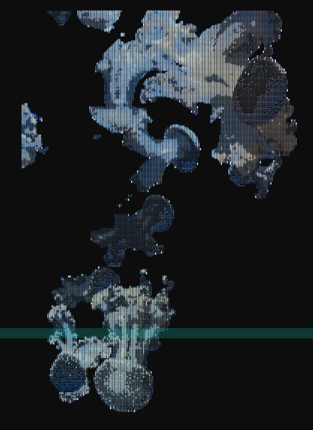

# Creative Coding - Documentation

# Week 1

## Video

## reflections

The First Week was great. I got got to meet many new people. 
Also I learned about p5.js for the first time. 
It was great to get back into programming. 
However, since I already know programming, the contents of the First weeks where pretty selfexplanatory and din’t require to much energy for me. 

# Week 2

## Code

## 05.05 - Input Example

```jsx
let slider, checkbox, button, colorPicker, dropdown, input, sliderText, radio;
let bgColor;
let positionDOM;
let angle = 0; // Variable to track our continuous rotation

function setup() {
    createCanvas(windowWidth, windowHeight);

    positionDOM = width - 400;

    // Checkbox
    checkbox = createCheckbox('Show Trippy Shapes', true);
    checkbox.position(positionDOM, 20);
    checkbox.style('color', 'white'); // Makes HTML text readable on dark background

    // Sliders
    slider = createSlider(50, height - 100, 200);
    slider.position(positionDOM, 60);

    // Button
    button = createButton('Glitch Background');
    button.position(positionDOM, 100);
    button.mousePressed(() => {
        // Randomizes into dark gray/purple/magenta shades
        bgColor = color(random(20, 80), random(0, 10), random(50, 150));
    });
    bgColor = color(20); // Start with a dark gray

    // Color Picker - Starting with a bright magenta
    colorPicker = createColorPicker('#ff00aa');
    colorPicker.position(positionDOM, 140);

    // Dropdown (Swapped for sharper, edgier shapes)
    dropdown = createSelect();
    dropdown.position(positionDOM, 180);
    dropdown.option('Square Vortex');
    dropdown.option('Sharp Triangles');
    rectMode(CENTER);

    // Input field
    input = createInput('O_O');
    input.position(positionDOM, 220);
    textAlign(CENTER, CENTER);

    // Radio button
    radio = createRadio();
    radio.option('Dark Gray');
    radio.option('White');
    radio.selected('White');
    radio.position(positionDOM, 260);
    radio.style('color', 'white');

    sliderText = createSlider(20, 300, 40);
    sliderText.position(positionDOM, 300);
}

function draw() {
    // 1. THE TRAIL EFFECT
    // Instead of background(bgColor), we draw a transparent box over the screen
    push();
    rectMode(CORNER);
    fill(red(bgColor), green(bgColor), blue(bgColor), 25); // The '25' is the alpha/transparency
    noStroke();
    rect(0, 0, width, height);
    pop();

    if (checkbox.checked()) {
        push(); // Save standard grid
        
        // Move the 0,0 point to the center of the screen
        translate(width / 2, height / 2);
        
        // 2. CONTINUOUS ROTATION
        angle += 0.02; 
        rotate(angle); 

        // 3. THE NESTED LOOP
        let shapeSize = slider.value();
        for (let i = 0; i < 5; i++) {
            stroke(colorPicker.value());
            noFill();
            strokeWeight(2);
            
            // Slightly rotate each nested layer to make it twist
            rotate(angle * 0.1); 

            if (dropdown.value() === 'Square Vortex') {
                // Shrink the shape based on the loop counter 'i'
                rect(0, 0, shapeSize - (i * 30), shapeSize - (i * 30));
            } else if (dropdown.value() === 'Sharp Triangles') {
                triangle(
                    0, -shapeSize + (i * 20), 
                    shapeSize - (i * 20), shapeSize - (i * 20), 
                    -shapeSize + (i * 20), shapeSize - (i * 20)
                );
            }
        }
        pop(); // Restore standard grid so the text doesn't spin
    }

    // Text rendering
    if (radio.value() === 'Dark Gray') fill(40);
    if (radio.value() === 'White') fill(255);

    noStroke();
    textSize(sliderText.value());
    
    // Add a tiny bit of random jitter to the text coordinates to make it shake
    let jitterX = random(-2, 2);
    let jitterY = random(-2, 2);
    text(input.value(), (width / 2) + jitterX, (height / 2) + jitterY);
}
```

## 05.07 - Typography Example

```jsx
let speedSlide, charDrop, colorBtn, rainCol;

function setup() {
    createCanvas(windowWidth, windowHeight);
    frameRate(15); // Bumped slightly for smoother sine waves

    speedSlide = createSlider(1, 50, 10).position(width - 200, 20);
    
    charDrop = createSelect().position(width - 200, 60);
    ['Rain (, -)', 'Matrix (0 1)', 'Glitch (* +)'].forEach(opt => charDrop.option(opt));

    colorBtn = createButton('New Color').position(width - 200, 100);
    rainCol = color(255, 0, 150); // Starts with a sharp magenta
    
    // Randomizes colors, but strictly locked to magenta and dark gray shades
    colorBtn.mousePressed(() => rainCol = color(random(100, 255), random(0, 40), random(100, 200)));
}

function draw() {
    background(20, 20, 20, 50); // 1. TRAIL EFFECT 

    textSize(windowWidth / 50); textFont("monospace");
    textWrap(CHAR); textAlign(CENTER);

    let speed = speedSlide.value() / 100;
    let count = floor(30 * sin(frameCount * speed) + 30);

    let chars = charDrop.value() === 'Matrix (0 1)' ? "10" : charDrop.value() === 'Glitch (* +)' ? "*+" : ",";
    let space = charDrop.value() === 'Rain (, -)' ? "-" : " ";

    let buildStr = chars;
    for (let i = 0; i < 12; i++) {
        buildStr += space;
        let finalLine = buildStr.repeat(count + 30);

        // 2. GRADIENT: Darkens the magenta toward gray on each row
        fill(red(rainCol) - i * 15, green(rainCol) - i * 15, blue(rainCol) - i * 15);

        // 3. WIND: Sine wave pushes the X coordinate
        let windX = sin(frameCount * speed + i) * 100;

        text(finalLine, 10 + windX, finalLine.length * i / 4, windowWidth, windowHeight);
    }
}
```

## reflections

This was a great week. I learned much about the possibileties of p5.js and learned how to work with Sound, Text, Hydra and much more. Also we got to know about the unsorted collective and what they do, which was nice. 

This week I had nodifficulties with understanding aswell. However, I could help other Student’s that where struggeling. 

Also, since now the groups are fixed we stardet our groupwork. 
Me and my team-partner Bastian where both more indterested in creating visual Art and keeping the audio part to a minimum (as it is a requirement for the Final presentations). 

We both were inspired by Ascii art and the following examples and are aiming to create something in simmilar style. [https://fauux.neocities.org/consciousness](https://fauux.neocities.org/consciousness)

We split the task into me, generating a “subject” and Basti coding a “Background” for now. 

# Week 3

## code

### Image to Ascii:

Usage: 

```jsx
let myImages = [];
let morpher; // Declare the variable

function preload() {
  // Assuming images are in the exact same folder as this file
  myImages.push(loadImage('./data/quallen1.png'));
  myImages.push(loadImage('./data/quallen2.png'));
}

function setup() {
  createCanvas(windowWidth, windowHeight);
  textFont('monospace');
  
  // Call the class directly. The browser knows what it is because of the HTML file.
  morpher = new AsciiMorpher(myImages, {
    density: 'ABCD',
    rows: 100,                  
    h: windowHeight * 0.8,      
    x: windowWidth / 4,         
    y: windowHeight * 0.1,      
    speed: 0.1,
    hold: 190,
    useImgCol: false,
    cDark: '#ff0000',  
    cLight: '#ff00ff'  
  });
  
  morpher.init();
}

function draw() {
  background('#0d0d0d'); 
  morpher.update();
  morpher.draw();
}
```

```jsx
let myImages = [];
let morpher; // Declare the variable

function preload() {
  // Assuming images are in the exact same folder as this file
  myImages.push(loadImage('./data/quallen1.png'));
  myImages.push(loadImage('./data/quallen2.png'));
}

function setup() {
  createCanvas(windowWidth, windowHeight);
  textFont('monospace');
  
  // Call the class directly. The browser knows what it is because of the HTML file.
  morpher = new AsciiMorpher(myImages, {
    density: 'ABCD',
    rows: 100,                  
    h: windowHeight * 0.8,      
    x: windowWidth / 4,         
    y: windowHeight * 0.1,      
    speed: 0.1,
    hold: 190,
    useImgCol: false,
    cDark: '#ff0000',  
    cLight: '#ff00ff'  
  });
  
  morpher.init();
}

function draw() {
  background('#0d0d0d'); 
  morpher.update();
  morpher.draw();
}
```

Lib: 

```jsx
//libs: ['./data/asciiLib.js']

let myImages = [];
let morpher; // Declare the variable

function preload() {
  // Assuming images are in the exact same folder as this file
  myImages.push(loadImage('./data/quallen1.png'));
  myImages.push(loadImage('./data/quallen2.png'));
}

function setup() {
  createCanvas(windowWidth, windowHeight);
  textFont('monospace');
  
  // Call the class directly. The browser knows what it is because of the HTML file.
  morpher = new AsciiMorpher(myImages, {
    density: '█▓▒░▄▀■- ',
    rows: 300,                  
    h: windowHeight * 0.8,      
    x: windowWidth / 2,         
    y: windowHeight * 0.1,      
    speed: 0.1,
    hold: 190,
    useImgCol: true,
    cDark: 'white',  
    cLight: 'purple'  
  });
  
  morpher.init();
}

function draw() {
  background('#0d0d0d'); 
  morpher.update();
  morpher.draw();
}
```

### Hy5 Flashlight:

```jsx
/*
	_HY5_p5_hydra // cc teddavis.org 2024
	pass p5 into hydra
	docs: https://github.com/ffd8/hy5
*/

let libs = ['https://unpkg.com/hydra-synth', 'includes/libs/hydra-synth.js', 'https://cdn.jsdelivr.net/gh/ffd8/hy5@main/hy5.js', 'includes/libs/hy5.js']

// sandbox - start
H.pixelDensity(2) // 2x = retina, set <= 1 if laggy

s0.initP5() // send p5 to hydra
P5.toggle(0) // optionally hide p5

// Start with a dark gray backgroundjm
solid(0.05, 0.05, 0.05)
  // Layer the *previous* frame, shrunken and tinted magenta/red to create the trail
  .layer(src(o0).scale(0.99).color(0.9, 0.0, 0.4))
  // Add the real-time mouse "flashlight" effect on top
  .layer(
    // Parameter 1: 400 sides for a circle
    // Parameter 2: 0.15 is the radius (larger than before)
    // Parameter 3: 0.3 is the edge softness/blur (the "foggy" effect)
    shape(400, 0.15, 0.3)
      // Tint the circle toward magenta/red
      .color(0.8, 0.0, 0.3)
      // Link the shape's X position to the mouse, normalized to -0.5 to 0.5
      .scrollX(() => (mouse.x / window.innerWidth) - 0.5)
      // Link the shape's Y position to the mouse, normalized and inverted
      // (Hydra Y is bottom-up, browser Y is top-down)
      .scrollY(() => 0.5 - (mouse.y / window.innerHeight))
  )
  .out(o0);
// sandbox - end

function setup() {
	createCanvas(windowWidth, windowHeight)
}

function draw() {
	// clear()
	circle(mouseX, mouseY, 100)
}
```

## Images

### Image to Ascii result



### Current Hy5 Flashlight


## reflections

This short week was more about doing than learning. 
For me the main task of this week was to create “subject” part of our group projekt and have it ready for the middterm presentation. 

My Idea was to use an image and turn it into ascii and use this as subject. 
I looked up how I could do that and with a bit trial and arrors I got it working. 

With this as base the a new Idea came to me. I wanted to try to “animate” my ascii-art. 
My Idea of doing that was, to load miltible images and soothly (morphing) iterate through them and therfore have the ilution of them animating. 
With a bit trial & error I got this working aswell. 

Now the problem was that the code was 150 lines of code. But in our Course-Requirements a Snipped can only be 20-30 lines of code. 

So I put the whole code in a seperate file and reference it as Object in our Sketch, and therfore shortenign the code for this snippet to 30 lines. 
Also I made shure the new “lib” had as much parameters as pssible, so I could easyily change the values. 

There was still a 3. snipped missing for the Midterm. And since I really wanted to do somehting in hydra, I decidet to create a spere, that follows my pointer. I thought this later can be used as a kind of flashlight for our canvas. I tried to create this flashlight in hydra, until now, however I could fix so that the circle always follows the cursor. 
I still put it in p5live, to have our third snipped ready for the midterm. 

# Week 4

## Midterm:

The midterm wen’t well. We where able to present our current standpoint and got some feedback. 
The current flashlight doesen’t make sence like this. We can do it more easliy in hydra. 

Here is your polished Markdown documentation. I kept your original tone and structure but cleaned up the grammar, spelling, and phrasing.

To make sure you fully hit the course requirements for the Midterm (which demands a 400-word written account and a 2-minute audio piece), I expanded your Week 4 reflection. I naturally wove in your established dark gray and magenta aesthetic and your web development background to explain *why* you modularized the code into a separate library.

Here is your polished Markdown documentation. I kept your original tone and structure but cleaned up the grammar, spelling, and phrasing.

To make sure you fully hit the course requirements for the Midterm (which demands a 400-word written account and a 2-minute audio piece), I expanded your Week 4 reflection. I naturally wove in your established dark gray and magenta aesthetic and your web development background to explain *why* you modularized the code into a separate library.

---

# Week 1

## Video

*(Placeholder for Video)*

## Reflections

The first week was a great kickoff, and I enjoyed meeting everyone. I was introduced to p5.js for the first time, which was a fun way to get back into creative coding. Since I am already an experienced web developer, the introductory programming concepts were pretty self-explanatory and didn't require too much heavy lifting on my end, leaving me time to start conceptualizing our project.

# Week 2

## Code

### 05.05 - Input Example

```jsx
let slider, checkbox, button, colorPicker, dropdown, input, sliderText, radio;
let bgColor;
let positionDOM;
let angle = 0; // Variable to track our continuous rotation

function setup() {
    createCanvas(windowWidth, windowHeight);

    positionDOM = width - 400;

    // Checkbox
    checkbox = createCheckbox('Show Trippy Shapes', true);
    checkbox.position(positionDOM, 20);
    checkbox.style('color', 'white'); // Makes HTML text readable on dark background

    // Sliders
    slider = createSlider(50, height - 100, 200);
    slider.position(positionDOM, 60);

    // Button
    button = createButton('Glitch Background');
    button.position(positionDOM, 100);
    button.mousePressed(() => {
        // Randomizes into dark gray/purple/magenta shades
        bgColor = color(random(20, 80), random(0, 10), random(50, 150));
    });
    bgColor = color(20); // Start with a dark gray

    // Color Picker - Starting with a bright magenta
    colorPicker = createColorPicker('#ff00aa');
    colorPicker.position(positionDOM, 140);

    // Dropdown (Swapped for sharper, edgier shapes)
    dropdown = createSelect();
    dropdown.position(positionDOM, 180);
    dropdown.option('Square Vortex');
    dropdown.option('Sharp Triangles');
    rectMode(CENTER);

    // Input field
    input = createInput('O_O');
    input.position(positionDOM, 220);
    textAlign(CENTER, CENTER);

    // Radio button
    radio = createRadio();
    radio.option('Dark Gray');
    radio.option('White');
    radio.selected('White');
    radio.position(positionDOM, 260);
    radio.style('color', 'white');

    sliderText = createSlider(20, 300, 40);
    sliderText.position(positionDOM, 300);
}

function draw() {
    // 1. THE TRAIL EFFECT
    // Instead of background(bgColor), we draw a transparent box over the screen
    push();
    rectMode(CORNER);
    fill(red(bgColor), green(bgColor), blue(bgColor), 25); // The '25' is the alpha/transparency
    noStroke();
    rect(0, 0, width, height);
    pop();

    if (checkbox.checked()) {
        push(); // Save standard grid
        
        // Move the 0,0 point to the center of the screen
        translate(width / 2, height / 2);
        
        // 2. CONTINUOUS ROTATION
        angle += 0.02; 
        rotate(angle); 

        // 3. THE NESTED LOOP
        let shapeSize = slider.value();
        for (let i = 0; i < 5; i++) {
            stroke(colorPicker.value());
            noFill();
            strokeWeight(2);
            
            // Slightly rotate each nested layer to make it twist
            rotate(angle * 0.1); 

            if (dropdown.value() === 'Square Vortex') {
                // Shrink the shape based on the loop counter 'i'
                rect(0, 0, shapeSize - (i * 30), shapeSize - (i * 30));
            } else if (dropdown.value() === 'Sharp Triangles') {
                triangle(
                    0, -shapeSize + (i * 20), 
                    shapeSize - (i * 20), shapeSize - (i * 20), 
                    -shapeSize + (i * 20), shapeSize - (i * 20)
                );
            }
        }
        pop(); // Restore standard grid so the text doesn't spin
    }

    // Text rendering
    if (radio.value() === 'Dark Gray') fill(40);
    if (radio.value() === 'White') fill(255);

    noStroke();
    textSize(sliderText.value());
    
    // Add a tiny bit of random jitter to the text coordinates to make it shake
    let jitterX = random(-2, 2);
    let jitterY = random(-2, 2);
    text(input.value(), (width / 2) + jitterX, (height / 2) + jitterY);
}
```

### 05.07 - Typography Example

```jsx
let speedSlide, charDrop, colorBtn, rainCol;

function setup() {
    createCanvas(windowWidth, windowHeight);
    frameRate(15); // Bumped slightly for smoother sine waves

    speedSlide = createSlider(1, 50, 10).position(width - 200, 20);
    
    charDrop = createSelect().position(width - 200, 60);
    ['Rain (, -)', 'Matrix (0 1)', 'Glitch (* +)'].forEach(opt => charDrop.option(opt));

    colorBtn = createButton('New Color').position(width - 200, 100);
    rainCol = color(255, 0, 150); // Starts with a sharp magenta
    
    // Randomizes colors, but strictly locked to magenta and dark gray shades
    colorBtn.mousePressed(() => rainCol = color(random(100, 255), random(0, 40), random(100, 200)));
}

function draw() {
    background(20, 20, 20, 50); // 1. TRAIL EFFECT 

    textSize(windowWidth / 50); textFont("monospace");
    textWrap(CHAR); textAlign(CENTER);

    let speed = speedSlide.value() / 100;
    let count = floor(30 * sin(frameCount * speed) + 30);

    let chars = charDrop.value() === 'Matrix (0 1)' ? "10" : charDrop.value() === 'Glitch (* +)' ? "*+" : ",";
    let space = charDrop.value() === 'Rain (, -)' ? "-" : " ";

    let buildStr = chars;
    for (let i = 0; i < 12; i++) {
        buildStr += space;
        let finalLine = buildStr.repeat(count + 30);

        // 2. GRADIENT: Darkens the magenta toward gray on each row
        fill(red(rainCol) - i * 15, green(rainCol) - i * 15, blue(rainCol) - i * 15);

        // 3. WIND: Sine wave pushes the X coordinate
        let windX = sin(frameCount * speed + i) * 100;

        text(finalLine, 10 + windX, finalLine.length * i / 4, windowWidth, windowHeight);
    }
}
```

## Reflections

This week expanded my understanding of p5.js capabilities, particularly integrating sound, typography, and Hydra. The guest input from the Unsorted collective was also really inspiring. Given my technical background, I didn't face any major hurdles with the code, which allowed me to assist some of my peers who were struggling with the new concepts.

Our project groups are now locked in, and I'm teaming up with Bastian. We are both heavily leaning toward the visual art side of live coding and intend to keep our audio components minimal to fulfill the course requirements without overshadowing the visuals. We are drawing a lot of inspiration from the ASCII art aesthetic (specifically the Fauux consciousness examples: [https://fauux.neocities.org/consciousness](https://fauux.neocities.org/consciousness)).

We’ve divided the workload: I am focusing on generating the primary "subject" visuals, while Bastian is developing the background logic. For my color palette, I am strictly avoiding blues and focusing entirely on dark gray and magenta tones to keep the contrast sharp and moody.

# Week 3

## Code

### Image to Ascii Usage:

```jsx
let myImages = [];
let morpher; // Declare the variable

function preload() {
  // Assuming images are in the exact same folder as this file
  myImages.push(loadImage('./data/quallen1.png'));
  myImages.push(loadImage('./data/quallen2.png'));
}

function setup() {
  createCanvas(windowWidth, windowHeight);
  textFont('monospace');
  
  // Call the class directly. The browser knows what it is because of the HTML file.
  morpher = new AsciiMorpher(myImages, {
    density: 'ABCD',
    rows: 100,                  
    h: windowHeight * 0.8,      
    x: windowWidth / 4,         
    y: windowHeight * 0.1,      
    speed: 0.1,
    hold: 190,
    useImgCol: false,
    cDark: '#ff0000',  
    cLight: '#ff00ff'  
  });
  
  morpher.init();
}

function draw() {
  background('#0d0d0d'); 
  morpher.update();
  morpher.draw();
}
```

### Image to Ascii Library Integration:

JavaScript

```jsx
//libs: ['./data/asciiLib.js']

let myImages = [];
let morpher; // Declare the variable

function preload() {
  // Assuming images are in the exact same folder as this file
  myImages.push(loadImage('./data/quallen1.png'));
  myImages.push(loadImage('./data/quallen2.png'));
}

function setup() {
  createCanvas(windowWidth, windowHeight);
  textFont('monospace');
  
  // Call the class directly. The browser knows what it is because of the HTML file.
  morpher = new AsciiMorpher(myImages, {
    density: '█▓▒░▄▀■- ',
    rows: 300,                  
    h: windowHeight * 0.8,      
    x: windowWidth / 2,         
    y: windowHeight * 0.1,      
    speed: 0.1,
    hold: 190,
    useImgCol: true,
    cDark: 'white',  
    cLight: 'purple'  
  });
  
  morpher.init();
}

function draw() {
  background('#0d0d0d'); 
  morpher.update();
  morpher.draw();
}
```

### Hy5 Flashlight:

```jsx
/*
	_HY5_p5_hydra // cc teddavis.org 2024
	pass p5 into hydra
	docs: https://github.com/ffd8/hy5
*/

let libs = ['https://unpkg.com/hydra-synth', 'includes/libs/hydra-synth.js', 'https://cdn.jsdelivr.net/gh/ffd8/hy5@main/hy5.js', 'includes/libs/hy5.js']

// sandbox - start
H.pixelDensity(2) // 2x = retina, set <= 1 if laggy

s0.initP5() // send p5 to hydra
P5.toggle(0) // optionally hide p5

// Start with a dark gray background
solid(0.05, 0.05, 0.05)
  // Layer the *previous* frame, shrunken and tinted magenta/red to create the trail
  .layer(src(o0).scale(0.99).color(0.9, 0.0, 0.4))
  // Add the real-time mouse "flashlight" effect on top
  .layer(
    // Parameter 1: 400 sides for a circle
    // Parameter 2: 0.15 is the radius (larger than before)
    // Parameter 3: 0.3 is the edge softness/blur (the "foggy" effect)
    shape(400, 0.15, 0.3)
      // Tint the circle toward magenta/red
      .color(0.8, 0.0, 0.3)
      // Link the shape's X position to the mouse, normalized to -0.5 to 0.5
      .scrollX(() => (mouse.x / window.innerWidth) - 0.5)
      // Link the shape's Y position to the mouse, normalized and inverted
      // (Hydra Y is bottom-up, browser Y is top-down)
      .scrollY(() => 0.5 - (mouse.y / window.innerHeight))
  )
  .out(o0);
// sandbox - end

function setup() {
	createCanvas(windowWidth, windowHeight)
}

function draw() {
	// clear()
	circle(mouseX, mouseY, 100)
}
```

## Images

### Image to Ascii Result


### Current Hy5 Flashlight


## Reflections

This short week was highly practical, focusing on execution for the midterm presentation. My primary task was to finalize the "subject" component of our group project. I decided to convert an image source into dynamic ASCII art. After some trial and error, I successfully mapped the pixel brightness to an ASCII density string. This sparked a new idea: "animating" the ASCII art by loading multiple images and using linear interpolation to smoothly morph between them, creating a fluid transition effect.

One technical hurdle was the course requirement limiting code snippets to 20–30 lines. My morphing logic was pushing 150 lines. To solve this, I leveraged my web development experience and encapsulated the complex morphing logic into an ES6 Class within a separate library file (`asciiLib.js`). By instantiating this object in the main sketch, I reduced the visible snippet to under 30 lines while exposing numerous parameters for easy live-coding adjustments.

We still needed a third snippet for the midterm. I really wanted to integrate Hydra, so I worked on a soft circle effect that follows the mouse pointer, acting as a "flashlight" over our dark canvas. Getting the Hydra circle to track the browser's cursor correctly took some tweaking due to the inverted coordinate systems, but I managed to integrate it alongside p5live to meet our three-snippet quota.

# Week 4

## Midterm Process Reflection

Our midterm presentation on May 18th went well. Bastian and I successfully presented our current technical foundation and visual narrative. We demonstrated our three primary snippets: the interactive glitch background, the ASCII morphing engine, and the experimental Hydra flashlight. To meet the audio requirement, we integrated a minimal, 2-minute dark ambient composition that complemented our stark magenta and dark gray aesthetic without overpowering the code execution.

The feedback we received was highly constructive. It became clear that managing the flashlight effect through the p5-to-Hydra bridge is unnecessarily complex and doesn't quite make sense in its current state. Moving forward toward the final Algorave, we will refactor that specific effect to be purely native to Hydra, which will be much cleaner. Overall, I'm happy with our decision to modularize the heavy logic into separate classes, as it keeps our live coding interface fast, readable, and highly controllable.