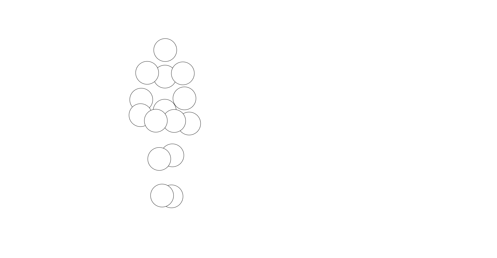

# Day 1

Tedd

- Went through the basics of p5live again

- Showed us how to create and use snippets

- Experimented with the audio snippet

  ```javascript
  function setup() {
  	createCanvas(windowWidth, windowHeight)
  
  	setupAudio(true) // global vars
  	// a5.ease = .075 // set easing
  	setupAudio(true) // global vars
  	// a5.ease = .075 // set easing
  }
  
  function draw() {
  	//ctrl shift A = audiorecative snippet
  	updateAudio()
  	//Fade Out hinzugügen mit background
  	background(0, 0, 255, 15)
  	fill(255, 0, 0)
  	//Kreis der von links nach rechts geht und auf Audio reagiert
  	circle(frameCount * 10 % width, height / 2, ampEase * 10)
  
  
  
  
  }
  ```

  


- Created a Webcam snippet

  ```javascript
  // {"P5LIVE":{"name":"webcam snipped used","mod":1777910742845}} 
  
  let capture, scl = 1,
  	rot = 0
  
  function setup() {
  	createCanvas(windowWidth, windowHeight)
  
  	createCanvas(windowWidth, windowHeight)
  	capture = createCapture(VIDEO)
  	capture.size(320, 240)
  	capture.hide() // hide raw camera
  	imageMode(CENTER)
  }
  
  function draw() {
  	//option shift s = snippet bearbeiten
  	//ctrl shift s = snippet einfügen
  scl = 2
  	image(capture, mouseX, mouseY, capture.width * scl, capture.height * scl)
  
  }
  ```

  


- Showed us how to use snippets from online libraries

  ```javascript
  // {"P5LIVE":{"name":"walker snippet","mod":1777912133985}} 
  
  //library einbetten mit let libs tab
  let libs = ['https://tetunori.github.io/BMWalker.js/dist/v0.6.1/bmwalker.js']
  
  const bmw = new BMWalker();
  
  function setup() {
  	createCanvas(windowWidth, windowHeight)
  	background(0, 0, 255)
  
  }
  //code aus dem snippet an richtigen Ort kopieren
  //parameter nach Wunsch anpassen
  function draw() {
  	clear()
  	//Grösse des Walkers
  	const walkerHeight = 600;
  	const markers = bmw.getMarkers(walkerHeight);
  
  	//Position des Walkers bestimmen
  	translate(width / 3, height / 2)
  	markers.forEach((m) => {
  		//Grösse der Kreise bestimmen
  		circle(m.x, m.y, 80);
  	});
  }
  ```

  

  
![[P5L_walker snippet_20260504162853.png]]

# Day 2

Alper

- Showed us how to create basic sliders

- Started with one slider and expanded it also with buttons 

  ```javascript
  // {"P5LIVE":{"name":"slider 01","mod":1777973807214}} 
  
          let slider, checkbox, button, colorPicker, dropdown, input, sliderText;
  
          function setup() {
          	createCanvas(windowWidth, windowHeight);
  
          	//checkbox
          	checkbox = createCheckbox('Show Form', true);
          	checkbox.position(width - 400, 20);
  
          	//slider1
          	//first value = start Grösse des Kreises
          	// second value = max Grösse des Kreises
          	slider = createSlider(50, width - 100, 200);
          	slider.position(width - 400, 60);
          	//slider2
          	slider2 = createSlider(50, height - 100, 200);
          	slider2.position(width - 400, 80);
          }
  
          function draw() {
          	background(220);
  
          	if(checkbox.checked()) {
          		//slider1 value bestimmt breite, slider 2 value höhe 
          		ellipse(width / 2, height / 2, slider.value(), slider2.value());
          	}
          }
  ```

  


```javascript
// {"P5LIVE":{"name":"slider 01","mod":1777974610291}} 

let slider, checkbox, button, colorPicker, dropdown, input, sliderText;
let bgColor;
let positionDOM;

function setup() {
	createCanvas(windowWidth, windowHeight);
	positionDOM = width - 400

	//checkbox (Erstellung Checkbox / Position)
	checkbox = createCheckbox('Show Form', false);
	checkbox.position(width - 400, 20);

	//sliders (Erstellung Slider / Position)
	// 50 = Startpunkt / height-100 = max Grösse
	slider = createSlider(50, height - 100, 400);
	slider.position(width - 400, 60);

	// Button
	button = createButton('Random Background');
	button.position(positionDOM, 100);
	button.mousePressed(() => {
		bgColor = color(random(255), random(255), random(255));
	});
	bgColor = color(220);

	// Color Picker
	colorPicker = createColorPicker('#ff0000');
	colorPicker.position(positionDOM, 140);
}

//
function draw() {
	background(bgColor);
	fill(colorPicker.value());

	if(checkbox.checked()) {
		ellipse(width / 2, height / 2, slider.value(), slider.value());
	}
}
```


- Created our own basic GUI

  ```
  // {"P5LIVE":{"name":"GUI","mod":1777976055921}} 
  
  let slider, checkbox, button, colorPicker, dropdown, input, sliderText, buttonText;
  let bgColor;
  let colorText;
  let positionDOM;
  
  function setup() {
  	createCanvas(windowWidth, windowHeight);
  	positionDOM = width - 400
  
  	//checkbox (Erstellung Checkbox / Position)
  	checkbox = createCheckbox('Show Form', false);
  	checkbox.position(width - 400, 20);
  
  	//sliders (Erstellung Slider / Position)
  	// 50 = Startpunkt / height-100 = max Grösse
  	slider = createSlider(50, height - 100, 400);
  	slider.position(width - 400, 60);
  	//slider Text
  	sliderText = createSlider(0, 300, 400);
  	sliderText.position(width - 600, 60);
  
  	// Button
  	button = createButton('Random Background');
  	button.position(positionDOM, 100);
  	button.mousePressed(() => {
  		bgColor = color(random(255), random(255), random(255));
  	});
  	bgColor = color(220);
  	
  	// ButtonText
  	buttonText = createButton('Random Color Text');
  	buttonText.position(positionDOM, 250);
  	buttonText.mousePressed(() => {
  		colorText = color(random(255), random(255), random(255));
  	});
  	//Start Farbe
  	colorText = color(200);
  
  	// Color Picker
  	colorPicker = createColorPicker('#ff0000');
  	colorPicker.position(positionDOM, 140);
  
  	// Dropdown
  	dropdown = createSelect();
  	dropdown.position(positionDOM, 180);
  	//Dropdown Option hinzugügen
  	dropdown.option('Circle');
  	dropdown.option('Square');
  	dropdown.option('Circle2');
  	rectMode(CENTER);
  
  	// Input field
  	input = createInput('Type text');
  	input.position(positionDOM, 220);
  	textAlign(CENTER, CENTER);
  }
  
  //
  function draw() {
  	background(bgColor);
  	fill(colorPicker.value());
  
  	if(checkbox.checked()) {
  		//wenn dropdown value is circle = draw ellipse
  		if(dropdown.value() === 'Circle') {
  			ellipse(width / 2, height / 2, slider.value(), slider.value());
  			//wenn dropdown value is square = draw rectangle
  		} else if(dropdown.value() === 'Square') {
  			rect(width / 2, height / 2, slider.value(), slider.value());
  		} else if(dropdown.value() === 'Circle2') {
  			ellipse(width / 2 + 100, height / 2, slider.value(), slider.value());
  			ellipse(width / 2 - 100, height / 2, slider.value(), slider.value());
  		}
  	}
  	//Text values von Slider und Button
  	fill(colorText)
  	textSize(sliderText.value());
  	text(input.value(), width / 2, height / 2);
  }
  ```

  


- Showed us how to create pencil tools and animations

- Experimented with snippets

  ```javascript
  // {"P5LIVE":{"name":"new_001","mod":1777988307010}} 
  
  let penColor = 0;
  
  function setup() {
  	createCanvas(windowWidth, windowHeight);
  	background(255);
  	stroke(0);
  }
  
  function draw() {
  
  	let pen1 = map(sin(frameCount * 0.005), -1, 1, 10, 50)
  	let differentX = map(mouseX, 0, width, 0, width / 2)
  
  	// ellipse (width/2 + cos(frameCount*0.025)*200,height/2 + sin(frameCount*0.025)*200,100)
  
  
  	if(mouseIsPressed) {
  		stroke(penColor);
  
  		strokeWeight(pen1);
  		line(prevX, prevY, mouseX, mouseY);
  		//ellipse(mouseX,mouseY, pen1, pen1)
  		//ellipse (mouseX,height/2,20)
  		//ellipse (differentX,height/2-100,20)
  	}
  	prevX = mouseX;
  	prevY = mouseY;
  	//random color for pen
  	penColor = color((255), random(255), random(255));
  }
  
  function keyPressed() {
  	if(key == 'S') {
  		save('drawing.png')
  	}
  }
  ```

  


```javascript
// {"P5LIVE":{"name":"colorful keypress","mod":1777990537599}} 

function setup() {
  createCanvas(windowWidth, windowHeight);
  textSize(80);
  fill(255);
  background(200);
}

function draw() {
  strokeWeight(4)
  stroke(0);
  fill(random(255), random(255), random(255));
  text(key, mouseX, mouseY); // Draw at coordinate (20,75)
}
```


```
// {"P5LIVE":{"name":"random colorful circle","mod":1777993426974}} 

let t = 0;


function setup() {
	createCanvas(windowWidth, windowHeight)
	
 setupAudio(true) // global vars
// a5.ease = .075 // set easing 
}
function draw() {
    updateAudio();
    
    // Noise für Bewegung über den ganzen Screen
    let x = noise(t) * width;
    let y = noise(t + 100) * height;
    t += 0.005;
    
    fill(random(255), random(255), random(255));
    ellipse(x, y, ampEase * 20);
}

/* 
P5LIVE - Audio
If using outside P5LIVE, include p5live-audio.js 
https://cdn.jsdelivr.net/gh/ffd8/P5LIVE/includes/utils/p5live-audio.js
*/
```


# Day 3


- Got introduced to Hydra
- Experimented with the basics and transformations

```javascript
osc(20, 0.1, 1.5).shift(0.4,0,0)
  .modulate(src(o0).scale(0.1), 0.15)
  .modulate(noise(3, 0.5), 0.1)   // noise zu Output o0 hinzufügen
  .out(o0)
//Output 0 wird genommen und rotiert
src(o0).rotate(0.8).out(o1)
//Kaleid wird auf srco1 angewendet und Scroll-Effekt wird hinzugefügt
//neuer Output heisst o2
src(o1).kaleid(10).scrollY(1, 0.2).out(o2)
;


render(o2)
```


```javascript
osc(20, 0.1, 1.5).shift(0.4,0,0)
  .modulate(src(o0).scale(0.1), 0.15)
  .modulateRotate(noise(3, 0.5), 0.1)   // noise zu Output o0 hinzufügen
  .out(o0)
//Output 0 wird genommen und rotiert
src(o0).rotate(0.8).out(o1)
//Kaleid wird auf srco1 angewendet und Scroll-Effekt wird hinzugefügt
//neuer Output heisst o2 // rotate mouse.x -> kann mit maus rotiert werden
//wenn array mit eckigen kammern mehrer values hat, dann werden sie nacheinander abgespielt
src(o1).kaleid([10,,4,50]).scrollY(1, 0.2).diff(o0).rotate( () => mouse.x).out(o2)
;


render(o2)
```


```javascript
s0.initCam()
src(s0).out(o0)
src(o0).modulate(noise(7,0.5)).scale(() => 1 + a.fft[3]).out(o1)
render(o1)
```


- Learned how to load hydra into p5live

- Experimented with it

  ```javascript
  let libs = ['https://unpkg.com/hydra-synth', 'includes/libs/hydra-synth.js', 'https://cdn.jsdelivr.net/gh/ffd8/hy5@main/hy5.js', 'includes/libs/hy5.js']
  // sandbox - start - inside sandbox we write hydra
  H.pixelDensity(2) // 2x = retina, set <= 1 if laggy
  
  s0.initP5() // send p5 to hydra
  P5.toggle(0) // optionally hide p5
  //s0 = p5
  src(s0)
  	.mult(gradient(3))
  	.modulate(noise([10,100,2]))
  	//.kaleid(10,0.2)
  	//.scrollY(1, 0.2)
  	.brightness(0.5)
  	//.scale(() => 1 + a.fft[3])
  	.modulateRepeatY(noise(3))
  	.pixelate(30)
  	.scrollY(1,0.3)
  	.out(o1)
  render(o1)
  // sandbox - end
  
  
  function setup() {
  	createCanvas(windowWidth, windowHeight)
  }
  
  function draw() {
  	// clear()
  	ellipse(mouseX,mouseY,200)
  	noStroke()
  
  }
  ```

  


```javascript
/*
	_HY5_p5_hydra // cc teddavis.org 2024
	pass p5 into hydra
	docs: https://github.com/ffd8/hy5
*/

let libs = ['https://unpkg.com/hydra-synth', 'includes/libs/hydra-synth.js', 'https://cdn.jsdelivr.net/gh/ffd8/hy5@main/hy5.js', 'includes/libs/hy5.js']

// sandbox - start
H.pixelDensity(2) // 2x = retina, set <= 1 if laggy

s0.initP5() // send p5 to hydra
P5.toggle(0) // optionally hide p5
//Hintergrund erstellen
osc(107, 0, 0.7)
  .color(0.4, 1, 1)
  .rotate(0, -0.08)
  .modulateRotate(o1, 0.4)
  .out(o0)
//src o0 nehmen und verändern und dann Maske mit Form hinzufügen
src(o0)
  .add(osc(33))
  .modulateRepeat(noise(3))
  .diff(o0)
//Zwei Dreiecke ergeben Stern
  .mask(shape(3).add(shape(3).rotate(1.3)).rotate(0, 0.08))
  .out(o1)
src(o1).osc(20,10,4).out(o2)


// sandbox - end


function setup() {
	createCanvas(windowWidth, windowHeight)
}


```


```javascript
// {"P5LIVE":{"name":"pixel text audio","mod":1778154280316}} 


/*
	_HY5_p5_hydra // cc teddavis.org 2024
	pass p5 into hydra
	docs: https://github.com/ffd8/hy5
*/

let libs = ['https://unpkg.com/hydra-synth', 'includes/libs/hydra-synth.js', 'https://cdn.jsdelivr.net/gh/ffd8/hy5@main/hy5.js', 'includes/libs/hy5.js']

// sandbox - start
H.pixelDensity(2) // 2x = retina, set <= 1 if laggy

s0.initP5() // send p5 to hydra
P5.toggle(0) // optionally hide p5

src(s0)
	.modulate(noize(2,1))
	.scrollY(1, 1.5)
	.pixelate(150)
	//.scale(() => 0.01 + a.fft[0])
	.kaleid([1,50,5])

	.out()
// sandbox - end

function setup() {
	createCanvas(windowWidth, windowHeight)
	
}
function draw() {
	background(20,30,255)
	textAlign(CENTER,CENTER)
	fill(255,0,100)
	textSize(400)
	text('erdbeeri',width/2,height/2)
	fill(0,255,0)
	text('mango',width/2-200,height/2+200)
	fill(255,255,0)
	text('kiwi',width/2+200,height/2-200)
	
}
```


# Day 4


- Jasmin showed us some of her work
- Learned how we can edit and use Text in p5live
- Experimented with the different Text options


```javascript

/*
	_HY5_p5_hydra // cc teddavis.org 2024
	pass p5 into hydra
	docs: https://github.com/ffd8/hy5
*/

let libs = ['https://unpkg.com/hydra-synth', 'includes/libs/hydra-synth.js', 'https://cdn.jsdelivr.net/gh/ffd8/hy5@main/hy5.js', 'includes/libs/hy5.js']

// sandbox - start
H.pixelDensity(2) // 2x = retina, set <= 1 if laggy

s0.initP5() // send p5 to hydra
P5.toggle(0) // optionally hide p5

src(s0)
	.modulate(noize(2,1))
	.scrollY(1, 1.5)
	.pixelate(150)
	//.scale(() => 0.01 + a.fft[0])
	.kaleid([1,50,5])

	.out()
// sandbox - end

function setup() {
	createCanvas(windowWidth, windowHeight)
	
}
function draw() {
	background(20,30,255)
	textAlign(CENTER,CENTER)
	fill(255,0,100)
	textSize(400)
	text('erdbeeri',width/2,height/2)
	fill(0,255,0)
	text('mango',width/2-200,height/2+200)
	fill(255,255,0)
	text('kiwi',width/2+200,height/2-200)
	
}
```


```javascript
function setup() {
	createCanvas(windowWidth, windowHeight)
	
}

function draw() {
	let live = frameCount%10
	//Damit Framecount weniger schnell ist
	frameRate(7)
	background(0,0,255)
	fill(255)
	textSize(100*(live/2))
	//Zeilenumbruch bei Wort oder Character
	textWrap(CHAR)
	textFont('monospace')
	textAlign(LEFT)
	textStyle(random([NORMAL,ITALIC]))
	//Zeilenabstand = textLeading, animiert mit Framecount
	textLeading(50*(live/2))
	//.repeat um Text zu wiederholen
	text("zürich zürich ".repeat(100), 100,100, 
	windowWidth,windowHeight)
}
```


```
function setup() {
	createCanvas(windowWidth, windowHeight)
	
}

function draw() {
	let live = frameCount%10
	let words = ["-- --","ooo oo",",,,,","!!! !!","???? ?","<< <<<",".. ...","||| ||||||","xx x",">> >>>"];
	let rand = random(words);
	let sine = floor(5*sin(frameCount/10)+5)
	//Damit Framecount weniger schnell ist
	frameRate(10)
	background(0,0,255)
	fill(255)
	textSize(200)
	//Zeilenumbruch bei Wort oder Character
	textWrap(CHAR)
	textFont('monospace')
	textAlign(LEFT)
	textStyle(NORMAL)
	//Zeilenabstand = textLeading, animiert mit Framecount
	textLeading(30*(live/2))
	//.repeat um Text zu wiederholen
	text(words[sine].repeat(1000), 100,100, 
	windowWidth-100,windowHeight-100)
}
```


```
function setup() {
	createCanvas(windowWidth, windowHeight)
	
}

function draw() {
	let live = frameCount%10
	let words = ["-- --","ooo oo",",,,,","!!! !!","???? ?","<< <<<",".. ...","||| ||||||","xx x",">> >>>"];
	let rand = random(words);
	let sine = floor(5*sin(frameCount/10)+5)
	//Damit Framecount weniger schnell ist
	frameRate(10)
	background(0,0,255)
	fill(255)
	textSize(200)
	//Zeilenumbruch bei Wort oder Character
	textWrap(CHAR)
	textFont('monospace')
	textAlign(LEFT)
	textStyle(NORMAL)
	//Zeilenabstand = textLeading, animiert mit Framecount
	textLeading(30*(live/2))
	//.repeat um Text zu wiederholen
	text(words[sine].repeat(1000), 100,100, 
	windowWidth-100,windowHeight-100)
}
```


```
let libs = ['https://unpkg.com/hydra-synth', 'includes/libs/hydra-synth.js', 'https://cdn.jsdelivr.net/gh/ffd8/hy5@main/hy5.js', 'includes/libs/hy5.js']

// sandbox - start
H.pixelDensity(2) // 2x = retina, set <= 1 if laggy

s0.initP5() // send p5 to hydra
P5.toggle(0) // optionally hide p5

src(s0)
	.rotate(10)
	.out()
// sandbox - end
function setup() {
	createCanvas(windowWidth, windowHeight)
	
// setupAudio(true) // global vars
// a5.ease = .075 // set easing 
}


function draw() {
 /* audio vars: amp, ampEase, fft, fftEase, waveform, waveformEase */
//updateAudio() 
	let live = frameCount%10
	let words = ["-- --","jjj jj","hässig ","222 22","o00o 00","dunnstig ",".. ...","namittag ","xx x","%% %%"];
	let rand = random(words);
	let sine = floor(5*sin(frameCount/10)+5)
	//Damit Framecount weniger schnell ist
	frameRate(5)
	background(127,255,0)
	fill(0)
	textSize(100)
	//Zeilenumbruch bei Wort oder Character
	textWrap(CHAR)
	textFont('monospace')
	textAlign(LEFT)
	textStyle(random([NORMAL,ITALIC]))
	//Zeilenabstand = textLeading, animiert mit Framecount
	textLeading(100)
	//.repeat um Text zu wiederholen
	text(words[sine].replace(/ /g,"!!!").repeat(1000), 100,100, 
	windowWidth-200,windowHeight-200)
  
}


```


```
function setup() {
	createCanvas(windowWidth, windowHeight)
	
}

function draw() {
	let live = frameCount%10
	let words = "hässig ";
	let rand = random(words);
	let sine = floor(5*sin(frameCount/10)+5)
	//Damit Framecount weniger schnell ist
	frameRate(10)
	background(0,0,255)
	fill(255)
	textSize(100)
	//Zeilenumbruch bei Wort oder Character
	textWrap(CHAR)
	textFont('monospace')
	textAlign(LEFT)
	textStyle(ITALIC)
	
	//Zeilenabstand = textLeading, animiert mit Framecount
	textLeading(30*(live/2))
	//.replace(/x/g,"a") = alle x werden mit a ersetzt
	text(words.replace(/i/g,"!").repeat(1000), 500,100, 
	windowWidth,windowHeight)
}
```


```
function setup() {
	createCanvas(windowWidth, windowHeight)
	frameRate(10)
	noSmooth()
}

function draw() {
	background(30)
	let comma = ","
	let space = ["-"]
	let commaline;
	fill(255)
	textSize(windowWidth/5)
	textWrap(CHAR)
	textSize(windowWidth/50)
	textFont("monospace")
	//loop wiederholen bis i nicht mehr kleiner als 11 ist
	for (let i = 0; i < 11; i ++){
		space.push("---")
	 // space[i] wird bei jeder runde an comma angehängt = wird immer länger
		comma = comma + space[i]
	//wiederholt es 33 mal
		commaline = comma.repeat(33)
	// 100 = Abstand vom links 
    //commaline.length*i/1.1 = macht dass linine immer weiter unten ist, desto länger sie wird
		text(commaline,100,commaline.length*i/1.1, windowWidth/2.5,windowHeight);
	}
}
```


