# DOCUMENTATION WEEK 2

## MONDAY

#### morning

- presentation by Ted Davis of his own work
- downloading p5.live offline
- answering questions


#### afternoon

- recapping key features of p5.live
- coding audioreactive programme (implementing amp)
- creating own snippets
- using code of libraries
- basic introduction to hydra & hy5.live
- basic introduction to strudel + its implementation in p5.live
- experimenting with tutorials


###### AUDIOREACTIVE PROGRAMME

```javascript
function setup() {
	createCanvas(windowWidth, windowHeight)

	setupAudio(true) // global vars
	// a5.ease = .075 // set easing
}

function draw() {
	/* audio vars: amp, ampEase, fft, fftEase, waveform, waveformEase */
	updateAudio()
	
	//circle which goes from left to right
	background(0, 0, 255, 10)
	fill(255)
	circle(frameCount * 10 % width, height / 2, 250)
	noStroke()
	print(mouseX)
	
	
	// pink circle which changes size according to 
	// volume of sound (audioreactive); position of
	// circle follows mouse position
	fill (255, 0, 123)
	circle(mouseX, mouseY, ampEase*10)

	// text that appears whenever you press a key
	push()
	fill(0, 255, 0)
	textSize(200)
	textAlign(CENTER, CENTER)
	text(key, width / 2, height / 2)
	pop()


}
```

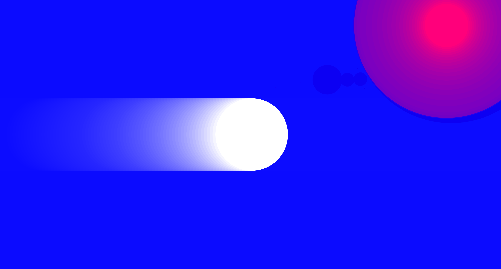


###### WEBCAM SNIPPET

```javascript
let capture, scl = 1,
	rot = 0

function setup() {
	createCanvas(windowWidth, windowHeight)

	capture = createCapture(VIDEO)
	capture.size(320, 240)
	capture.hide() // hide raw camera
	imageMode(CENTER)
}

function draw() {

	image(capture, mouseX, mouseY, capture.width * scl, capture.height * scl)

}
```

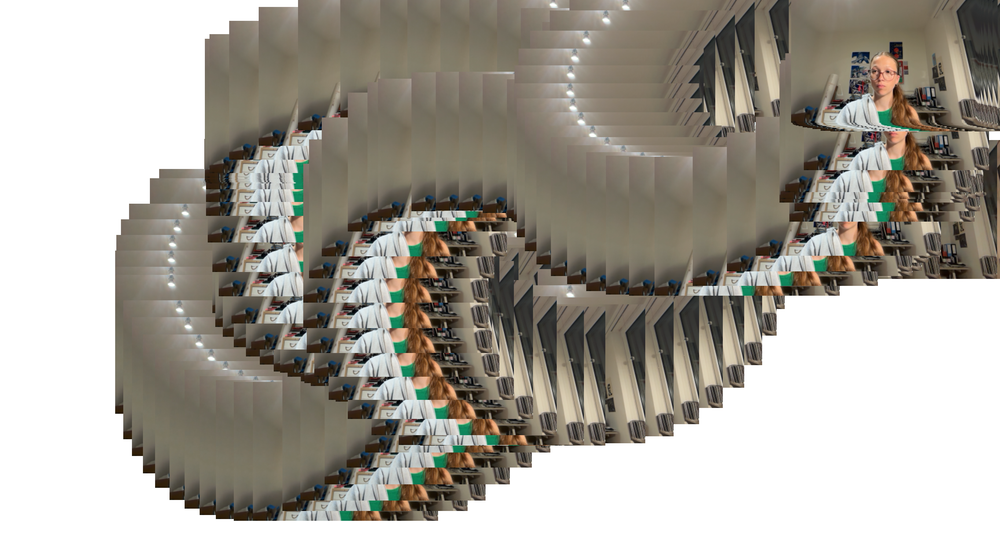


###### USING LIBRARIES: BM WALKER

```javascript
let libs = ['https://tetunori.github.io/BMWalker.js/dist/v0.6.1/bmwalker.js']

const bmw = new BMWalker();

function setup() {
	createCanvas(windowWidth, windowHeight)

	
}

function draw() {
	clear()
	background (0,255,255)
	const walkerHeight = height/2;
	const markers = bmw.getMarkers(walkerHeight);
	
	translate(width / 2, height / 2)
	//translate (mouseX, mouseY)
	markers.forEach((m) => {
		fill(255,255,0)
		stroke(255,0,255)
	circle(m.x, m.y, 50);
});
}
```

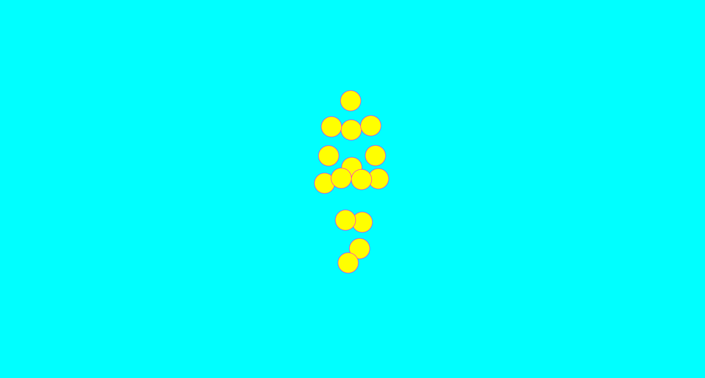


###### STRUDEL x P5.Live

```javascript
// strudel
$: s("<[bd*2 sd], hh*4>").p5live(()=>{
  if(hap.s == 'bd'){
    bgColor = random(255)  // set a variable, don't draw directly
  }
  if(hap.s == 'sd'){
    circles.push({x: random(width), y: random(height), r: random(200)})
  }
})
// strudel

let bgColor = 0
let circles = []

function setup() {
  createCanvas(windowWidth, windowHeight)
}

function draw() {
  background(bgColor)  // draw() reads the variable each frame
  
  noFill()
  stroke(255)
  for(let c of circles){
    circle(c.x, c.y, c.r)
  }
} 
```

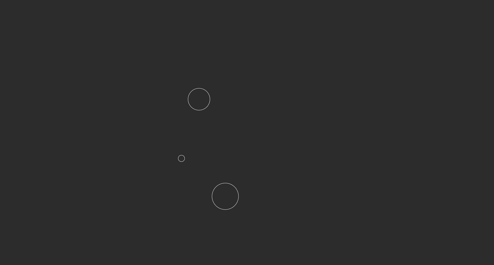


###### TUTORIAL 1: FLOATING BUBBLES

```javascript
function setup() {
	createCanvas(windowWidth, windowHeight)

}

function draw() {
	background(0, 5)
	
	stroke (255)
	noFill()
	
	let lc = 55;
	for(let i = 0; i < lc; i++) {
		//multiplying i with a number creates offset within movement
		//x is sin from the current framecount * 0.013 plus i * 0.4
		// this result is then multiplied with 0.5 width
		let x = sin(i*3.4 +frameCount * .0005) * width / 2 
		let y = cos(i* 9 + frameCount * .001) * height / 2
		// size of bubbles: sin of framecount * 0.0012 plus i * 0.5
		let s = sin(i*.5 + frameCount * .0012) * 200
		// the ellipse is drawn at an offset of x and y to the center
		ellipse(width / 2 + x, height / 2 + y, s)
	}
}
```

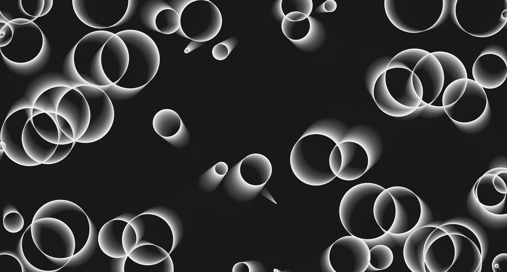


###### TUTORIAL 2: OSCILLATING CIRCLES

```javascript
function setup() {
	createCanvas(windowWidth, windowHeight)

}

function draw() {
	background(0, 5)
	
	stroke (255)
	noFill()
	
	let lc = 10;
	for(let i = 0; i < lc; i++) {
		//multiplying i with a number creates offset within movement
		//x is sin from the current framecount * 0.03 plus i * 0.4
		// this result is then multiplied with 1/3 width
		let x = sin(i*.4 +frameCount * .03) * width / 3 
		let y = cos(i* 1.6 + frameCount * .03) * height / 3
		// size of bubbles: sin of framecount * 0.5 plus i * 0.02
		let s = sin(i*.5 + frameCount * .02) * 100
		// the ellipse is drawn at an offset of x and y to the center
		ellipse(width / 2 + x, height / 2 + y, s)
	}
}
```


###### TUTORIAL 3: ROTATING SQUARES

```javascript
function setup() {
	createCanvas(windowWidth, windowHeight)

}

function draw() {
	background(0, 5)

	stroke(255)
	noFill()
	rectMode(CENTER)

	let lc = 15;
	for(let i = 0; i < lc; i++) {
		let x = sin(i * 3.4 + frameCount * .001) * width / 2
		let y = cos(i * 9 + frameCount * .005) * height / 2
		let s = sin(i * .5 + frameCount * .0012) * 700
		push()
		// translate whole orientation of coordinates and putting
		// rectangles at P(0/0) instead of changing position of
		// rectangles bc we want to rotate
		translate(width / 2 + x, height / 2 + y)
		rotate(radians(i*.5 + frameCount*.5))
		rect(0, 0, s)
		pop()
	}
}
```

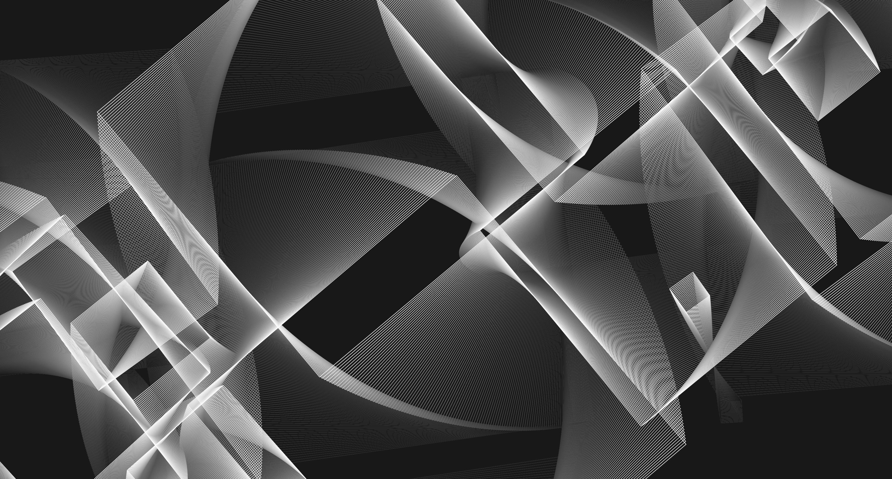


###### TUTORIAL 4: 3D ROTATING SQUARES

```javascript
let layer3d;
function setup() {
	createCanvas(windowWidth, windowHeight)
	layer3d = createGraphics(width, height, WEBGL)
}

function draw() {
	background(0, 10)

	layer3d.clear()
	layer3d.stroke(255)
	layer3d.noFill()
	layer3d.rectMode(CENTER)

	let lc = 5;
	for(let i = 0; i < lc; i++) {
		let x = sin(i * 3.4 + frameCount * .001) * width / 3
		let y = cos(i * 9 + frameCount * .005) * height / 3
		let s = sin(i * .5 + frameCount * .0012) * width/4
		
		layer3d.push()
		// translate whole orientation of coordinates and putting
		// rectangles at P(0/0) instead of changing position of
		// rectangles bc we want to rotate
		layer3d.translate(x,y)
		layer3d.rotateY(radians(i*15 + frameCount*2))
		layer3d.stroke(255)
		if(frameCount%5==0){
			layer3d.stroke(0)
		}
		layer3d.rect(0, 0, s)
		layer3d.pop()
	}
	
	image (layer3d, 0, 0, width, height)
}
```

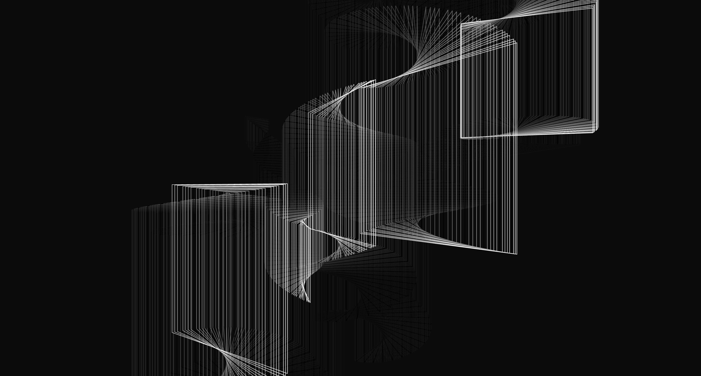


###### TUTORIAL 5: 3D ROTATING SQUARES CENTERED

```javascript
let layer3d; //make a new layer. why?
function setup() {
	createCanvas(windowWidth, windowHeight)
	layer3d = createGraphics(width, height, WEBGL)
}

function draw() {
	background(0, 10)

	layer3d.clear()
	layer3d.stroke(255)
	layer3d.noFill()
	layer3d.rectMode(CENTER)


	let lc = 5;
	for(let i = 0; i < lc; i++) {
		let x = 0 //sin(i * 3.4 + frameCount * .001) * width / 3
		let y = 0 // cos(i * 9 + frameCount * .005) * height / 3
		let s = sin(i * .5 + frameCount * .0012) * mouseX
		
		layer3d.push()
		// translate whole orientation of coordinates and putting
		// rectangles at P(0/0) instead of changing position of
		// rectangles bc we want to rotate
		layer3d.translate(x,y)
		layer3d.rotateY(radians(i*15 + frameCount*.2))
		layer3d.stroke(255)
		if(frameCount%5==0){
			layer3d.stroke(0)
		}
		layer3d.rect(0, 0, s)
		layer3d.pop()
	}
	
	image (layer3d, 0, 0, width, height)
}
```

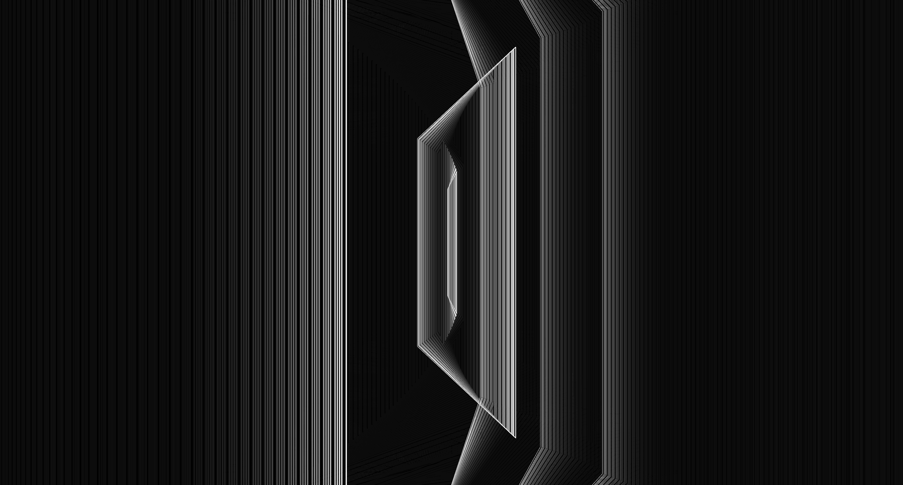


###### TUTORIAL 6: ROTATING CIRCLES

```javascript
let layer3d; //make a new layer. why?
function setup() {
	createCanvas(windowWidth, windowHeight)
	layer3d = createGraphics(width, height, WEBGL)
}

function draw() {
	background(0, 5)

	layer3d.clear()
	layer3d.stroke(255)
	layer3d.noFill()
	layer3d.rectMode(CENTER)


	let lc = 15;
	for(let i = 0; i < lc; i++) {
		let x = 0 //sin(i * 3.4 + frameCount * .001) * width / 3
		let y = 0 // cos(i * 9 + frameCount * .005) * height / 3
		let s = sin(i*15 + frameCount * .0012) * height
		
		layer3d.push()
		// translate whole orientation of coordinates and putting
		// rectangles at P(0/0) instead of changing position of
		// rectangles bc we want to rotate
		layer3d.translate(x,y)
		layer3d.rotateY(radians(i*25 + frameCount* i *.01))
		layer3d.stroke(255)
		if(frameCount%5==0){
			layer3d.stroke(0)
		}
		layer3d.circle(0, 0, s)
		layer3d.pop()
	}
	
	image (layer3d, 0, 0, width, height)
}
```

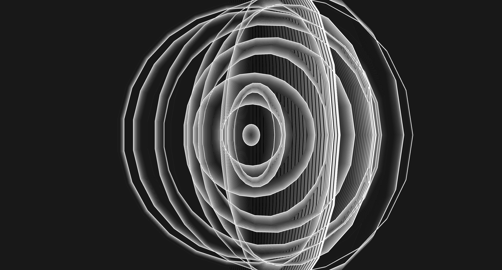


###### TUTORIAL 6: ROTATION IF MOUSE CLOSE

```javascript
let angle = 0
let distMouse = 100

function setup() {
	createCanvas(windowWidth, windowHeight)
	rectMode(CENTER)
	angleMode(DEGREES)

}

function draw() {
	background(220, 80)
	let distance = dist(mouseX, mouseY, width / 2, height / 2)

	if(distance < distMouse) {
		angle += 5
	}
	//print(distance)
	translate(width / 2, height / 2)
	noStroke()
	fill(0, 0, 255)
	rotate(angle)
	rect(0, 0, 100, 50)
	//angle+= 1

}
```

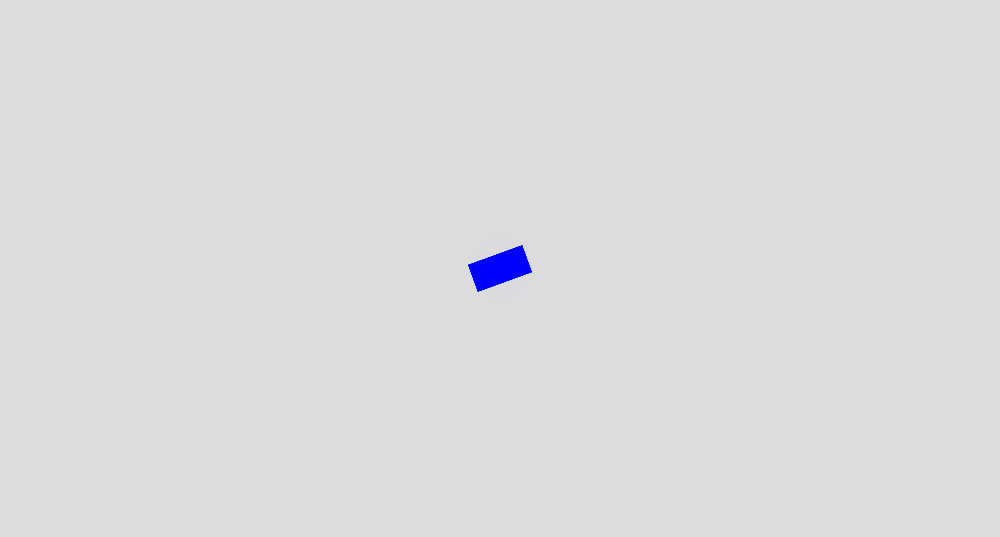


## TUESDAY

#### morning

- presentation by Alger Yagcioglu on his work
- learning to code sliders, buttons, colour pickers, radio


###### SLIDERS, BUTTONS, COLOUR PICKERS, RADIOS

```javascript
        let slider, checkbox, button, colorPicker, dropdown, input, radio
        let bgColor;
        let textColor
        let positionDOM;

        function setup() {
        	createCanvas(windowWidth, windowHeight);

        	positionDOM = width - 400

        	//checkbox
        	// true = checkbox is per default activated
        	checkbox = createCheckbox('show form', true);
        	checkbox.position(width - 400, 20);

        	//sliders
        	//create slider; with range from 50 to (height - 100),
        	// 200 is the value that is used per default

        	//slider width
        	slider = createSlider(50, height - 100, 200);
        	slider.position(positionDOM, 90);

        	//slider height
        	slider2 = createSlider(50, height - 100, 200);
        	slider2.position(positionDOM, 110);

        	// slider Text Size
        	sliderText = createSlider(10, 400, 30);
        	sliderText.position(positionDOM, 290);


        	//sliderStroke
        	sliderStroke = createSlider(2, 100, 5);
        	sliderStroke.position(positionDOM, 605);

        	// Button Random Background
        	button = createButton('random background');
        	button.position(positionDOM, 440);
        	button.mousePressed(() => {
        		bgColor = color(random(255), random(255), random(255));
        	});
        	bgColor = color(220);

        	// Button Random Text
        	button = createButton('random textcolor');
        	button.position(positionDOM, 320);
        	button.mousePressed(() => {
        		textColor = color(random(255), random(255), random(255));
        	});
        	textColor = color(0);


        	// Color Picker
        	colorPicker = createColorPicker('#ff0000');
        	colorPicker.position(positionDOM, 140);

        	// Dropdown Shape
        	dropdown = createSelect();
        	dropdown.position(positionDOM, 60);
        	dropdown.option('circle');
        	dropdown.option('square');
        	rectMode(CENTER);

        	// Dropdown Fonts
        	dropdownFont = createSelect();
        	dropdownFont.position(positionDOM, 270);
        	dropdownFont.option('Helvetica');
        	dropdownFont.option('Courier');
        	dropdownFont.option('Verdana')
        	rectMode(CENTER);

        	// Input field
        	input = createInput('type text');
        	input.position(positionDOM, 250);
        	textAlign(CENTER, CENTER);


        	//Radio button
        	radio = createRadio();
        	radio.option('black');
        	radio.option('white');
        	radio.option('none');
        	radio.selected('black');
        	radio.position(positionDOM, 580);


        }


        function draw() {
        	background(bgColor);
        	// shape should be filled with colour of color picker
        	fill(colorPicker.value())
        	strokeWeight(sliderStroke.value())


        	//Stroke around circle
        	if(radio.value() === 'black') stroke(0);
        	if(radio.value() === 'white') stroke(255);
        	if(radio.value() === 'none') noStroke();


        	// whatever shape chosen in the dropdown is shown,
        	// if the checkbox is activated
        	if(checkbox.checked()) {
        		if(dropdown.value() === 'circle') {
        			ellipse(width / 2, height / 2, 
                      slider.value(), slider2.value());
        		} else if(dropdown.value() === 'square') {
        			rect(width / 2, height / 2, 
                   slider.value(), slider2.value());
        		}
        	}

        	if(dropdownFont.value() === 'Helvetica') {
        		textFont('Helvetica')
        	} else if(dropdownFont.value() === 'Courier') {
        		textFont('Courier')
        	} else if(dropdownFont.value() === 'Verdana') {
        		textFont('Verdana')
        	}

        	push()
        	noStroke()
        	fill(textColor)
        	textSize(sliderText.value());
        	text(input.value(), width / 2, height / 2);
        	pop()

        }
```

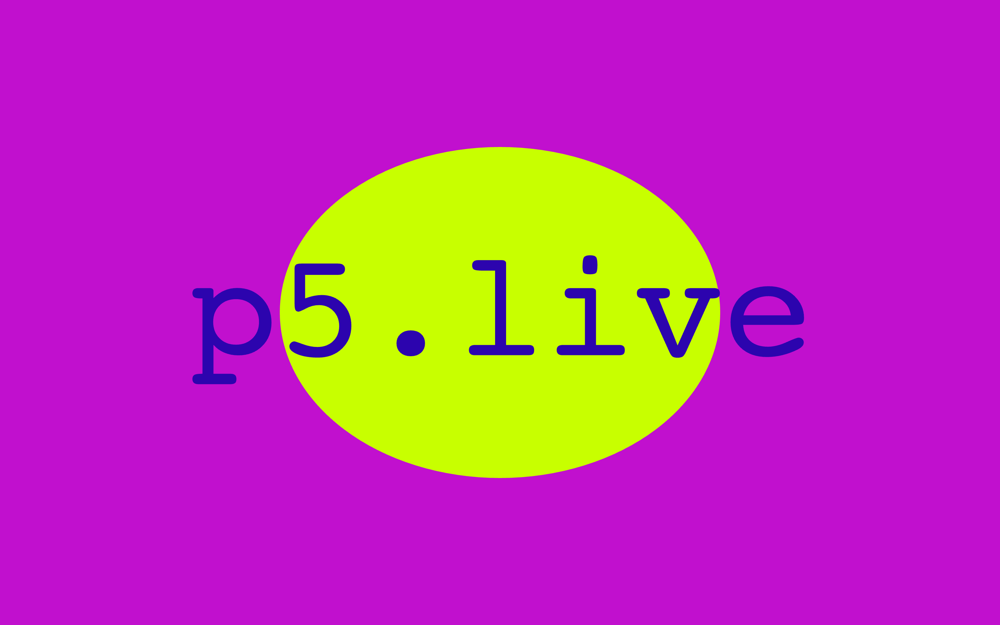


#### afternoon

- coding different paint tools
- coding with sin and cos


###### SIZE-CHANGING TWO-COLOUR BRUSH

```javascript
function setup() {
  createCanvas(windowWidth,windowHeight);
  background(200);
  stroke(0);
}

function draw() {
  
  let pen1 = map(sin(frameCount*0.03),-1,1,1,50)
  
  let diffrentX = map(mouseX,0,width,0,width/2)
  
  if (mouseIsPressed) {
    stroke(0);
    strokeWeight(pen1);
    //line(prevX, prevY, mouseX, mouseY);
    ellipse(mouseX,mouseY, pen1, pen1)
    
    stroke(255)
    ellipse(mouseX+30,mouseY+40, pen1, pen1)
  }
  prevX = mouseX;
  prevY = mouseY;
}

function keyPressed(){
	if(key == 's'){
		save('drawing.png')
	}
}
```

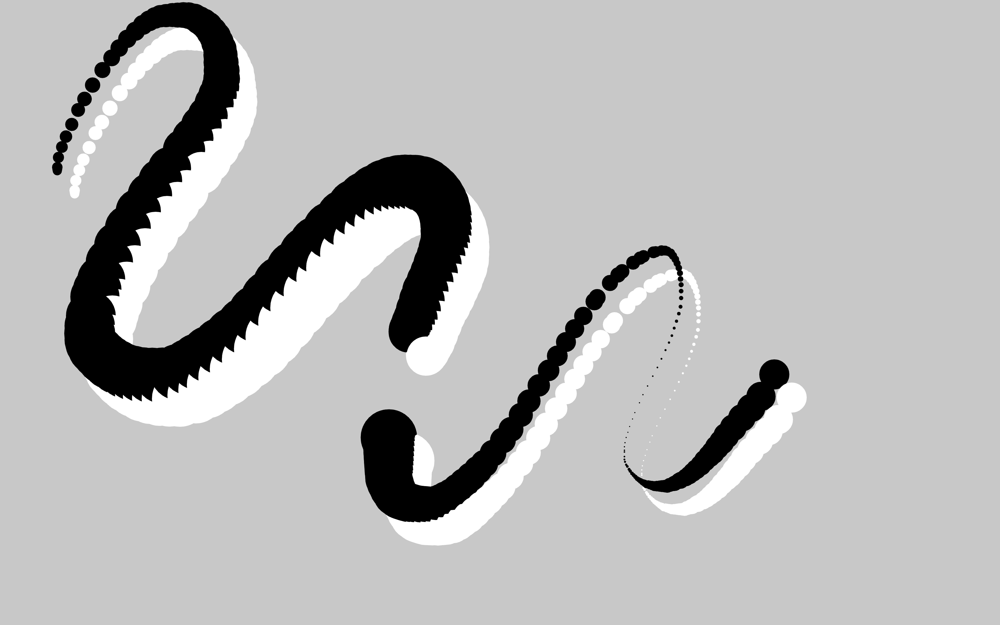


###### WEIGHT-CHANGING BRUSH

```javascript
function setup() {
  createCanvas(windowWidth,windowHeight);
  background(200);
  stroke(0);
}

function draw() {
  
  let pen1 = map(sin(frameCount*0.03),-1,1,1,50)
  
  let diffrentX = map(mouseX,0,width,0,width/2)
  
  if (mouseIsPressed) {
    stroke(0);
    strokeWeight(pen1);
    line(prevX, prevY, mouseX, mouseY);
    
    stroke(255)
  }
  prevX = mouseX;
  prevY = mouseY;
}

function keyPressed(){
	if(key == 's'){
		save('drawing.png')
	}
}
```

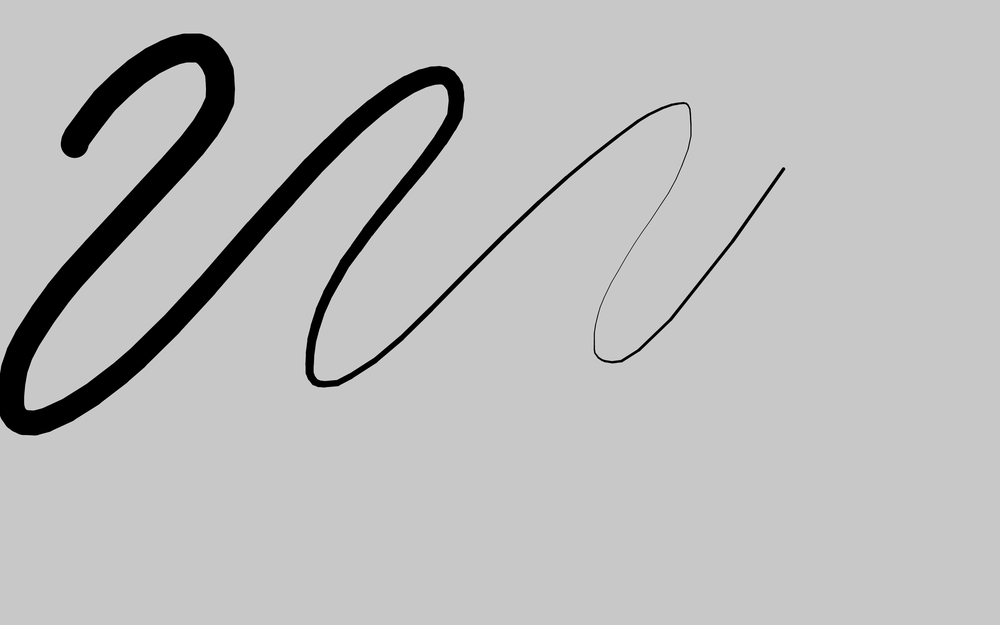


###### CIRCULATING CIRCLE

```javascript
function setup() {
	createCanvas(windowWidth, windowHeight);
	background(52, 209, 162);
	// we multiply the same circle all the time
	// but we don't see single circles
	// because the stroke is 10 thick
	strokeWeight(10)
	stroke(251, 84, 43);

}

function draw() {

	// pen 1 is always fluctuating its value 
	// following sine
	let pen1 = map(sin(frameCount * 0.025), -1, 1, 10, 50)
	ellipse(width / 2 + cos(frameCount * 0.025) * 200, height / 2 + sin(frameCount * 0.025) * 200, 100)

	// when you press the mouse, the current value
	// of pen 1 (which fluctuates) is used for the
	// strokeWeight

	// white circle doesn't change size but appears
	// smaller if stroke is thicker
	// if mouse is not pressed, the strokeWeight
	// stays the same
	if(mouseIsPressed == true) {
		stroke(251, 84, 43)
		strokeWeight(pen1)
	}
}

function keyPressed() {
	if(key == 'S') {
		save('drawing.png')
	}
}
```

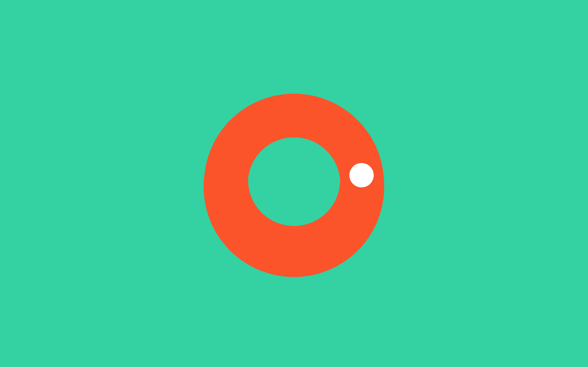


###### SIN-COS-DRAWING

```javascript
function setup() {
	createCanvas(windowWidth, windowHeight)
	stroke(39, 59, 218)
	noFill()
	background(223, 255, 0)
}

function draw() {
	let speedX = sin(frameCount * 0.02) + sin(frameCount * 0.016) * 300
	let speedY = cos(frameCount * 0.02) + cos(frameCount * 0.004)* 300
	
	ellipse(width/2 + speedX, height/2 + speedY, 100)
	

	
}
```

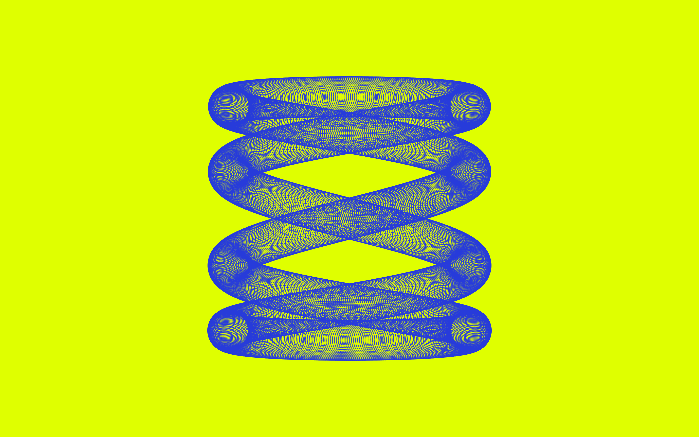


###### NOISE-BASED TWO-LINE DRAWING TOOL

```javascript
function setup() {
	createCanvas(windowWidth, windowHeight)
	background(233, 92, 255)
	
	
}

function draw() {
	//Line No. 1
	fill(216, 255, 50)
	let x1 = noise(frameCount * 0.005 + 50) * width
	let y1 = noise(frameCount * 0.006 + 50 )* height
	ellipse(x1,y1, 15)
	
	
	//Line No. 2
	fill(88, 0, 255)
	let x2 = noise (frameCount * 0.004 + 100) * width
	let y2 = noise(frameCount * 0.008 + 100) * height
	ellipse(x2, y2, 15)
}
```

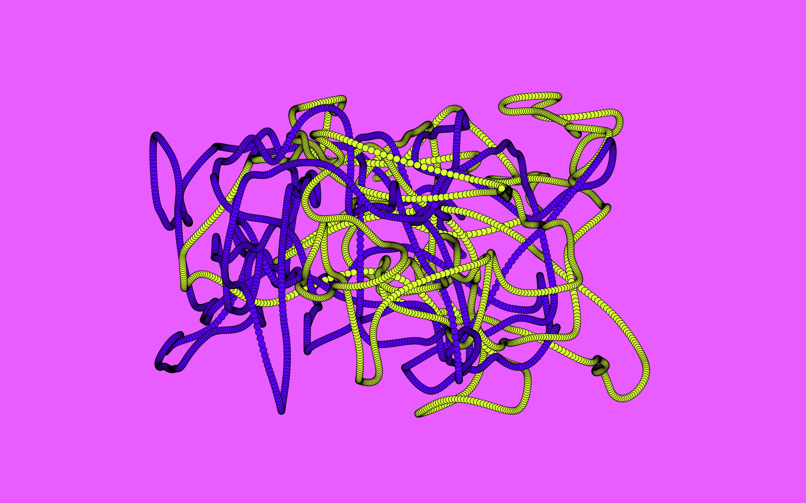


###### COLOUR-CHANGING DONUT

```javascript
function setup() {
	createCanvas(windowWidth, windowHeight)
	background(255)
	
}

function draw() {

//colours change gradually 
fill(sin(frameCount*0.001)*220,sin(frameCount*0.006)*200,sin(frameCount*0.006)*255)


noStroke()
ellipse(width/2 + sin(frameCount*0.02)*250, height/2 + cos(frameCount*0.02)*250, 300)	
}
```

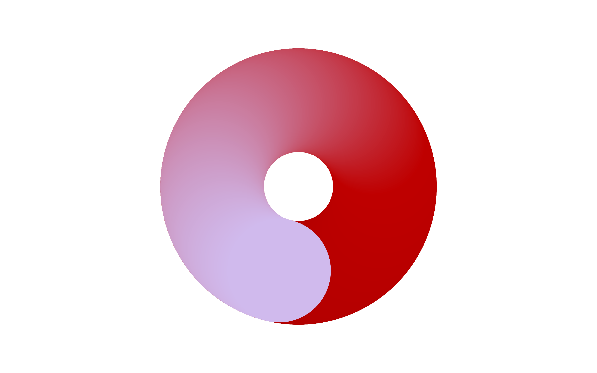


## WEDNESDAY

#### morning

- short presentation by Andrea on his work

- introduction to hydra:
  - sources
  
  - transformations
  
    -> experiments with different values on website: https://learn-andreazaccuri.azeta.workers.dev/260506-colabor/transforms/


#### afternoon

- combining different elements in hydra
- individual experimentation phase


###### EXPERIMENT NOISE, GRADIENT, OSCILLATOR

```javascript
osc(6,0.2,5)
    .kaleid(5)
    .modulate(noise(0.3)
    .sub(gradient()),5)
    .mult(osc(15,0.2,2)
    .rotate(5)
    .scale(10))
    .out(o0)

src(o0)
	.rotate(0.25)
	.diff(o0)
	.color(0.5, 0, 1)
	.out(o1)


render(o1)
```


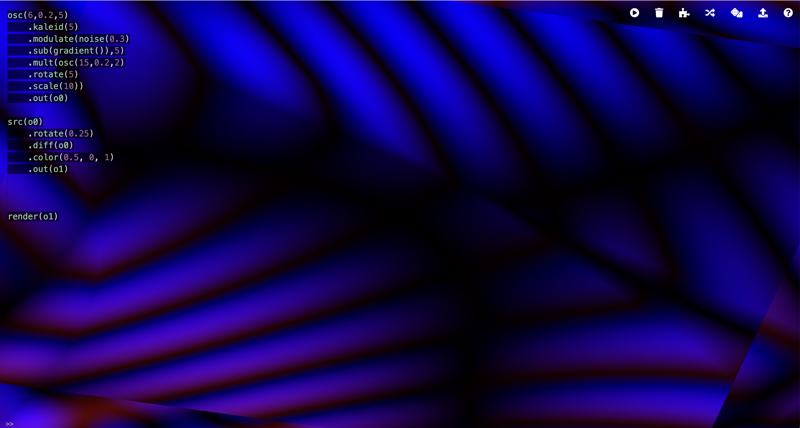


###### EXPERIMENT WITH CAMERA

```javascript
s0.initCam()
src(s0).modulate(osc(2,1.5)).color(1,0,1).diff(osc(2.6, .5).rotate(5)).out(o1)

src(o1).modulate(noise(3). rotate(3)).out(o2)

src(o2).repeat(2,2).out(o3)

render(o3)
```

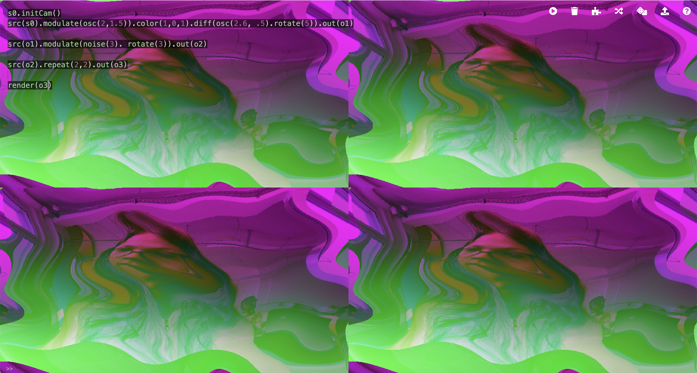


###### TYPOGRAPHY PIXELATED

```javascript
/*
	_HY5_p5_hydra // cc teddavis.org 2024
	pass p5 into hydra
	docs: https://github.com/ffd8/hy5
*/

let libs = ['https://unpkg.com/hydra-synth', 'includes/libs/hydra-synth.js', 'https://cdn.jsdelivr.net/gh/ffd8/hy5@main/hy5.js', 'includes/libs/hy5.js']

// sandbox - start
H.pixelDensity(2) // 2x = retina, set <= 1 if laggy

s0.initP5() // send p5 to hydra
P5.toggle(0) // optionally hide p5

src(s0)
	.modulate(noise(1,1))
	.pixelate(50)
	.out(o0)
// sandbox - end


function setup() {
	createCanvas(windowWidth, windowHeight)
	background(255)
}

function draw() {
	// clear()
	fill(50, 0, 245)
	textAlign(CENTER, CENTER)
	textSize(1000)
	text('hi', width/2, height/2)
}
```

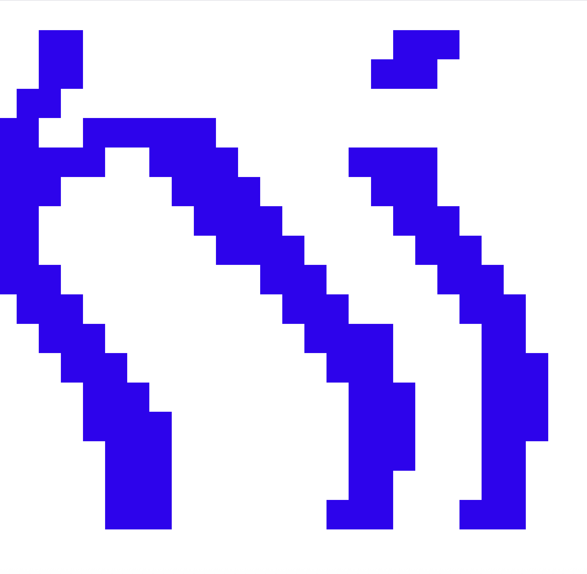


###### WIGGLING PIXELATED COLOUR-CHANGING TYPOGRAPHY

```javascript
/*
	_HY5_p5_hydra // cc teddavis.org 2024
	pass p5 into hydra
	docs: https://github.com/ffd8/hy5
*/

let libs = ['https://unpkg.com/hydra-synth', 'includes/libs/hydra-synth.js', 'https://cdn.jsdelivr.net/gh/ffd8/hy5@main/hy5.js', 'includes/libs/hy5.js']

// sandbox - start
H.pixelDensity(2) // 2x = retina, set <= 1 if laggy

s0.initP5() // send p5 to hydra
P5.toggle(0) // optionally hide p5

src(s0)
	.pixelate(80)
	.modulate(noize(2, 1))
	.repeat([1, 3, 5], [1, 2, 3] )
	.out(o0)
	
src(o0)
	.modulate(osc(2.5,1.1))
	.out(o2)
	
render(o2)
	
// sandbox - end


function setup() {
	createCanvas(windowWidth, windowHeight)
	
	background(255)
}

function draw() {
	// clear()
	frameRate(0.99)
	let options = ["rgb(236, 0, 168)", "rgb(0, 15, 255)", "rgb(169, 0, 255)"]
	let chosenText = random(options)
	
	let options2 = ["rgb(0, 208, 58)", "rgb(255, 144, 3)", "rgb(213, 243, 0)"]
	let chosenBg = random(options2)
	background(chosenBg)
	fill(chosenText)
	textAlign(CENTER, CENTER)
	textSize(800)
	text('sali', width / 2, height / 2)
}
```

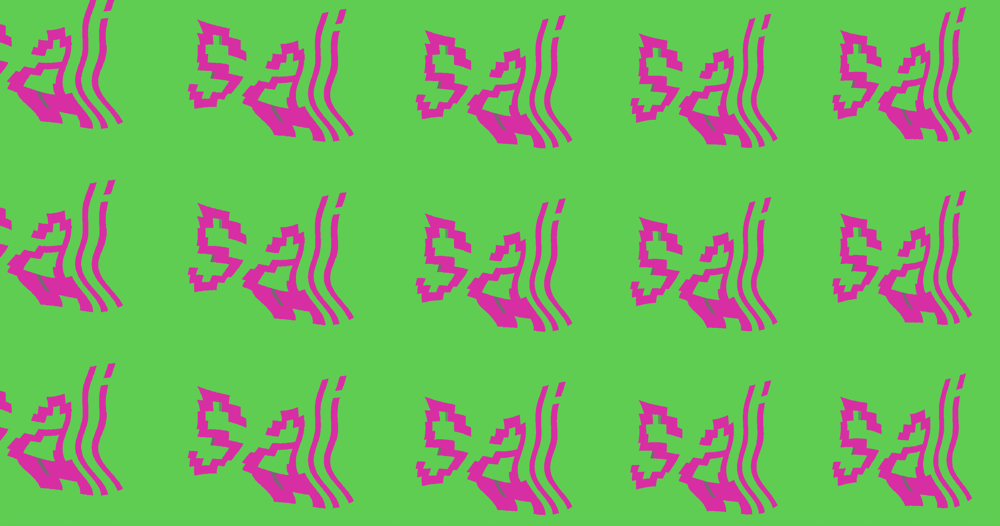


###### WIGGLING PIXELATED TYPOGRAPHY

```javascript
/*
	_HY5_p5_hydra // cc teddavis.org 2024
	pass p5 into hydra
	docs: https://github.com/ffd8/hy5
*/

let libs = ['https://unpkg.com/hydra-synth', 'includes/libs/hydra-synth.js', 'https://cdn.jsdelivr.net/gh/ffd8/hy5@main/hy5.js', 'includes/libs/hy5.js']

// sandbox - start
H.pixelDensity(2) // 2x = retina, set <= 1 if laggy

s0.initP5() // send p5 to hydra
P5.toggle(0) // optionally hide p5

src(s0)
	.modulate(osc(8, 0.3))
	.pixelate(40)
	.out(o1)

src(o1)
	.modulate(osc(8, 0.2).rotate(2))
	.out(o2)

render(o2)

// sandbox - end


function setup() {
	createCanvas(windowWidth, windowHeight)

	background(216, 247, 1)
}

function draw() {
	// clear()
	// frameRate(5)


	// let options2 = ["rgb(0, 208, 58)", "rgb(255, 144, 3)", "rgb(213, 243, 0)"]
	// let chosenBg = random(options2)
	// background(chosenBg)

	// let options = ["rgb(236, 0, 168)", "rgb(0, 15, 255)", "rgb(169, 0, 255)"]
	// let chosenText = random(options)
	//fill(chosenText)

	fill(231, 45, 0)
	circle(width / 2 + 100, height / 2 + 100, 1200)

	fill(129, 0, 198)
	textAlign(CENTER, CENTER)
	textSize(1000)
	text('6', width / 2 + 100, height / 2 + 100)


}
```

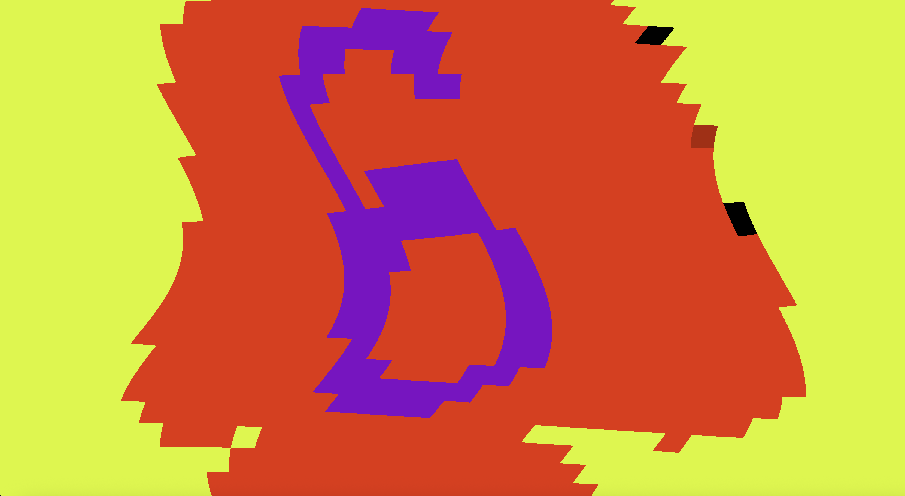


## THURSDAY

#### morning

- presentation by Jasmin on her work and career
- introduction to using text in p5.live
  - basic functions (textAlign, textWrap, etc.)
  - introduction to arrays
  - function "repeat"


###### ANIMATION TEXT LEADING (TAN)

```javascript
function setup() {
	createCanvas(windowWidth, windowHeight)

}

function draw() {
	background(230);
	fill(10);
	textSize(70);

	// textWrap = it automatically breaks text at the end of the text window
	// CHAR = between characters; WORD = between word
	textWrap(CHAR);
	textFont('Helvetica');

	//rechtsbündig, linksbündig, etc. (LEFT, CENTER, RIGHT)
	// second value aligns text vertically
	textAlign(LEFT, CENTER);


	textStyle(NORMAL)

	// with last two values, one can define width and height of text box
	text("xoxo x oxoxox oxoxo x o xoxo". repeat(100),
		100, 0, windowWidth-200, windowHeight)

	// Zeilenabstand
	textLeading(tan(frameCount*0.007)*100)
}
```

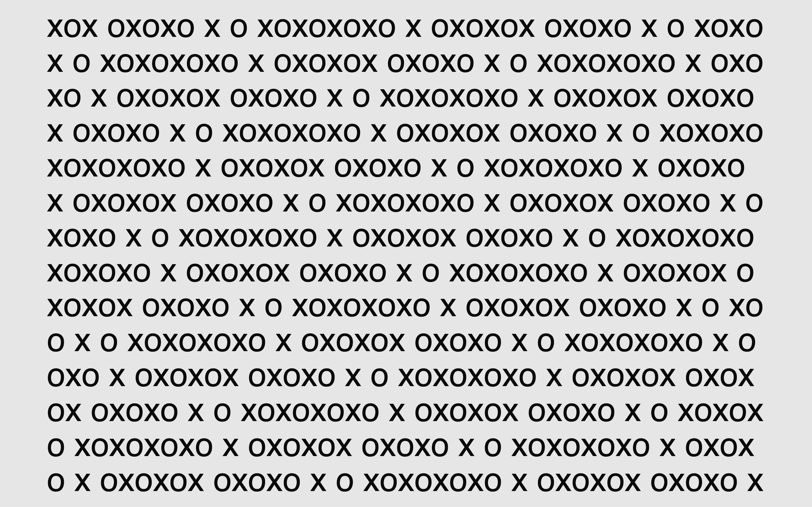

###### 

###### ANIMATION TEXT LEADING 2

```javascript
function setup() {
	createCanvas(windowWidth, windowHeight)

}

function draw() {
	//frameCount%10 = in rhythm of frameCount, it counts to 10
	background(230);
	let live = frameCount%10
	
	frameRate(5)
	fill(10);
	textSize(40);
	textWrap(CHAR);
	textFont('monospace');
	textAlign(LEFT);
	textStyle(ITALIC)
	textLeading(15*(live/5))
	text("xox     oxox    oxoxox ". repeat(200),
		10, 10, windowWidth/1.1,windowHeight)


}
```

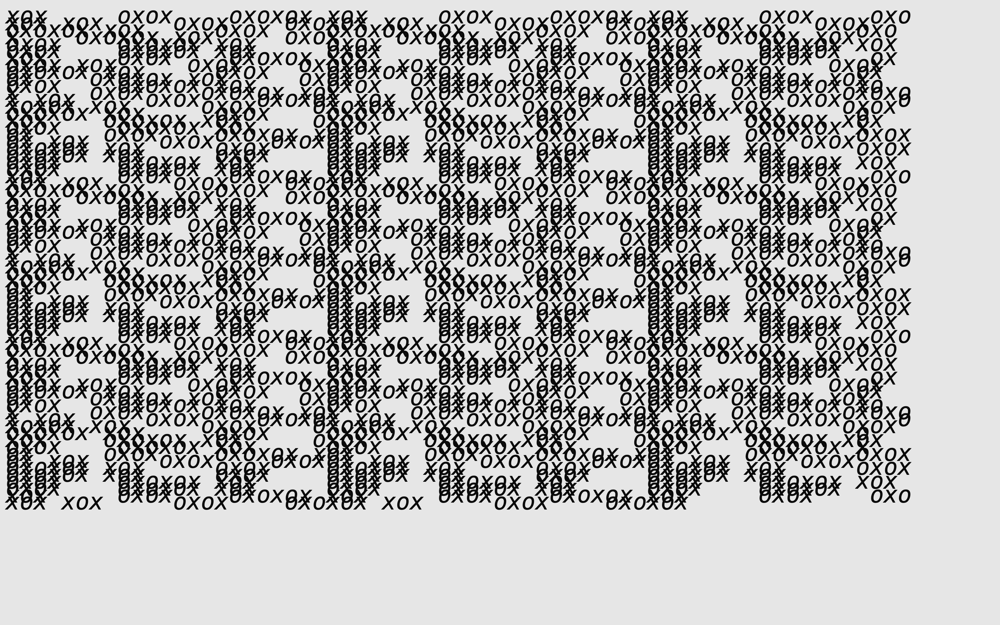


###### ANIMATION TYPOGRAPHY RANDOM 

```javascript
function setup() {
	createCanvas(windowWidth, windowHeight)

}

function draw() {
	//frameCount%10 = in rhythm of frameCount, it counts to 10
	background(230);
	let live = frameCount%10
	
	frameRate(3)
	fill(10);
	textSize(40);
	textWrap(CHAR);
	textFont('Courier');
	textAlign(LEFT);
	textStyle(random([ITALIC, BOLD, NORMAL]))
	textLeading(random([20, 40, 60]))
	//textLeading(15*(live/5))
	text("xox     oxox    oxoxox ". repeat(200),
		10, 10, random([400, 800, width]),random([300, 600, height]))


}
```

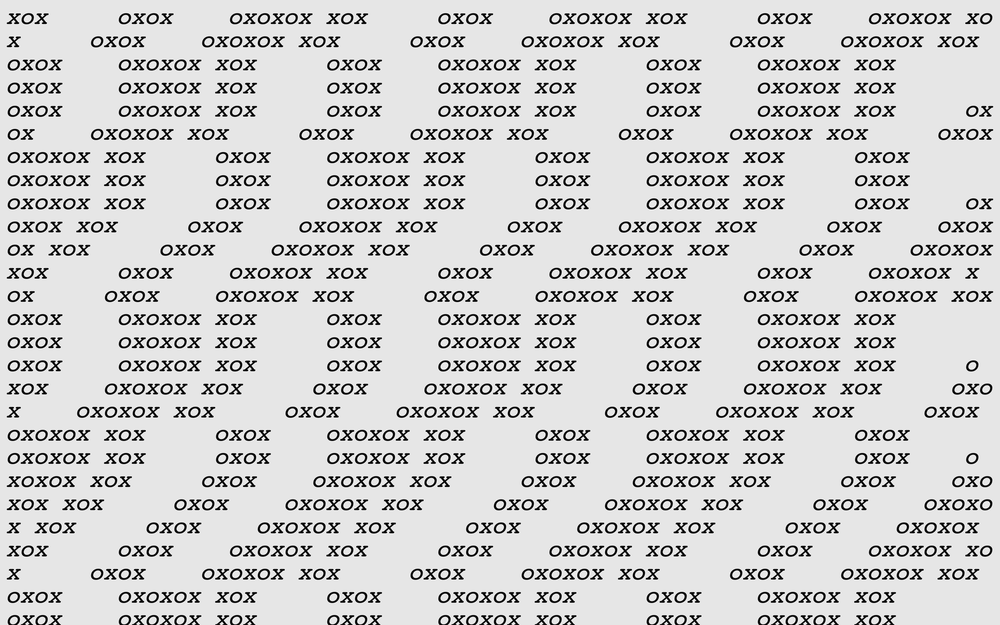


#### afternoon

- getting to know further functions to play with typography
  - using word lists
  - replace function
- experimenting on my own

###### ANIMATION TEXT LIST

```javascript
function setup() {
	createCanvas(windowWidth, windowHeight)

}

function draw() {

	background(37, 87, 255);
	//frameCount%10 = in rhythm of frameCount, it counts to 10
	// live should count as high as there are ites in the words
	// list -> otherwise empty screen because there's no word 7
	let live = frameCount % 12
	let words = (["i ", "han ", "es ", "zündhölzli ", "azündet ", "und ",
		"es ", "hett ", "e ", "flamme ", "geh ", "und "
	])

	frameRate(2)
	fill(255, 74, 0);
	textSize(100);
	textWrap(WORD);
	textFont('Courier');
	textAlign(CENTER, CENTER);
	textStyle(NORMAL)
	//textStyle(random([ITALIC, BOLD, NORMAL]))
	textLeading(100)

	// words[x] -> x describes which word in the list
	// called words is displayed; we use "live" -> 
	text(words[live].repeat(random([1, 12, 110])),
		60, 40, width-60, height-40)
}
```

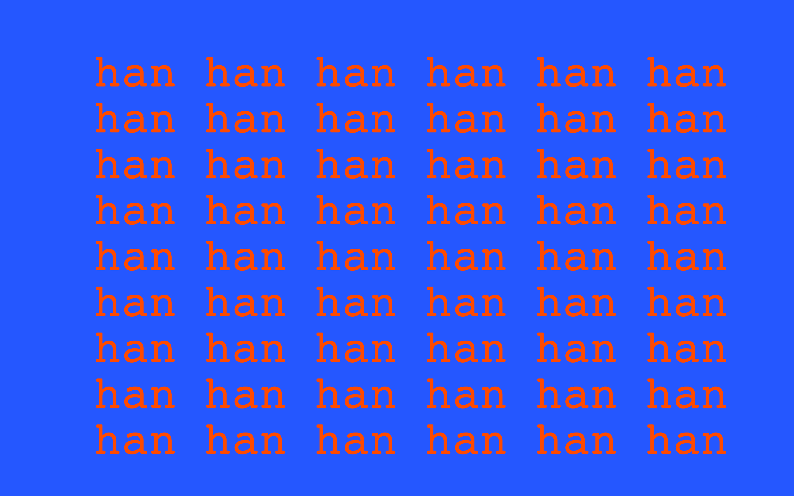


###### ANIMATION TEXT REPLACE

```javascript
function setup() {
	createCanvas(windowWidth, windowHeight)

}

function draw() {

	background(255, 0, 120);
	//frameCount%10 = in rhythm of frameCount, it counts to 10
	// live should count as high as there are ites in the words
	// list -> otherwise empty screen because there's no word 7
	let live = frameCount % 5
	let words = (["it sucks to read this, right?"])
	let sine = floor(sin(frameCount / 2))
	let randomLetter = random(["i", "t", "s", "u", "c", "k", "s", "o", "a", "d", "h", "g"]);
	let randomLetter2 = random(["i", "t", "s", "u", "c", "k", "s", "o", "a", "d", "h", "g"]);
	let randomLetter3 = random(["i", "t", "s", "u", "c", "k", "s", "o", "a", "d", "h", "g"]);

	frameRate(7)
	fill(113, 0, 255);
	textSize(80);
	textWrap(CHAR);
	textFont('monospace');
	textAlign(CENTER);
	textStyle(NORMAL)
	textLeading(120)

	text(words[0].replace(new RegExp(randomLetter, "g"), "█"),
		0, 350, width, height);
	text(words[0].replace(new RegExp(randomLetter2, "g"), "█"),
		0, 450, width, height);
	text(words[0].replace(new RegExp(randomLetter3, "g"), "█"),
		0, 550, width, height);
}
```

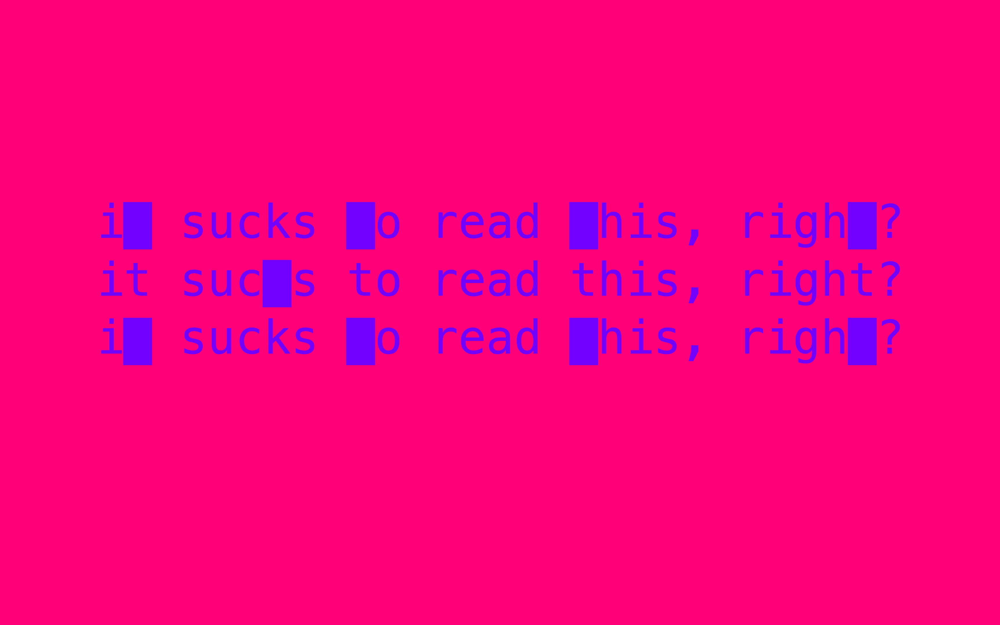

#### 

###### FOR-LOOP WITH TEXT

```javascript
function setup() {
	createCanvas(windowWidth, windowHeight)

}

function draw() {

	background(74, 234, 2);
	//frameCount%10 = in rhythm of frameCount, it counts to 10
	// live should count as high as there are ites in the words
	// list -> otherwise empty screen because there's no word 7
	let live = frameCount % 5
	let words = (["", "eis ", "zwei ", "drü ", "vier ", "füf ", "sechs ", "siebe ", "acht ", "nün ", "zäh "])
	let sine = floor(sin(frameCount / 2))


	frameRate(7)
	fill(113, 0, 255);
	textSize(40);
	textWrap(CHAR);
	textFont('monospace');
	textAlign(RIGHT)
	textStyle(NORMAL)
	textLeading(120)
	
	yGap = 60

	for (let i = 0; i<11; i++) {
	text(words[i].repeat(i),
		-50, 350+i*yGap, width, height);
}
}
```

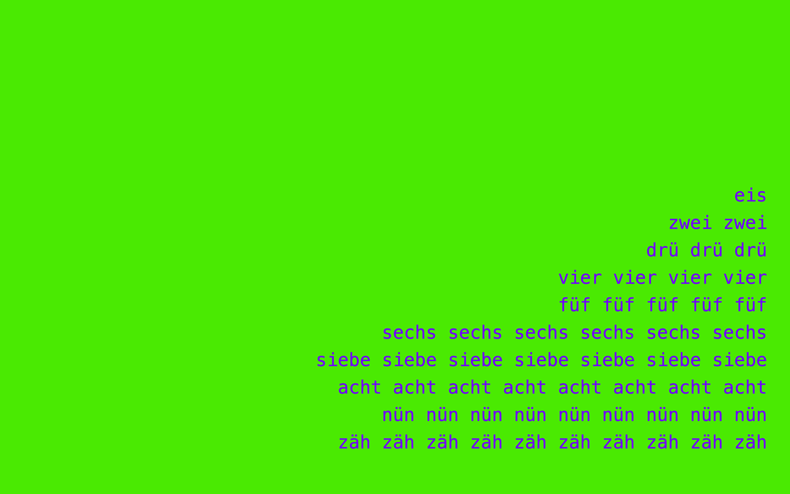


###### REBUILDING "RAIN-ART" REFERENCE

```javascript
function setup() {
	createCanvas(windowWidth, windowHeight)
	frameRate(7)
}

function draw() {

	background(255);
	let comma = ","
	let space = ["-"]
	let commaline;
	
	fill(0,0,255);
	textSize(windowWidth/50);
	textWrap(CHAR);
	textFont('monospace');
	textLeading(20)

	for (let i=0; i<11; i++){
		// everytime sketch is run, one "-" is added
		space.push("-");
		
		// slash is attached to comma -> the higher i, the 
		//more slashes are attached
		comma = comma + space[i]
		
		// for each repetition, the comma / slash combo
		// is repeated 33 times
		commaline = comma.repeat (33)
		
		// commaline.length*i/2 determines gap between different
		// comma - slash boxes
		text(commaline, 100, commaline.length*i/2, windowWidth/2.5, windowHeight)
	}

}
```

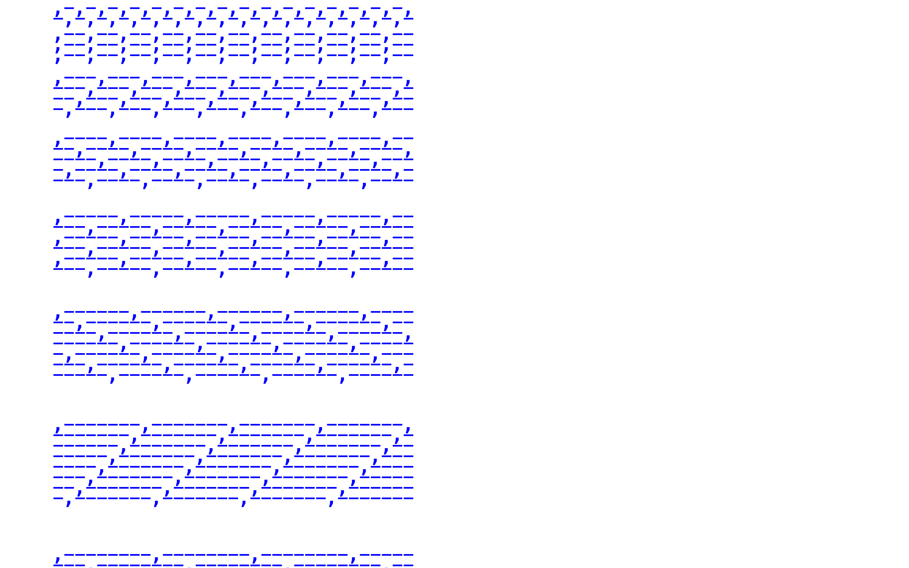


## FRIDAY

#### morning

- presentation by Paulina on her work and career
- theory about machine learning
- getting to know different tools of ml5.js library
- training the teachable machine using the webcam -> object identification


#### afternoon

- using machine learning in p5:
  - object identifier 
  - handpose


###### OBJECT IDENTIFIER INFLUENCING STRENGTH OF NOISE

```javascript
let libs = ['https://unpkg.com/ml5@1/dist/ml5.min.js', 'https://unpkg.com/hydra-synth', 'includes/libs/hydra-synth.js',
	'https://cdn.jsdelivr.net/gh/ffd8/hy5@main/hy5.js', 'includes/libs/hy5.js'
];

let strength = 0


// sandbox - start
H.pixelDensity(2) // 2x = retina, set <= 1 if laggy

s0.initP5() // send p5 to hydra
P5.toggle(0) // optionally hide p5

//hydra doesn't recognise variables, we have to signal variables 
// with () => name of variable
src(s0)
	.modulate(noize(100000), () => strength)
	.luma(() => 0.6 * a.fft[0]) //a.fft [0]
    .out()
// sandbox - end


let classifier;
//replace with your link to Teachable Machine model
// you can train your model here https://teachablemachine.withgoogle.com/train/image
let imageModelURL = 'https://teachablemachine.withgoogle.com/models/2KV13g_7C/';

let video;
let label = 'loading...';
let confidence = 0;

function preload() {
	classifier = ml5.imageClassifier(imageModelURL + 'model.json');
}

function setup() {
	createCanvas(windowWidth, windowHeight);
	video = createCapture(VIDEO, { flipped: true });
	video.size(width, height);
	video.hide();

	classifyVideo();

	textFont('monospace');
	textAlign(CENTER, CENTER);
}

function draw() {


	image(video, 0, 0, width, height);
	//background(0);

	// Label
	noStroke();
	fill(0, 180);
	rect(0, height - 100, width, 100);

	fill(0, 255, 27);
	textSize(48);
	//text(label, width / 2, height / 2);
	rectMode(CENTER)
	textSize(18);
	//nf shows the percentage of how much the object
	//looks like the identified class
	//text(nf(confidence, 1, 2), width / 2, height - 20);

	if(label == "me") { //zwei da für if statements braucht man 2 varianten?
		fill(255, 0, 199)
		circle(width / 2, height / 2, 100)
		strength = 0.01
	} else if(label == "bottle") {
		fill(230, 255, 0)
		rect(width / 2, height / 2, 200)
		strength = 0.001
	} else {
		triangle(width / 2 - 200, height / 2 + 100, width / 2, height / 2 - 100, width / 2 + 200, height / 2 + 100)
		strength = 0.05
	}
	
	// with console.log, you can see the current value of the variable
	// in the bottom left corner
	//console.log(strength)

}

function classifyVideo() {
	classifier.classify(video, gotResult);
}

function gotResult(results) {
	label = results[0].label;
	confidence = results[0].confidence;
	classifyVideo();
}
```


###### OBJECT IDENTIFIER INFLUENCING EFFECT

```javascript
let libs = ['https://unpkg.com/ml5@1/dist/ml5.min.js', 'https://unpkg.com/hydra-synth', 'includes/libs/hydra-synth.js',
	'https://cdn.jsdelivr.net/gh/ffd8/hy5@main/hy5.js', 'includes/libs/hy5.js'
];

let strength = 0
let fx1 = 0
let fx2 = 0
let fx3 = 0

// sandbox - start
H.pixelDensity(2) // 2x = retina, set <= 1 if laggy

s0.initP5() // send p5 to hydra
P5.toggle(0) // optionally hide p5

//hydra doesn't recognise variables, we have to signal variables 
// with () => name of variable
src(s0)
	.modulate(noize(100000), () => fx1 * 0.01) //effect for "me"
	.modulateScale(osc(20), () => fx2) // effect for "bottle"
	.modulate(voronoi(20,2). luma(0.8). scale(0.99), () => fx3)
	//.add(src(s0).luma(0.9).scale(1.03), () => fx3)//effect for "food"
	.luma(() => 0.6 * a.fft[0]) //a.fft [0]
    .out()
// sandbox - end


let classifier;
//replace with your link to Teachable Machine model
// you can train your model here https://teachablemachine.withgoogle.com/train/image
let imageModelURL = 'https://teachablemachine.withgoogle.com/models/2KV13g_7C/';

let video;
let label = 'loading...';
let confidence = 0;

function preload() {
	classifier = ml5.imageClassifier(imageModelURL + 'model.json');
}

function setup() {
	createCanvas(windowWidth, windowHeight);
	video = createCapture(VIDEO, { flipped: true });
	video.size(width, height);
	video.hide();

	classifyVideo();

	textFont('monospace');
	textAlign(CENTER, CENTER);
}

function draw() {


	image(video, 0, 0, width, height);
	//background(0);

	// Label
	noStroke();
	fill(0, 180);
	rect(0, height - 100, width, 100);

	fill(0, 255, 27);
	textSize(48);
	//text(label, width / 2, height / 2);
	rectMode(CENTER)
	textSize(18);
	//nf shows the percentage of how much the object
	//looks like the identified class
	//text(nf(confidence, 1, 2), width / 2, height - 20);

	if(label == "me") { //zwei da für if statements braucht man 2 varianten?
		fill(255, 0, 199)
		circle(width / 2, height / 2, 100)
		//strength = 0.01
		fx1 = 1
		fx2 = 0
		fx3 = 0
	} else if(label == "bottle") {
		fill(230, 255, 0)
		rect(width / 2, height / 2, 200)
		//strength = 0.001
		fx1 = 0
		fx2 = 1
		fx3 = 0
	} else {
		triangle(width / 2 - 200, height / 2 + 100, width / 2, height / 2 - 100, width / 2 + 200, height / 2 + 100)
		fx1 = 0
		fx2 = 0
		fx3 = 1
		//strength = 0.05
	}
	
	// with console.log, you can see the current value of the variable
	// in the bottom left corner
	//console.log(strength)

}

function classifyVideo() {
	classifier.classify(video, gotResult);
}

function gotResult(results) {
	label = results[0].label;
	confidence = results[0].confidence;
	classifyVideo();
}
```


HANDPOSE: SIZE-CHANGING CIRCLE

```javascript
let libs = ['https://unpkg.com/ml5@1/dist/ml5.min.js'];

let video;
let state = 'starting...';
let handPose;
let hands = [];
let options = { maxHands: 2, flipHorizontal: true };
let pScale = 20

let distTip = 0 // define variable for distance between finger tips
let distTip2 = 0

function preload() {
	handPose = ml5.handPose(options);
}

function setup() {
	createCanvas(windowWidth, windowHeight);

	video = createCapture(VIDEO, { flipped: true });
	video.size(width, height);
	video.hide();

	handPose.detectStart(video, gotHands);
	state = 'detecting hands';
}

function draw() {
	background(20, 100);
	//image(video,0,0) //show webcam


	for(let i = 0; i < hands.length; i++) {
		const hand = hands[i];
		for(let j = 0; j < hand.keypoints.length; j++) {
			const kp = hand.keypoints[j];
			const x = kp.x;
			const y = kp.y;
			fill(map(j, 0, hand.keypoints.length, 0, 255), 255, map(j, 0, hand.keypoints.length, 255, 0));
			noStroke();
			circle(x, y, pScale * sin(frameCount * 0.1 + j) % pScale);
		}
	}

	noStroke();
	fill(255);
	text(state, 10, height - 10);

	//according to ml5 handpose mode, thumb tip = keypoint 4, 
	//index finger tip =  keypoint 8
	//hands [0] = one of the hands; we have two = hands [0] and hands [1]


	if(hands.length != 0) {
		
		stroke(255)
		strokeWeight(5)
		
		distTip = dist(hands[0].keypoints[4].x, hands[0].keypoints[4].y,
			hands[0].keypoints[8].x, hands[0].keypoints[8].y)
		// if it detects a second hand
		if(hands[1]) {
			distTip2 = dist(hands[1].keypoints[4].x, hands[1].keypoints[4].y,
				hands[1].keypoints[8].x, hands[1].keypoints[8].y)
			line(hands[1].keypoints[4].x, hands[1].keypoints[4].y, hands[1].keypoints[8].x, hands[1].keypoints[8].y)

		}
		
		line(hands[0].keypoints[4].x, hands[0].keypoints[4].y, hands[0].keypoints[8].x, hands[0].keypoints[8].y)
		console.log(distTip)

		// if distance of tips of first detected hand is smaller than 30,
		// a circle is drawn
		// the distance of tips of second detected hand controls the size of the circle
		if(distTip < 30) {
			noStroke()
			circle(hands[0].keypoints[8].x, hands[0].keypoints[8].y, 50 + distTip2 * 0.5)
		}
		
	}


}

function gotHands(results) {
	hands = results;
}
```

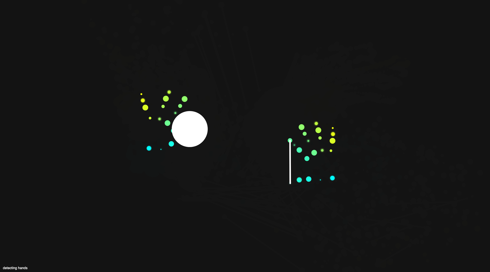


###### HANDPOSE: COLOR- AND SIZECHANGING DRAWTOOL

```javascript
let libs = ['https://unpkg.com/ml5@1/dist/ml5.min.js'];

let video;
let state = 'starting...';
let handPose;
let hands = [];
let options = { maxHands: 2, flipHorizontal: true };
let pScale = 20

let distTip = 0 // define variable for distance between finger tips
let distTip2 = 0
let distTip3 = 0

let r, g, b

function preload() {
	handPose = ml5.handPose(options);
}

function setup() {
	createCanvas(windowWidth, windowHeight);

	video = createCapture(VIDEO, { flipped: true });
	video.size(width, height);
	video.hide();

	handPose.detectStart(video, gotHands);
	state = 'detecting hands';
}

function draw() {
	//background(20, 100);
	//image(video,0,0) //show webcam


	for(let i = 0; i < hands.length; i++) {
		const hand = hands[i];
		for(let j = 0; j < hand.keypoints.length; j++) {
			const kp = hand.keypoints[j];
			const x = kp.x;
			const y = kp.y;
			fill(map(j, 0, hand.keypoints.length, 0, 255), 255, map(j, 0, hand.keypoints.length, 255, 0));
			noStroke();
			//circle(x, y, pScale * sin(frameCount * 0.1 + j) % pScale);
		}
	}

	noStroke();
	fill(255);
	text(state, 10, height - 10);

	//according to ml5 handpose mode, thumb tip = keypoint 4, 
	//index finger tip =  keypoint 8
	//hands [0] = one of the hands; we have two = hands [0] and hands [1]


	if(hands.length != 0) {

		stroke(255)
		strokeWeight(5)

		distTip = dist(hands[0].keypoints[4].x, hands[0].keypoints[4].y,
			hands[0].keypoints[8].x, hands[0].keypoints[8].y)
		// if it detects a second hand
		if(hands[1]) {
			distTip2 = dist(hands[1].keypoints[4].x, hands[1].keypoints[4].y,
				hands[1].keypoints[8].x, hands[1].keypoints[8].y)
			//line(hands[1].keypoints[4].x, hands[1].keypoints[4].y, hands[1].keypoints[8].x, hands[1].keypoints[8].y)
			distTip3 = dist(hands[1].keypoints[4].x, hands[1].keypoints[4].y,
				hands[1].keypoints[12].x, hands[1].keypoints[12].y)
		}

		//line(hands[0].keypoints[4].x, hands[0].keypoints[4].y, hands[0].keypoints[8].x, hands[0].keypoints[8].y)
		console.log(distTip)
		if(distTip3 < 30) {
			fill (255, 0, 0)
			//circle(100, 100, 400)
		}
		

		// if distance of tips of first detected hand is smaller than 30,
		// a circle is drawn
		// the distance of tips of second detected hand controls the size of the circle
		if(distTip < 30) {
			noStroke()
			circle(hands[0].keypoints[8].x, hands[0].keypoints[8].y, 50 + distTip2 * 0.5)
		}


	}


}

function gotHands(results) {
	hands = results;
}
```

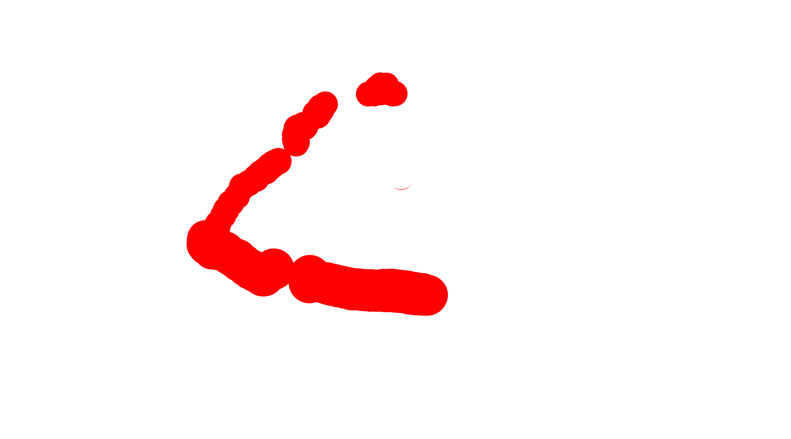


###### OBJECT DETECTION TOOL

```javascript
let libs = ['https://unpkg.com/ml5@1/dist/ml5.min.js'];

let video;
let detector;
let detections = [];

function preload() {
  // COCO SSD model — 80 common objects
  // https://github.com/tensorflow/tfjs-models/blob/master/coco-ssd/src/classes.ts
  detector = ml5.objectDetection('cocossd');
}

function setup() {
  createCanvas(960, 540);
  background(0);

  video = createVideo(
    'https://raw.githubusercontent.com/digitalideation/colabor2026/main/2026_05_08-Paulina_Zybinska/code/objectDetection/assets/rainyday2.mp4'
  );
  video.size(width, height);
  video.hide();
  video.loop();
  video.volume(0);

  detector.detectStart(video, gotDetections);
}

function gotDetections(results) {
  detections = results;
}

function draw() {
  background(0);

  let scaleX = width / video.elt.videoWidth;
  let scaleY = height / video.elt.videoHeight;

  //clip path made of all detection rectangles
 /* drawingContext.save();
  drawingContext.beginPath();
  for (let i = 0; i < detections.length; i++) {
    let d = detections[i];
    drawingContext.rect(
      d.x * scaleX,
      d.y * scaleY,
      d.width * scaleX,
      d.height * scaleY
    );
  }
  drawingContext.clip();*/


  image(video, 0, 0, width, height);

  drawingContext.restore();

  // outlines + labels on top
  for (let i = 0; i < detections.length; i++) {
    let d = detections[i];
    let x = d.x * scaleX;
    let y = d.y * scaleY;
    let w = d.width * scaleX;
    let h = d.height * scaleY;

    
    

    stroke(0, 255, 25);
    strokeWeight(2);
 
    //blendMode(DIFFERENCE)
    noFill()
    rect(x, y, w, h);

    noStroke();
    fill(0,255,25);
    textSize(24);
    textFont ('Courier')
    text(d.label, x + 10, y + 24);
  }
  
  blendMode(BLEND)
}

```

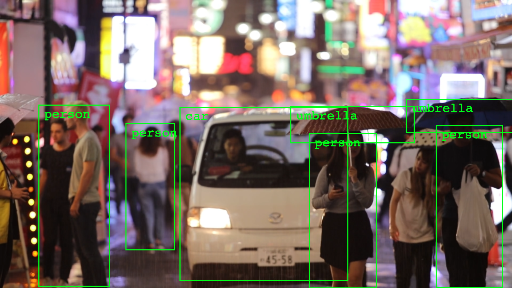
