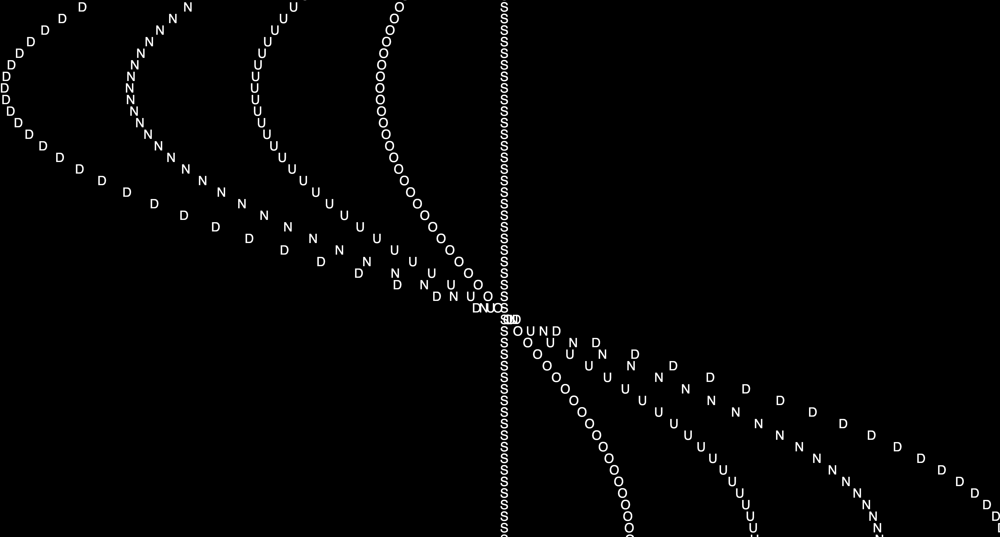
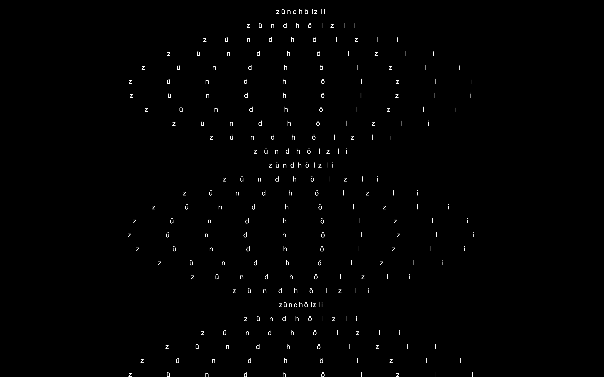
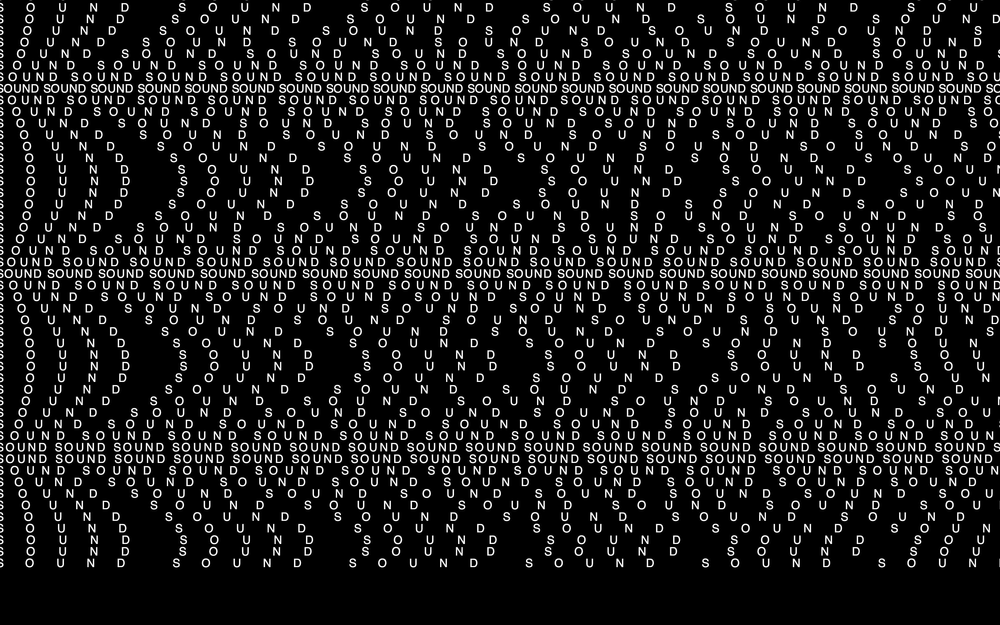
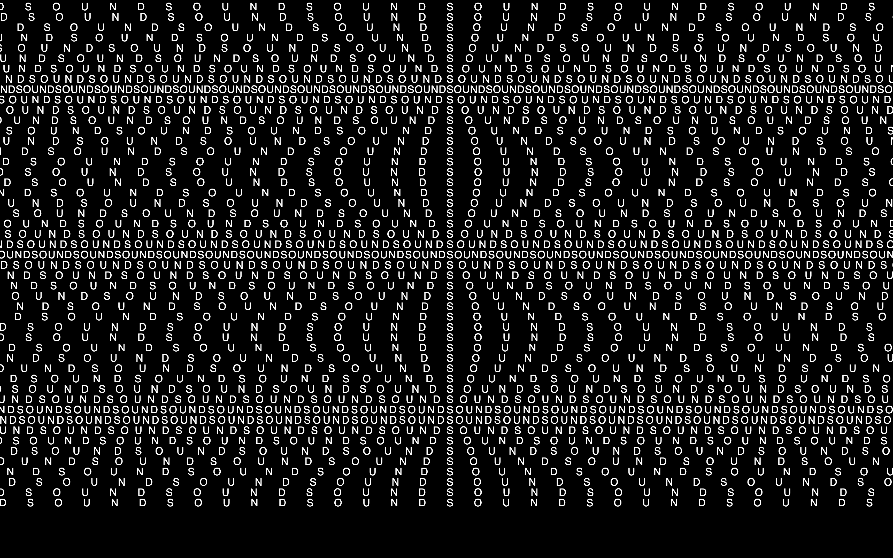
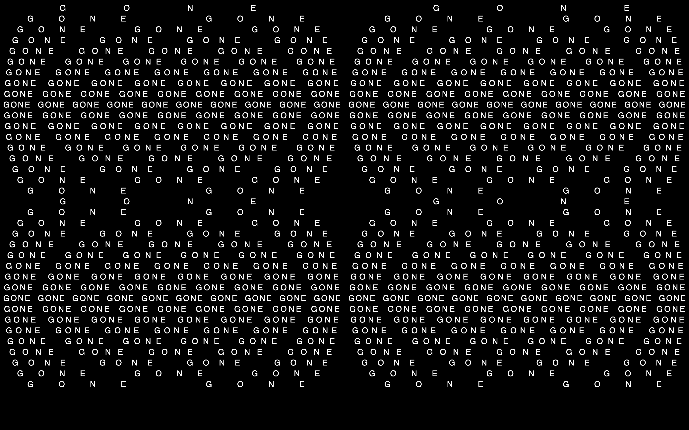

## MONDAY

#### morning

- feedback about the last two weeks
- input about sound & synthesizing sound


#### afternoon

- HUB


## TUESDAY

#### morning

- support with Yann
  - discuss idea: typographic visuals (audio-/imagereactive)
  - typography functions
  - superformula

- experimenting with typography


###### EXPERIMENT TYPOGRAPHY

```javascript
let word = "SOUND";
let letters = [];
let offsetX = 0

function setup() {
	createCanvas(windowWidth, windowHeight);
	letters = word.split('');
}

function draw() {
	background(0);
	fill(255)
	textSize(22)
	
	for(let j = 0; j < 50; j++) {
		for(let i = 0; i < letters.length; i++) {
			offsetX = sin(frameCount * 0.07 + j * 0.08) * width/4 * i
			text(letters[i], width/2 + offsetX * 0.5, 20 * j);
		}
	}
}
```




#### afternoon

- HUB


## WEDNESDAY

#### morning

- introduction to strudel


###### BASIC MELODY WITH BEAT

```javascript
// set bpm of music: 120 bpm, 4 beats per bar
setcpm(120/4)

// playing a bass drum
// gain defines volume
// bd * 4 = 4 basedrums per bar
// $ needed to use different sounds simultaneously (?)
$: sound("bd*4").gain(0.25)

// playing a snare drum
// _ in front of sound it shouldn't be played
$: sound("sd*2").gain(0.25)

// playing piano notes c3 e3, etc.
_$: note ("c3 e3 g3 c3").s("piano").dec(0.5)

// playing supersaw
_$: note("70 75 70 78").s("supersaw").dec(0.5).gain(0.25)

// using chord
// numbers also stand for sound
// with chord, we attribute the different numbers the different notes
// .add to make notes higher-pitched (?)
//._punchcard() to add visualisation of sound

$:note("0 1@2 <2 4 6> [3 5 7 12 [12 [2 4] -4] 1 2]".add("0 1 6 7")).chord("C F A B").voicing().s("supersaw").dec(0.5).gain(0.25)._punchcard()


// .slow(4) -> slows down music
// .fast(4) -> speeds up music
```


###### SECOND SKETCH

```javascript
setcpm(120/4)

$: s("bd")
 //.struct("1 0 0 0 1 0 0 0 <1> 0 0 0 1? 0 0 0 ")
 // 1? = it is random whether the sound is played here or not
 //<1> = sound is played every other time on this beat
 .beat("0, 10, 12?", 16)
 //.beat("0, 4, 8, 12", 16)
 .bank("compurhythm1000"). gain("0.5 0.25 !3")
 // different values for gain: each value is for one beat
 // !3 = repeated three times

$: s("sd")
 //.struct("0 0 0 1 0 0 1 0 0 0 0 1 0 0 1 0 ")
 . struct(" 0 0 0 0 1 0 0 0 0 0 0 0 1 0 0 ")  
 .bank("compurhythm1000").gain(0.25)

$: s("hh")
 .struct("1 0 1 0 1 0 1 0 1 0 1 0 1 0 1 0 ")
 //.fast(8)
 .bank("tr909").gain("0.25 0.125")

// irand(12)gives us random number from 0 to 12
// dec influences the fading out of the sounds -> how long they are fading out
// delay: adds stereo echo
// delaytime: how long after sound the stereo echo comes
// lpf allows low frequencies to pass through while reducing high frequencies
$: n(irand(12).seg(16))
 .rib(3,1)
 .dec(0.5)
 .chord("<C Am F D>").voicing()
 //.lpf(sine.slow(4)).range(500,2000)
 //.delay(0.5)
 //.delaytime (1)
 .s("supersaw").gain(0.65)._punchcard()
```


## THURSDAY

- holiday: Auffahrt


## FRIDAY

- experimenting with the functions learned over the last weeks; goal to implement typography

###### TEXT STRING SINUS ANIMATION

```javascript
let word = "SOUND";
let letters = [];
let offsetX = 0

function setup() {
	createCanvas(windowWidth, windowHeight);
	letters = word.split('');
}

function draw() {
	background(0);
	fill(255)
	textSize(22)
	
	for(let j = 0; j < 50; j++) {
		for(let i = 0; i < letters.length; i++) {
			offsetX = sin(frameCount * 0.03 + j * 0.08) * 300 * i
			text(letters[i], width/2 + offsetX * 0.5, 20 * j);
		}
	}
}
```


###### SINUS STRINGS CENTRAL

```javascript
let word = "zündhölzli"

function setup() {
	createCanvas(windowWidth, windowHeight)

}

function draw() {
	background(0)
	fill(255)
	textSize(20)
	textAlign(CENTER)

	for(let i = 0; i < 50; i++) {
		let varSpacing = abs(sin(frameCount * 0.03 + i *0.3) * 10)
		textSpacing(word, 10 * varSpacing, width / 2, 40 * i)
	}
}


function textSpacing(txt, spacing, x, y) {
	let totalWidth = 0;
	for(let char of txt) {
		totalWidth += textWidth(char) + spacing;
	}
	totalWidth -= spacing; // remove trailing spacing after last char

	x -= totalWidth / 2; // ← shift left by half, so center stays fixed

	for(let char of txt) {
		text(char, x, y);
		x += textWidth(char) + spacing;
	}
}
```




###### SINUS ANIMATION SPACING

```javascript
let word = "SOUND "

function setup() {
	createCanvas(windowWidth, windowHeight);
}

function draw() {
	background(0);
	fill(255)
	textSize(20)
	textAlign(CENTER)
	let cycle = frameCount % 9 + 1
	print(cycle)

	for(let i = 0; i < 50; i++) {
	fill (255)
	 let spac = abs(sin(frameCount * 0.02 + i * 0.2) * 40)
	textSpacing(word.repeat(cycle * 15),spac, 0,20*i)
	}
	
	

}

function textSpacing(txt, spacing, x, y) {
	let totalWidth = 0;

	for(let char of txt) {
		totalWidth += textWidth(char) + spacing;
	}

	//let x = width / 2 - totalWidth / 2;
	//let y = height / 2;

	for(let char of txt) {
		text(char, x, y);
		x += textWidth(char) + spacing;
	}
}
```





###### SINUS ANIMATION SPACING CENTERED

```javascript
let word = "SOUND";
let spread = 40

function setup() {
  createCanvas(windowWidth, windowHeight);
}

function draw() {
  background(0);
  fill(255);
  textSize(20);
  textAlign(LEFT);
  
  for (let i = 0; i < 50; i++) {
    fill(255);
    let spac = abs(sin(frameCount * 0.013 + i * 0.2) * spread);
    textSpacing(word.repeat(30), spac, 20 * i);
  }
}

function textSpacing(txt, spacing, y) {
  let totalWidth = 0;
  for (let char of txt) {
    totalWidth += textWidth(char) + spacing;
  }

  let x = width / 2 - totalWidth / 2;

  for (let char of txt) {
    text(char, x, y);
    x += textWidth(char) + spacing;
  }
}
```




###### VARIED SPACING VISUALISATION

```javascript
let word = " GONE "
let lineHeight = 27
let rows = [1,2,3,4,5,6,7,8,9,10,9,8,7,6,5,4,3,2];

function setup() {
	createCanvas(windowWidth, windowHeight)
}

function drawBlock(yOffset) {
	
	for(let i = 0; i < rows.length; i++) { 
		// code is repeated as long as there's a new argument in the rows array to put in 
		let txt = word.repeat(2 * rows[i]);
		// word is repeated as many times as twice the argument in the rows array
		let naturalWidth = 0;
		for(let char of txt) naturalWidth += textWidth(char);
		// calculates natural width; goes through every character of the word and adds
		// it to the value of the variable naturalWidth -> when it's gone through all
		// letters, naturalWidth equals width of the letters without spacing
		let spacing = (width - naturalWidth) / (txt.length - 1);
		// spacing is calculated based by calculating the white space by subtracting
		// the naturalWidth of the overall width and then divided by the text length 
		// minus 1 because there's 1 less gap than there's letters
		
		textSpacing(txt, spacing, width / 2, yOffset + lineHeight * (i + 1))
	}
}

function draw() {
	background(0)
	fill(255)
	textSize(20)
	drawBlock(0)
	drawBlock(rows.length * lineHeight)
}

function textSpacing(txt, spacing, x, y) {
	let totalWidth = 0;
	for(let char of txt) {
		totalWidth += textWidth(char) + spacing;
	}
	totalWidth -= spacing;
	x -= totalWidth / 2;
	for(let char of txt) {
		text(char, x, y);
		x += textWidth(char) + spacing;
	}
}


```


